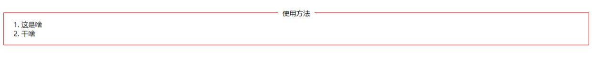
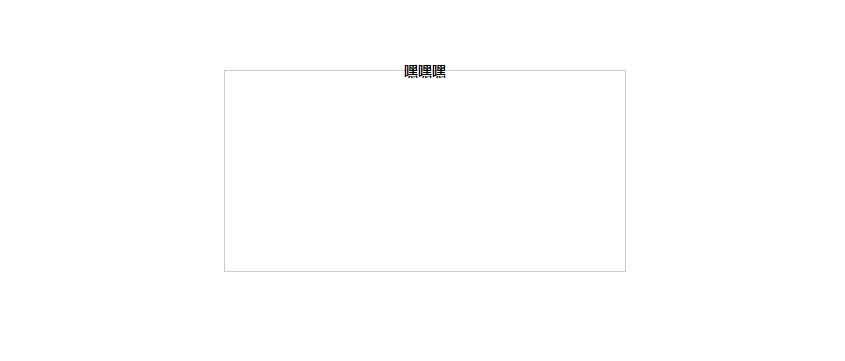
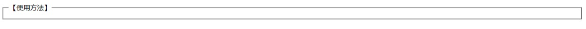

# CSS 如何让文字标题显示在边框上

[TOC]

### 方案一

- 效果图



```html
<!DOCTYPE html>
<html lang="en">

<head>
    <meta charset="UTF-8">
    <meta http-equiv="X-UA-Compatible" content="IE=edge">
    <meta name="viewport" content="width=device-width, initial-scale=1.0">
    <title>Document</title>
    <style>
        .box {
            position: relative;
            border: 1px solid red;
            margin: 100px auto;
        }

        .box::before {
            content: attr(title);
            position: absolute;
            left: 50%;
            transform: translateX(-50%);
            -webkit-transform: translate(-50%, -50%);
            padding: 0 10px;
            background-color: #fff;
        }
    </style>
</head>

<body>
    <div class="box" title="使用方法">
        <ol>
            <li>这是啥</li>
            <li>干啥</li>
        </ol>
    </div>
</body>

</html>
```

### 方案二

- 效果图



```html
<!DOCTYPE html>
<html lang="en">

<head>
    <meta charset="UTF-8">
    <meta http-equiv="X-UA-Compatible" content="IE=edge">
    <meta name="viewport" content="width=device-width, initial-scale=1.0">
    <title>Document</title>
    <style>
        div {
            width: 400px;
            height: 200px;
            border: 1px solid #ccc;
            margin: 200px auto;
        }

        div h1 {
            height: 20px;
            margin: -10px auto 0;
            font-size: 14px;
            padding: 0 10px;
            text-align: center;
            width: 50px;
        }
    </style>
</head>

<body>
    <div>
        <h1>嘿嘿嘿</h1>
    </div>
</body>

</html>
```

### 方案三

- 效果图


```html
<!DOCTYPE html>
<html lang="en">

<head>
    <meta charset="UTF-8">
    <meta http-equiv="X-UA-Compatible" content="IE=edge">
    <meta name="viewport" content="width=device-width, initial-scale=1.0">
    <title>Document</title>
    <style>
        h2:before,
        h2:after {
            content: "";
            display: inline-block;
            vertical-align: middle;
            width: 100px;
            border-top: 1px solid #123456;
        }
    </style>
</head>

<body>
    <h2>线标题</h2>
</body>

</html>
```

### 方案四（不建议）

- 效果图



```html
<!DOCTYPE html>
<html lang="en">

<head>
    <meta charset="UTF-8">
    <meta http-equiv="X-UA-Compatible" content="IE=edge">
    <meta name="viewport" content="width=device-width, initial-scale=1.0">
    <title>Document</title>

</head>

<body>
    <fieldset>
        <legend>【使用方法】</legend>
    </fieldset>
</body>

</html>
```

