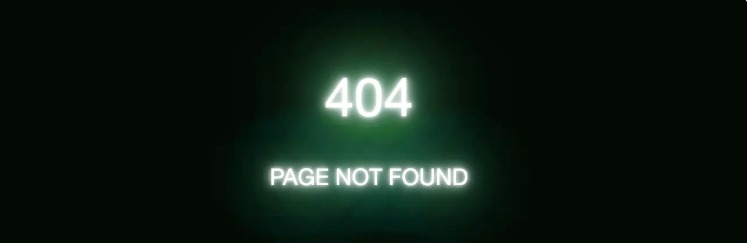
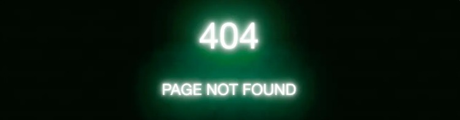
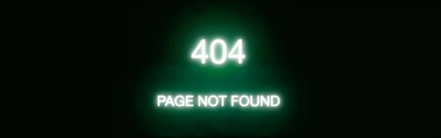
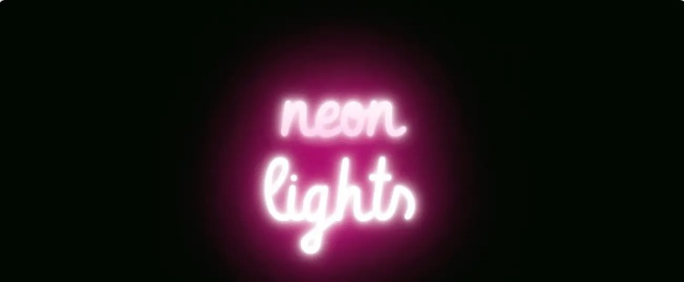
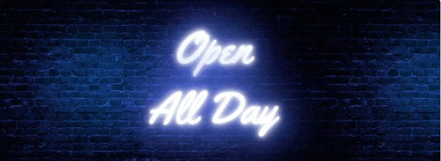
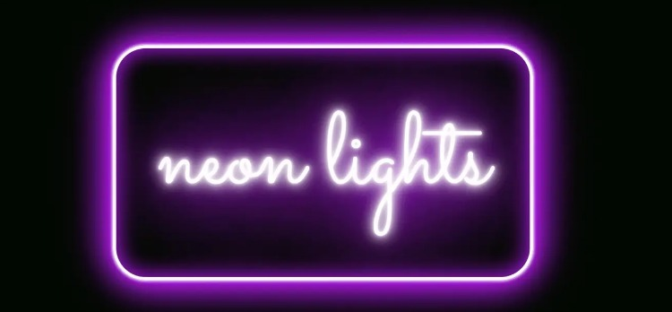

# CSS创建霓虹灯文字

[TOC]

### 为文本添加发光效果

1. 首先，让文本发光。可以使用`text-shadow`属性在CSS中完成此操作

   ```css
   .neonText {
     color: #fff;
     text-shadow:
       0 0 7px #fff,
       0 0 10px #fff,
       0 0 21px #fff,
       0 0 42px #0fa,
       0 0 82px #0fa,
       0 0 92px #0fa,
       0 0 102px #0fa,
       0 0 151px #0fa;
   }
   ```

   

   `text-shadow`需要四个值，其中前两个分别代表阴影的水平和垂直位置。第三个值代表模糊半径的大小，最后一个值代表阴影的颜色。为了增加发光效果的大小，我们将增加代表模糊半径的第三个值。或者，表达另一种方式：

   ```css
   text-shadow: [x-offset] [y-offset] [blur-radius] [color];
   ```

2. 详细代码

   ```css
   .neonText {
     color: #fff;
     text-shadow:
         0 0 7px #fff,
         0 0 10px #fff,
         0 0 21px #fff,
         0 0 42px #0fa,
         0 0 82px #0fa,
         0 0 92px #0fa,
         0 0 102px #0fa,
         0 0 151px #0fa;
   }
   
   /*其他样式 */
     
   body {
     font-size: 18px;
     font-family: "Vibur", sans-serif;
     background-color: #010a01;
   }  
   
   h1, h2 {
     text-align: center;
     text-transform: uppercase;
     font-weight: 400;
   }
     
   h1 {
       font-size: 4.2rem;
   }
     
   h2 {
       font-size: 1.8rem;
   }
   
   .container {
     margin-top: 20vh;
   }
   ```

   

3. 步骤解析

   - 首先，我们将白色发光效果添加到具有较小模糊半径的文本字母的外边缘

   ```css
   .neonText {
     color: #fff;
     text-shadow:
       /* 扩散白光 */
       0 0 7px #fff,
       0 0 10px #fff,
       0 0 21px #fff,
   }
   ```

   - 最后五个值是模糊半径较大的较宽文本阴影，形成绿色发光

   ```css
   .neonText {
     color: #fff;
     text-shadow:
       /* 扩散白光 */
       0 0 7px #fff,
       0 0 10px #fff,
       0 0 21px #fff,
       /* 扩散绿光 */
       0 0 42px #0fa,
       0 0 82px #0fa,
       0 0 92px #0fa,
       0 0 102px #0fa,
       0 0 151px #0fa;
   }
   ```

   - 如果可以用少于五个阴影完成此操作，那将是很好的选择，但是我们需要所有这些阴影，以便可以将它们彼此堆叠以增加发光的深度。如果我们改用单个text-shadow效果，则效果将无法达到使效果看起来逼真的深度。

4. 继续尝试各种色调和颜色以及模糊半径大小！可以创建多种冷光效果，因此请尝试不同的变化-甚至可以混合和匹配一种颜色混合成另一种颜色的颜色。


### 闪烁效果

1. 我们知道有一些霓虹灯是有闪烁效果的，尤其是较旧的标志。我们可以用CSS动画做同样的事情！让我们@keyframes来制作一个动画，看似随机的闪烁方式来开启和关闭灯光的效果。

   - 我们采用了与以前完全相同的text-shadow属性和值，将它们包装在@keyframes名为的动画中flicker，并在时间轴中选择点以应用阴影，以及完全去除阴影的点。
   - 剩下的就是在动画希望我们闪烁的地方调用动画。在这种情况下，我们仅将其添加到`<h1>`元素中。与我们将闪烁应用于所有文本相比，拥有整个符号闪烁的一部分感觉要现实一些。
   - 注意，如果希望整个符号闪烁，那么我们可以从技术上删除类text-shadow上的值.neonText，向其添加动画，然后@keyframes改为应用阴影。

   ```css
   @keyframes flicker {
     0%, 18%, 22%, 25%, 53%, 57%, 100% {
       text-shadow:
         0 0 4px #fff,
         0 0 11px #fff,
         0 0 19px #fff,
         0 0 40px #0fa,
         0 0 80px #0fa,
         0 0 90px #0fa,
         0 0 100px #0fa,
         0 0 150px #0fa;
     }
     20%, 24%, 55% {       
       text-shadow: none;
     }
   }
   ```

   ```css
   h1 {
     animation: flicker 1.5s infinite alternate;     
   }
   ```

   


### 脉动的光芒

1. 我们对此一目了然。就像前面的示例一样，它使用关键帧，其中我们在动画的开始和结束处指定模糊半径的大小。我们希望模糊半径的大小在动画结束时最小，因此我们只需减小关键帧中每个`text-shadow`值的模糊半径值即可`0%`。这样，模糊的大小逐渐起伏并流动，从而产生脉动效果。

   ```css
   @keyframes pulsate {
     100% {
       text-shadow:
         0 0 4px #fff,
         0 0 11px #fff,
         0 0 19px #fff,
         0 0 40px #0fa,
         0 0 80px #0fa,
         0 0 90px #0fa,
         0 0 100px #0fa,
         0 0 150px #0fa;
     }
     0% {
       text-shadow:
         0 0 2px #fff,
         0 0 4px #fff,
         0 0 6px #fff,
         0 0 10px #0fa,
         0 0 45px #0fa,
         0 0 55px #0fa,
         0 0 70px #0fa,
         0 0 80px #0fa;
     }
   }
   ```

   ```css
   h1 {
     animation: pulsate 2.5s infinite alternate;     
   }
   ```

   


### 微妙的闪烁

1. 我们需要做的只是稍微减小0%关键帧中模糊半径的大小，只是不达到上一个示例中看到的程度。

   ```css
   @keyframes pulsate {
     100% {
       text-shadow:
         0 0 4px #fff,
         0 0 11px #fff,
         0 0 19px #fff,
         0 0 40px #f09,
         0 0 80px #f09,
         0 0 90px #f09,
         0 0 100px #f09,
         0 0 150px #f09;
     }
    0% {
       text-shadow:
         0 0 4px #fff,
         0 0 10px #fff,
         0 0 18px #fff,
         0 0 38px #f09,
         0 0 73px #f09,
         0 0 80px #f09,
         0 0 94px #f09,
         0 0 140px #f09;
     }
   }
   ```

   由于闪烁更加细微，模糊半径的减小也没有那么大，因此我们应该增加每秒动画播放次数，以模拟更频繁的闪烁。这可以通过减少动画的持续时间来完成，例如0.11s

   ```css
   h1 {
     animation: pulsate 0.11s ease-in-out infinite alternate;    
   }
   ```

   


### 使用背景图片

1. 如果文字只是在一个黑黑的背景上面，那真的很单调，所以我们要使用砖纹理或其他东西：

   ```css
   body {
     background-image: url(wall.jpg);
   }
   ```

   

   

### 添加边框

1. 我们可以添加的最后一个细节是标志周围的某种圆形或矩形边框。这只是框住文本并使其看起来像一个实际符号的一种好方法。通过在边框上添加阴影，我们可以为其提供与文本相同的霓虹效果！

   无论文本的容器是元素是什么，都需要边框。假设我们只使用一个`<h1>`元素。这就是边界。我们将border简写属性称为标题周围的纯白色边框，外加一点填充以使文本有一定的呼吸空间：

   ```css
   h1 {
     border: 0.2rem solid #fff;
     padding: 0.4em;
   }
   ```

   - 我们可以在边框的拐角处稍微变圆一些，因此`border-radius`在标题上应用a可以使事情变得不那么尖锐。您可以使用最适合您的值来获得所需的精确度。

   ```css
   h1 {
     border: 0.2rem solid #fff;
     border-radius: 2rem;
     padding: 0.4em;
   }
   ```

   - 现在，`text-shadow`不会在这里为边界工作，但这没关系，因为这是该`box-shadow`物业设计的目的。语法非常相似，因此我们甚至可以精确地提取所需要的内容`text-shadow`并略微调整值：
   - 注意到那个`inset`关键词吗？这`text-shadow`是无法做到的，但是将其添加到边框中b`ox-shadow`可以使我们在边框的两面都获得一些发光效果，达到一定的真实深度。

   ```css
   h1 {
     border: 0.2rem solid #fff;
     border-radius: 2rem;
     padding: 0.4em;
     box-shadow: 0 0 .2rem #fff,
                 0 0 .2rem #fff,
                 0 0 2rem #bc13fe,
                 0 0 0.8rem #bc13fe,
                 0 0 2.8rem #bc13fe,
                 inset 0 0 1.3rem #bc13fe;
   }
   ```

   

