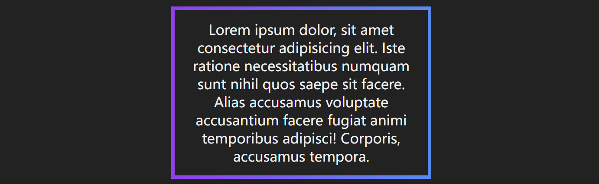
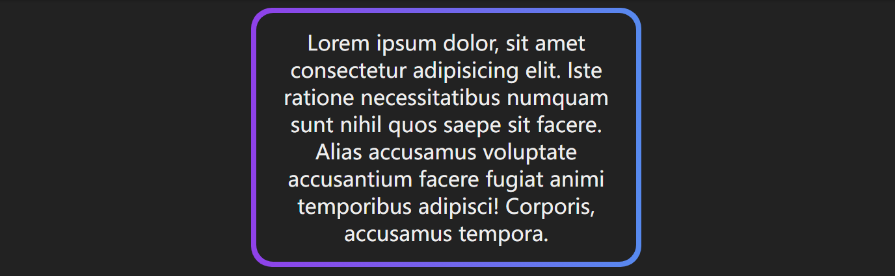
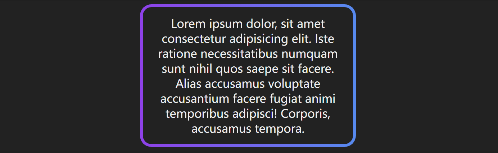
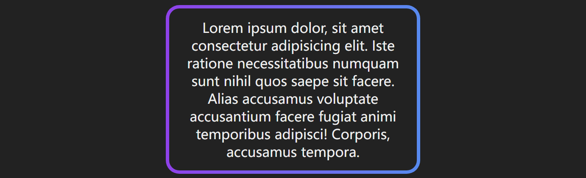
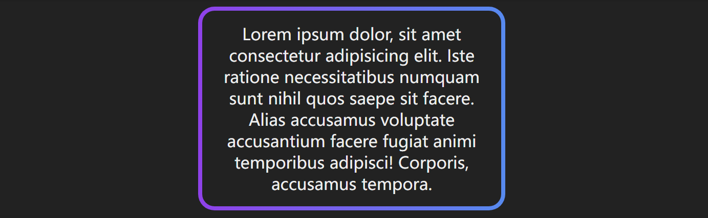

# CSS实现渐变色边框

[TOC]

### 使用 `border-image`

> CSS 提供了 [border-image](https://link.segmentfault.com/?enc=B6sXaLywjHWCJnwJH6N9Vg%3D%3D.oBdjFja7MKhxnDMyBJCm63JojVi7eIwTLSTFCn1I9Xwn2uIe4t85QGaVmHVUr5yRqw0dd1xkuPhqwWBcwSNHig%3D%3D) 属性用于给 border 绘制复杂图样，与 [background-image](https://link.segmentfault.com/?enc=95WrsHsK8lVj7O91sXBKJw%3D%3D.kHmErcZZ1R3eW87aC6%2FREQ0MyD9vjIsuZE%2BUr0MgaDHM3qAI5JNSrLmOhDnEmYxoyzMZ5rD1vV%2FX2WflaPw4qey6J5z7pLqObvsd7%2BA%2FpTQ%3D) 类似，我们可以在 border 中展示`image`和`linear-gradient`。
>
> 这种方式虽然简单但有个明显的缺陷，不支持设置 `border-radius`。

```css
div {
  border: 4px solid;
  border-image: linear-gradient(to right, #8f41e9, #578aef) 1;
}

/* 或者 */
div {
  border: 4px solid;
  border-image-source: linear-gradient(to right, #8f41e9, #578aef);
  border-image-slice: 1;
}
```




### 使用 `background-image`

> 使用 `background-image` 绘制渐变色背景，并且把中间用纯色遮住应该是最容易想到的一种方法，思路是：使用两个盒子叠加，给下层的盒子设置渐变色背景和 padding，给上层盒子设置纯色背景。
>
> 这种方式的优点是容易理解，兼容性好，缺点是设置 content 的 `border-radius` 会比较 tricky，且不准确。

```html
<div class="border-box border-bg">
  <div class="content">
    Lorem ipsum dolor, sit amet consectetur adipisicing elit. Iste ratione
    necessitatibus numquam sunt nihil quos saepe sit facere. Alias accusamus
    voluptate accusantium facere fugiat animi temporibus adipisci! Corporis,
    accusamus tempora.
  </div>
</div>
```

```css
.border-box {
  width: 300px;
  height: 200px;
  margin: 25px 0;
}

.border-bg {
  padding: 4px;
  background: linear-gradient(to right, #8f41e9, #578aef);
  border-radius: 16px;
}

.content {
  height: 100%;
  background: #222;
  border-radius: 13px; /*trciky part*/
}
```




### 两层元素、`background-image`、`background-clip`

> 为了解决方法 2 中 `border-radius` 不准确的问题，可以使用一个单独的元素作为渐变色背景放在最下层，上层设置一个透明的 border 和纯色的背景（需要设置 background-clip: padding-box 以避免盖住下层元素的 border）, 上下两层设置相同的 `border-radius`。

```html
<div class="border-box">
  <div class='border-bg'></div>
  <div class="content">
    Lorem ipsum dolor, sit amet consectetur adipisicing elit. Iste ratione necessitatibus numquam sunt nihil quos
    saepe sit facere. Alias accusamus voluptate accusantium facere fugiat animi temporibus adipisci! Corporis,
    accusamus tempora.
  </div>
</div>
```

```css
.border-box {
  border: 4px solid transparent;
  border-radius: 16px;
  position: relative;
  background-color: #222;
  background-clip: padding-box; /*important*/
}

.border-bg {
  position: absolute;
  top: 0;
  right: 0;
  left: 0;
  bottom: 0;
  z-index: -1;
  margin: -4px;
  border-radius: inherit; /*important*/ 
  background: linear-gradient(to right, #8f41e9, #578aef);
}
```




### 伪元素、方法3的简化

> 可以使用伪元素替换 `div.border-bg` 以简化HTML结构。

```html
<div class="border-box">
  <div class="content">
    Lorem ipsum dolor, sit amet consectetur adipisicing elit. Iste ratione necessitatibus numquam sunt nihil quos
    saepe sit facere. Alias accusamus voluptate accusantium facere fugiat animi temporibus adipisci! Corporis,
    accusamus tempora.
  </div>
</div>
```

```css
.border-box {
  border: 4px solid transparent;
  border-radius: 16px;
  position: relative;
  background-color: #222;
  background-clip: padding-box; /*important*/
}

.border-box::before {
  content: '';
  position: absolute;
  top: 0;
  right: 0;
  left: 0;
  bottom: 0;
  z-index: -1;
  margin: -4px;
  border-radius: inherit; /*important*/
  background: linear-gradient(to right, #8F41E9, #578AEF);
}
```




### 单层元素、`background-clip`、`background-origin`、`background-image`

> 最优雅的一种方法，只需要用到单层元素，为其分别设置 `background-clip`、`background-origin`、`background-image` 这三个属性，每个属性设置两组值，第一组用于设置border内的单色背景，第二组用于设置border上的渐变色。

```html
<div class="border-box">
  <div class="content">
    Lorem ipsum dolor, sit amet consectetur adipisicing elit. Iste ratione necessitatibus numquam sunt nihil quos
    saepe sit facere. Alias accusamus voluptate accusantium facere fugiat animi temporibus adipisci! Corporis,
    accusamus tempora.
  </div>
</div>
```

```css
.border-box {
  border: 4px solid transparent;
  border-radius: 16px;
  background-clip: padding-box, border-box;
  background-origin: padding-box, border-box;
  background-image: linear-gradient(to right, #222, #222), linear-gradient(90deg, #8F41E9, #578AEF);
}
```

