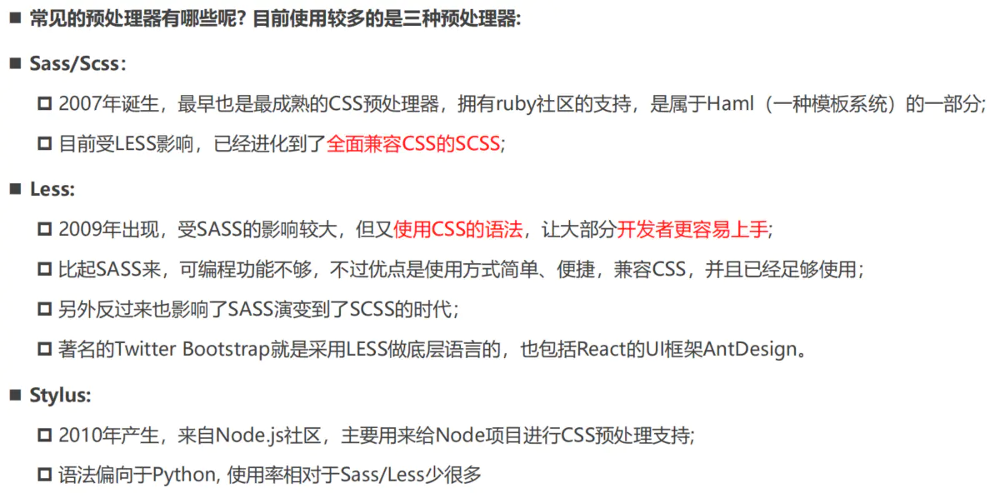
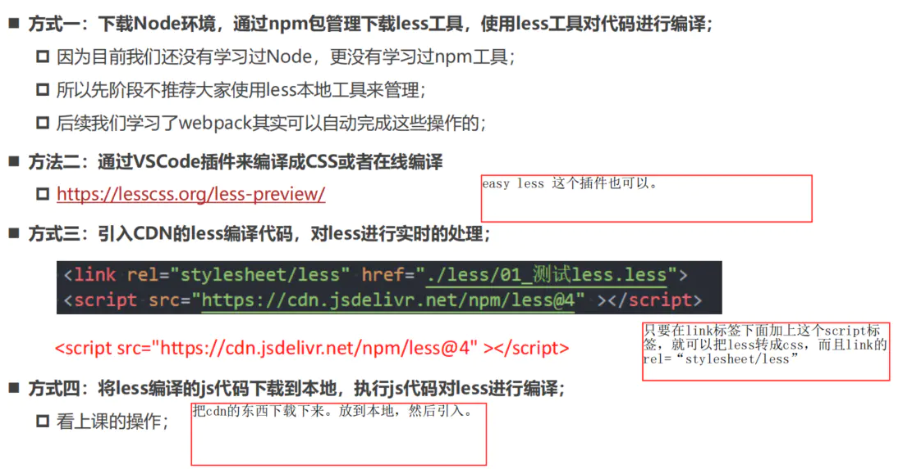

# CSS预处理器Less、Scss

### 1. CSS编写的痛点

1. CSS作为一种样式语言, 本身用来给HTML元素添加样式是没有问题的.
2. 但是目前前端项目已经越来越复杂, 不再是简简单单的几行CSS就可以搞定的, 我们需要几千行甚至上万行的CSS来完成页面的美化工作.
3. 随着代码量的增加, 必然会造成很多的编写不便：
   - 比如大量的重复代码, 虽然可以用类来勉强管理和抽取, 但是使用起来依然不方便；
   - 比如无法定义变量（当然目前已经支持）, 如果一个值被修改, 那么需要修改大量代码, 可维护性很差; (比如主题颜色)
   - 比如没有专门的作用域和嵌套, 需要定义大量的id/class来保证选择器的准确性, 避免样式混淆;
   - 等等一系列的问题；

### 2. CSS预处理器(CSS_preprocessor)

1. CSS 预处理器是一个能让你通过预处理器自己独有的语法来生成CSS的程序;
2. 市面上有很多CSS预处理器可供选择，且绝大多数CSS预处理器会增加一些原生CSS不具备的特性;
3. 代码最终会转化为CSS来运行, 因为对于浏览器来说只识别CSS;

### 3. 常见的CSS预处理器



### 4. Less

Less （Leaner Style Sheets 的缩写） 是一门CSS 扩展语言, 并且兼容CSS。

1. Less增加了很多相比于CSS更好用的特性;
2. 比如定义变量、混入、嵌套、计算等等；
3. Less最终需要被编译成CSS运行于浏览器中（包括部署到服务器中）；

### 5. less代码的编译



easy less 保存less文件以后，就自动在当前文件夹生成css文件。

```js
<script src="https://cdn.jsdelivr.net/npm/less@4" ></script>
```

### 6. 认识Sass和Scss

1. 事实上，最初Sass 是Haml的一部分，Haml 是一种模板系统，由 Ruby 开发者设计和开发。
2. 所以，Sass的语法使用的是类似于Ruby的语法，没有花括号，没有分号，具有严格的缩进；我们会发现它的语法和CSS区别很大，后来官方推出了全新的语法SCSS，意思是Sassy CSS，他是完全兼容CSS的。
3. 目前在前端学习SCSS直接学习SCSS即可：
   - SCSS的语法也包括变量、嵌套、混入、函数、操作符、作用域等；
   - 通常也包括更为强大的控制语句、更灵活的函数、插值语法等；
   - [Sass: Sass Basics (sass-lang.com)](https://sass-lang.com/guide)