# Emmet语法

### Emmet简介

> Emmet是一个Web开发工具，前身是Zen coding ，使用缩写，用于加快HTML和CSS代码的编写速度。使用Emmet能够通过简短的表达式生成HTML或CSS代码片段。使用类似于 CSS 选择器的语法来描述元素的结构与属性。另外，截至2022年，主流的编辑器工具如Visual Studio Code、WebStorm都已经集成了Emmet工具，无需手动安装即可使用。
>
> 在`Emmet`中包括HTML语法和CSS语法两个部分，分别包含若干语法用于简化代码输入。
>
> 所有的语法中，都**不能出现空格**，除非是在特定的括号中。因为Emmet在遇到空格时，就认为已经结束，会停止解析。

### HTML语法

- #### 初始化HTML结构

  - 输入`!`再按`Tab`键即可生成HTML初始化结构：

    ```html
    <!DOCTYPE html>
    <html lang="en">
    <head>
      <meta charset="UTF-8">
      <meta http-equiv="X-UA-Compatible" content="IE=edge">
      <meta name="viewport" content="width=device-width, initial-scale=1.0">
      <title>Document</title>
    </head>
    <body>
      
    </body>
    </html>
    ```

- #### 生成带有`id`的标签

  - 使用操作符`#`即可生成一个带有`id`的标签，如输入`div#main`可生成如下代码片段：

    ```html
    <div id="main"></div>
    ```

    

  - 当标签为`div`时，还可以省略`div`标签，直接输入`#main`即可生成与上面相同的代码片段：

    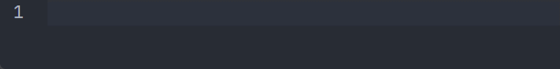

- #### 生成带有`class`的标签

  - 使用操作符`.`即可生成一个带有`class`的标签，如输入`div.main`可生成如下代码片段：

    ```html
    <div class="main"></div>
    ```

    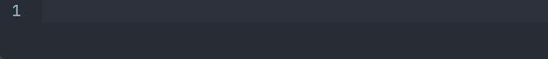

  - 类似的，当标签为`div`时，还可以省略`div`标签，直接输入`.main`即可生成与上面相同的代码片段：

    

- #### 生成带有属性的标签

  - 使用操作符`[]`即可生成一个带有属性的标签，如输入`div[name=syz age=18]`可生成如下代码片段：

    ```html
    <div name="syz" age="18"></div>
    ```

    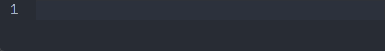

- #### 自定义属性

  - 使用类似CSS中的符号 **[attr="xxx"]** 向元素添加自定义属性：`div[title="Hello world!" colspan=3]`

  - 方括号内的属性数量不限，如果你喜欢，可以一直加

  - 如果不是默认属性值的话会生成插入占位 比如：div[title colspan] 会变成 <div title="" colspan=""> **前提是编辑器支持这样的写法**

  - 属性值可以使用单引号或者双引号都可以

  - 属性值如果不包含空格可以省去引号

    ```html
    <div title="Hello world!" colspan="3"></div>
    ```

- #### 标签属性值数字编号

  - 使用操作符`$`即可生成带有数字编号的标签属性值，如输入`ul>li.className$*3`可生成如下代码片段：

    ```html
    <ul>
      <li class="className1"></li>
      <li class="className2"></li>
      <li class="className3"></li>
    </ul>
    ```

    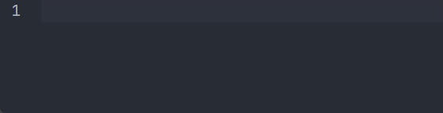

- #### 生成标签内文本

  - 使用操作符`{}`即可生成带文本内容的标签，如输入`div{文本内容}`可生成如下代码片段：

    ```html
    <div>文本内容</div>
    ```

    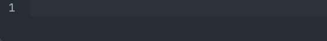

- #### 子节点生成

  - 使用操作符`>`即可生成一对父子节点，如输入`div>span`可生成如下代码片段：

    ```html
    <div><span></span></div>
    ```

    

- #### 兄弟节点生成

  - 使用操作符`+`即可生成一对兄弟节点，如输入`div+div`可生成如下代码片段：

    ```html
    <div></div>
    <div></div>
    ```

    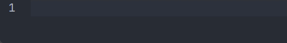

- #### 父级兄弟节点生成

  - 使用操作符`^`即可生成一个父级兄弟节点，父级兄弟节点生成通常与子节点生成同时使用，如输入`div>span^p`可生成如下代码片段：

    ```html
    <div><span></span></div>
    <p></p>
    ```

    

  - 顾名思义，当使用子节点生成使当前上下文处于子节点时，可以通过`^`操作符使上下文回到父节点处：

    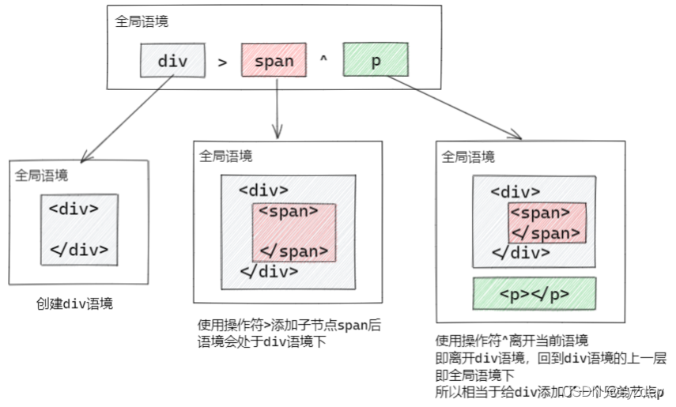

  - 还可以使用多个`^`操作符使语境处于多个父级中，如`div>ul>li^^p`可生成如下代码片段：

    ```html
    <div>
      <ul>
        <li></li>
      </ul>
    </div>
    <p></p>
    ```

    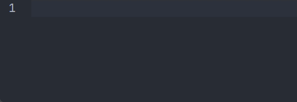

- #### 重复节点生成

  - 使用操作符`*`即可生成重复的节点，如输入`div*3`可生成如下代码片段：

    ```html
    <div></div>
    <div></div>
    <div></div>
    ```

    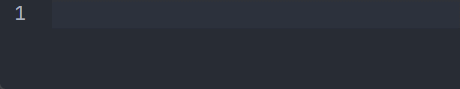

- #### 节点分组

  - 使用操作符`()`即可将部分节点分组形成一个整体，将`()`内的节点与外面节点隔离，避免产生嵌套关系，如输入`div>(ul>li)+p`可生成如下代码片段：

    ```html
    <div>
      <ul>
        <li></li>
      </ul>
      <p></p>
    </div>
    ```

    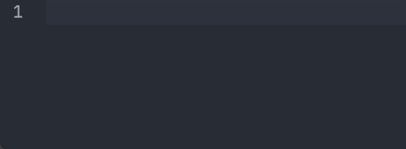

  - 在这个例子中`(ul>li)`可看作一个整体，这里用字母`A`表示，则表达式转换为`div>A+p`，这时`p`标签就为`A`的兄弟节点。若不加`()`，输入`div>ul>li+p`则生成的代码片段如下，可以发现`p`标签变成了`li`标签的兄弟节点：

    ```html
    <div>
      <ul>
        <li></li>
        <p></p>
      </ul>
    </div>
    ```

### CSS语法

- #### `width`和`height`

  - 输入`w100`即可生成`width: 100px`，输入`w100%`即可生成`width: 100%`；`height`同理。

    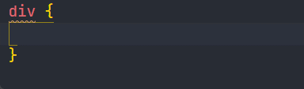

- #### `margin`和`padding`

  - 输入`m10`即可生成`margin: 10px`，当要分别设置四个方向的属性值时，输入`m10px20px30px40px`即可生成代码片段`margin: 10px 20px 30px 40px`；`padding`同理。

    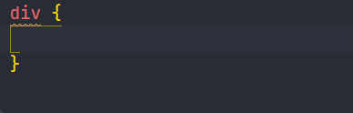

- #### 属性值生成

  - 输入fwb即可生成代码片段`font-weight: bold；`
  - 输入lh20px即可生成代码片段`line-height: 20px；`
  - 输入df即可生成代码片段`display: flex；`
  - 输入jcc即可生成代码片段`justify-content: center；`
  - 输入aic即可生成代码片段`align-items: center；`
  - 输入poa即可生成代码片段`position: absolute；`
  - 输入tac即可生成代码片段`text-align: center；`

