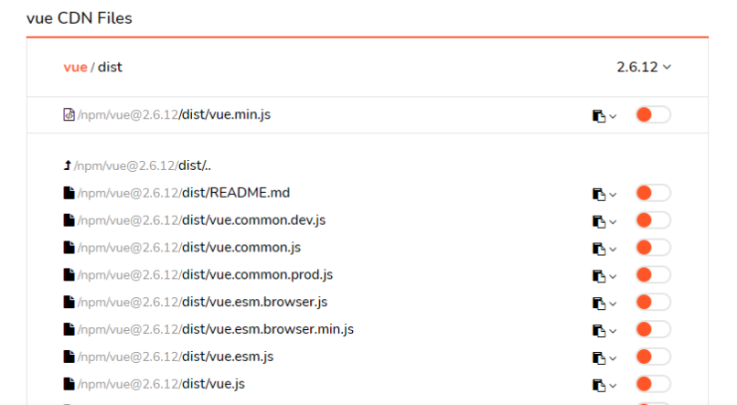
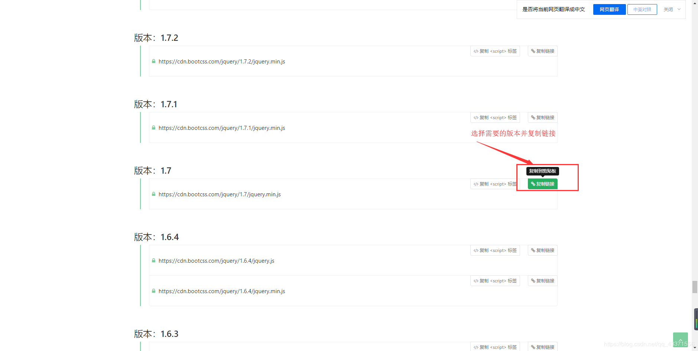

# 静态资源CDN

> ​		CDN的全称是Content Delivery Network，即内容分发网络。CDN是构建在网络之上的内容分发网络，依靠部署在各地的边缘服务器，通过中心平台的负载均衡、内容分发、调度等功能模块，使用户就近获取所需内容，降低网络拥塞，提高用户访问响应速度和命中率。CDN的关键技术主要有内容存储和分发技术。

## jsdelivr (推荐)

- https://www.jsdelivr.com/

- 可以引用的资源包括NPM、github、wordpress的所有资源，github可以是任意体积小于50M的仓库
- 以github为例，只需要通过符合 JSDelivr 规则的 URL 引用，即可直接使用 Github 中的资源
- 例
  - 原github链接：https://raw.githubusercontent.com/growvv/img/master/images/20200118222911.jpeg
  - CDN后的链接：https://cdn.jsdelivr.net/gh/growvv/img@master/images/20200118222911.jpeg

```http
// 用户名/仓库名@版本号/文件名
https://cdn.jsdelivr.net/gh/user/repo@version/file
// load jQuery v3.2.1
https://cdn.jsdelivr.net/gh/jquery/jquery@3.2.1/dist/jquery.min.js


// 使用一个范围内的版本
https://cdn.jsdelivr.net/gh/jquery/jquery@3.2/dist/jquery.min.js
https://cdn.jsdelivr.net/gh/jquery/jquery@3/dist/jquery.min.js


// 忽略版本号则默认使用最新版
// you should NOT use this in production
https://cdn.jsdelivr.net/gh/jquery/jquery/dist/jquery.min.js


// 在任意JS/CSS文件后添加 .min 能得到一个缩小版
// 如果它本身不存在，我们将会为你生成
https://cdn.jsdelivr.net/gh/jquery/jquery@3.2.1/src/core.min.js


// 在末尾加 / 则得到目录列表
https://cdn.jsdelivr.net/gh/jquery/jquery/
```

### 使用方法①

> https://cdn.jsdelivr.net/`代码托管平台`/`用户名`/`仓库名`@`版本或者tag`/`file`

- 代码托管平台
  - gh : 从 github 中查找资源
  - npm : 从 npm 中查找资源
- 用户名 : 代码托管平台的用户名，也就是仓库发布者的名字
- 仓库名 : 仓库名
- @版本或者tag : 如果此参数不写，默认重定向到最新的版本或者tag
- file : 文件名 ， 如果文件名之前有多级路径，请把路径也写上去

- 例

  - 获取 antdv 的最新 js 文件 ：https://cdn.jsdelivr.net/npm/ant-design-vue/dist/ , antdv 是吧资源发布到 npm 上的 ， 你也可以尝试去 github 找找 ， 一般 github 和 npm 都会有的
  - 获取 antdv 的1.7.2 版本的js 文件 ：https://cdn.jsdelivr.net/npm/ant-design-vue@1.7.2/dist/

### 使用方法②

打开官网，中间有搜索框，自己搜索，然后在相应的文件夹中查找cdn资源

- 获取 vue 的最新 js 文件




## bootcdn

- https://www.bootcdn.cn/

### 步骤

1. 搜索自己需要的静态资源

   

2. 选择对应版本

   

3. 引入相关资源（需联网）

   

## unpkg (推荐)

- https://unpkg.com/

> ​		unpkg是`npm`上所有内容的快速全球内容交付网络。使用它可以使用以下网址快速轻松地从任何程序包加载任何文件

### 使用方法

> https://unpkg.com/`包名`@`版本`/`...资源文件以及路径`

## staticaly

- https://www.staticaly.com

```http
# GitHub CDN
https://cdn.staticaly.com/gh/:user/:repo/:tag/:file
https://cdn.staticaly.com/gh/growvv/growvv.github.io/master/README.md

# GitLab CDN
https://cdn.staticaly.com/gl/:user/:repo/:tag/:file

# Bitbucket CDN
https://cdn.staticaly.com/bb/:user/:repo/:tag/:file

# WordPress CDN
https://cdn.staticaly.com/wp/c/:version/wp-includes/:file  
https://cdn.staticaly.com/wp/p/:plugin_name/:version/:file  
https://cdn.staticaly.com/wp/t/:theme_name/:version/:file

# Imgpx CDN
https://cdn.staticaly.com/img/:image_url

# Favicons CDN
https://cdn.staticaly.com/favicons/:favicon_url
```

