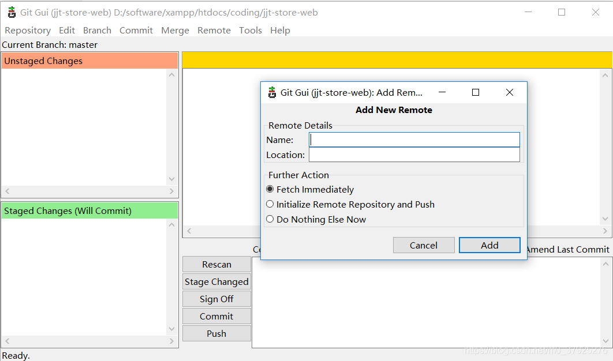
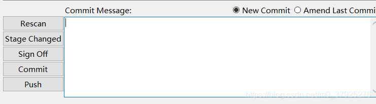
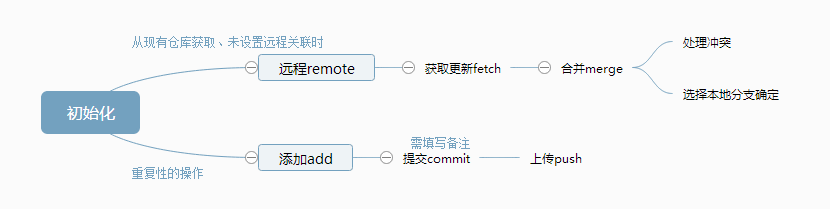

# Git GUI/Git Bash简单步骤

[TOC]

### 一、本地拉取远程仓库

1. 本地新建目标空文件夹，在上一级目录启动Git GUI

2. 连接远程仓库：
   - git bash：`git remote add origin https://github.co/xx.git`
   - git gui： `remote-add`
     - Name：自定义目标仓库名
     - Location：SSH秘钥 / HTTPS

3. 拉取目标仓库至本地
   - Git bash：`$ git pull origin（远程仓库名） master（分支名）`
     - ( 等同于先做git fetch，再执行git merge)
   - Git GUI：`1. Remote-fetch from 2. Merge-local merge`

4. 切换分支
   - Git bash：`$ git checkout -b master(分支名)`
   - Git GUI：`Branch-checkout`
   - 注：
     - 切换分支至dev ：`git checkout dev`
     - 新建分支dev：`git branch dev`
     - 新建并切换到该分支：`git checkout -b dev`

### 二、上传本地代码至远程仓库

- **Git GUI (推荐，更直观)** 

1. rescan：查找更新
2. stage changed：待提交更新
3. 填写更新信息（可以直接点击sign-off）
4. commit：提交
5. push：上传至远程仓库
6. 注：**移除更新：merge–Abort Merge**

### 三、总结

