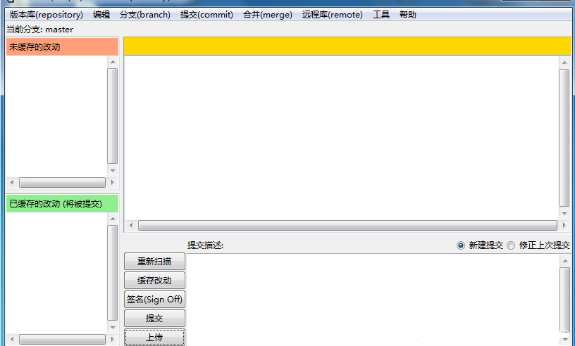

# Git GUI和Git bash汉化

[TOC]

### 1. Git bash设置中文

- Git bash本身就支持中文，只需要在打开Git bash后命令窗口右键 Options -->Windows -->UI languages 下拉选择 **zh_C** ，点击保存即可

  

### 2. Git GUI设置中文

- 下载这个文件：https://files.cnblogs.com/files/chenghu/git-gui-zh-master.zip

- 解压缩后得到 **zh_cn.msg** 文件，将其放到 **/mingw64/share/git-gui/lib/msgs/zh_cn.msg** 路径下，不过新版本Git安装路径下面没有msgs这个文件夹，那么自己创建之后再将这个汉化文件放进去

  

- 重新打开Git GUI ，你就会发现界面已经变成了中文了

  

  

### 3. 汉化包

- *Git GUI汉化包来源：https://github.com/stayor/git-gui-zh* 