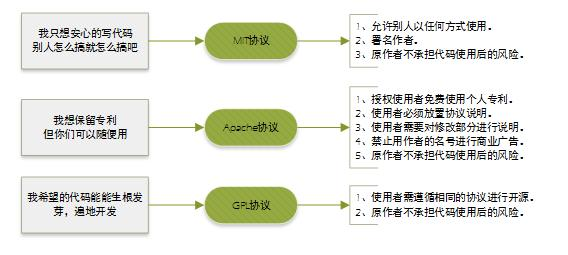
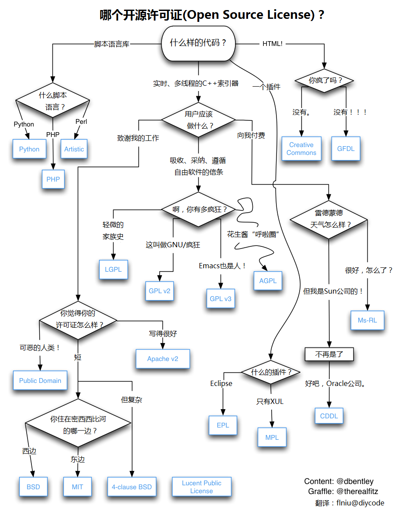

# GitHub 中声明 LICENSE 的方法

[TOC]

### 1. 创建一个LICENSE

1. 当我们在 GitHub 浏览一些开源项目时，我们经常会看到这样的标志：

   

2. 如上图所示，Apache-2.0，我们可以将其称之为开源许可证，那么到底开源许可证是什么呢？

   - 开源许可证即授权条款。开源软件并非完全没有限制。最基本的限制，就是开源软件强迫任何使用和修改该软件的人承认发起人的著作权和所有参与人的贡献。任何人拥有可以自由复制、修改、使用这些源代码的权利，不得设置针对任何人或团体领域的限制；不得限制开源软件的商业使用等。而许可证就是这样一个保证这些限制的法律文件。

   - 常见的开源许可证包括：
     - Apache License 2.0
     - GNU General Public License v3.0
     - MIT License

3. 如何创建一个项目开源许可证？

   - 在项目首页，点击`Create new file`，创建名为`LICENSE`文件：

     

   - 当我们键入`LICENSE`文件名的时候，GitHub 就已经自动提示`Choose a license template`选项了

     

   - 点击进入，最左侧展示了 GitHub 可以选择的开源许可证名称，以`MIT License`为例，点击之后，中间部分显示具体开源许可证的内容。在此处，我们可以自由选择自己想要的许可证，然后点击`Review and submit`：

     

   - 在这里，我们有两个选择：

     - 标注 1 ：`Commit directly to the master branch.`直接将此许可证提交到master分支；
     - 标注 2 ：`Create a new branch for this commit and start a pull request.`新建立一个分支，然后我们可以提PR到master，再进行合并。
     - 在此，我们选择 标注 1 所示的内容，直接将MIT License提交到master分支：

     

     

   - 到此为止，我们已经为`cg-favorite-list`项目创建了一个开源许可证

     

### 2. 如何选择开源许可证

1. 世界上的开源许可证，大概有[上百种](https://www.gnu.org/licenses/license-list.html)。很少有人搞得清楚它们的区别。即使在最流行的六种----[GPL](https://www.gnu.org/licenses/gpl.html)、[BSD](https://en.wikipedia.org/wiki/BSD_licenses)、[MIT](https://en.wikipedia.org/wiki/MIT_License)、[Mozilla](https://www.mozilla.org/MPL/)、[Apache](https://www.apache.org/licenses/LICENSE-2.0)和[LGPL](https://www.gnu.org/copyleft/lesser.html)----之中做选择，也很复杂。所以直接上图：

   

   

   

   