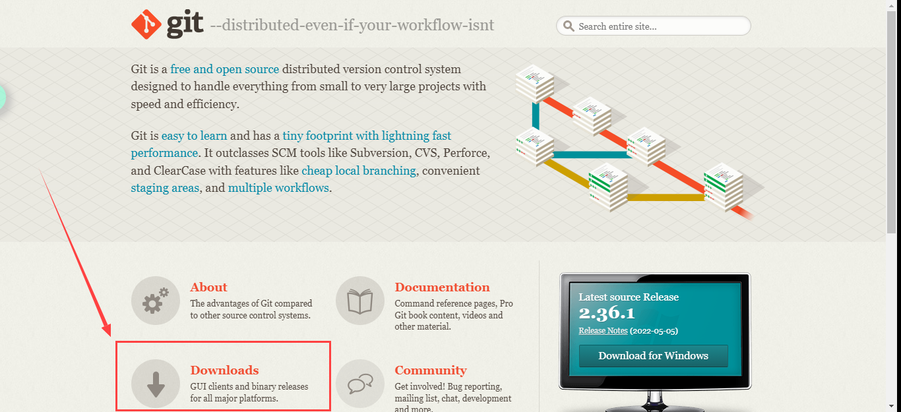
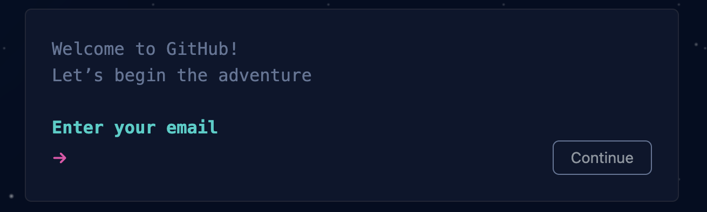
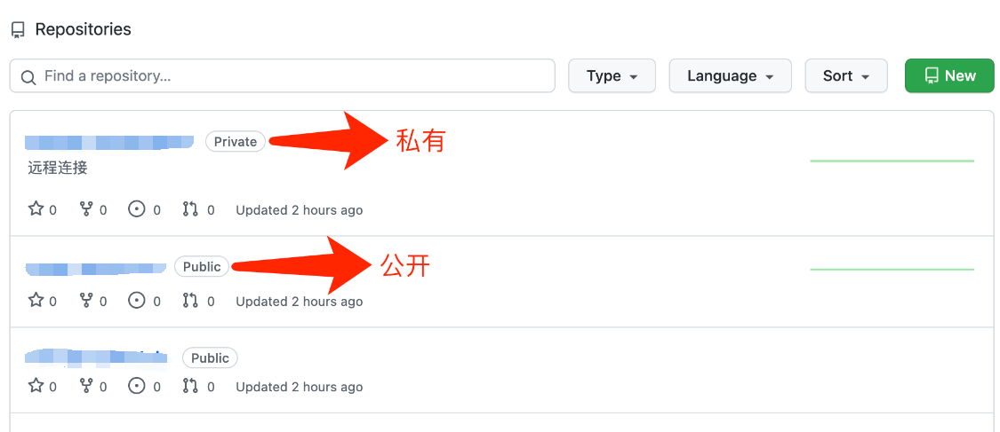
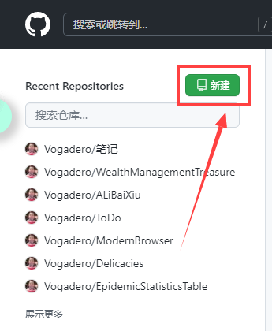
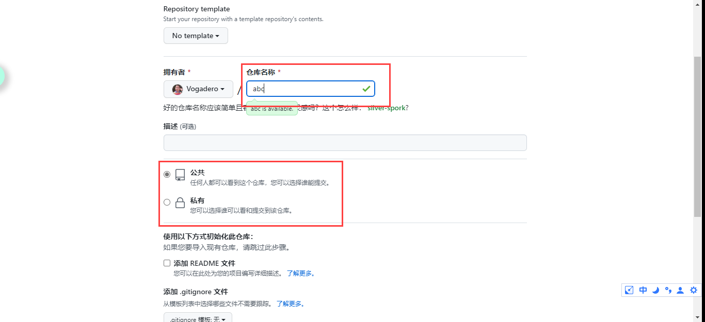
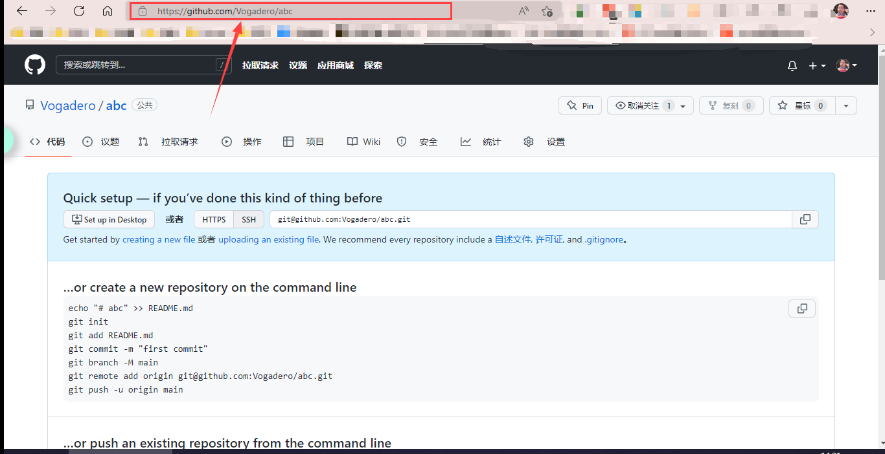
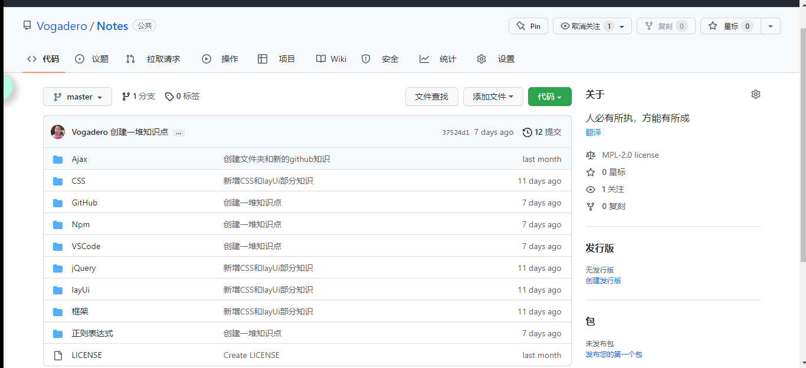
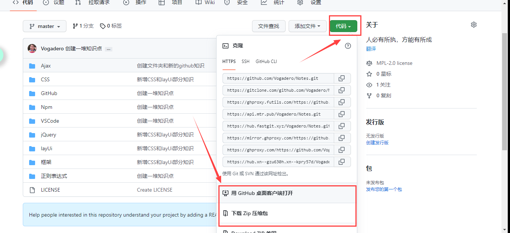

# GitHub 使用指南

[TOC]

### 1. 你需要安装 Git 这个软件



#### 1.1. 如果你用 Windows

- 直接在 [Git 官网](https://git-scm.com/)上下载安装包进行安装即可。


#### 1.2. 如果你用 Mac OS

- 可以使用 [homebrew](https://brew.sh/) 安装：`brew install git`，或使用 [MacPorts](https://www.macports.org/) 安装：`sudo port install git`。


#### 1.3. 如果你用 Linux

- 在 Ubuntu 上可以使用 `apt install git` 安装，在 CentOS 上可以使用 `yum install git` 安装。

### 2. 你需要有一个 GitHub 账号

- 在 [GitHub](https://github.com/signup) 上注册一个账号，注意这里输入的用户名是账号的唯一标识，一经确认就无法修改。

  

### 3. 访问实验室主页

- 作为普通路人，你只能访问公开仓库（标识为 `public`）；在加入该组织后，你可以访问所有公开仓库与私有仓库（标识为 `private`），并对任意仓库都有最高权限（包括但不限于 `clone`、`pull`、`push`）。

  

### 4. 我想新建一个仓库，把我本地的代码传上去，怎么做？

- 假设你本地的代码放在 `C:/Users/Documents/abc` 这个目录下：

  1. 首先，在主页上点击 New 新建一个代码仓库：

     

  2. 在 Repository name 处填入 `abc`，其他选项保持默认，点击 Create repository（如果这份代码可以在网上公开，你可以选择 Public）：

     

  3. 创建完成后，浏览器将自动跳转到该代码仓库的页面，此时新建的是一个空仓库，里面什么也没有。记住该仓库的链接为https://github.com/Vogadero/abc
  
     
  
  4. 打开命令行，使用 `cd C:/Users/Documents/abc` 进入本地代码所在的目录，使用 `git init` 对该目录进行初始化，使用 `git add .` 将该目录下的所有代码文件加入到 Git 的暂存区中，使用 `git commit -m "initialize"` 将暂存区中的文件提交到 Git 的本地仓库中：
  
     ```shell
     $ cd C:/Users/Documents/abc
     $ git init
     Initialized empty Git repository in /Users/Documents/abc/.git/
     $ git add .
     $ git commit -m "initialize"
     [master (root-commit) 588d19f] initialize
      4 files changed, 0 insertions(+), 0 deletions(-)
      create mode 100644 loss.py
      create mode 100644 network.py
      create mode 100644 test.py
      create mode 100644 train.py
     ```
  
  5. 使用 `git remote add origin https://github.com/Vogadero/abc` 将本地仓库与远程仓库关联在一起，使用 `git push -u origin master` 将本地仓库里的内容上传到远程仓库：
  
     ```shell
     $ git remote add origin https://github.com/Vogadero/abc
     $ git push -u origin master
     Enumerating objects: 3, done.
     Counting objects: 100% (3/3), done.
     Delta compression using up to 12 threads
     Compressing objects: 100% (2/2), done.
     Writing objects: 100% (3/3), 233 bytes | 233.00 KiB/s, done.
     Total 3 (delta 0), reused 0 (delta 0), pack-reused 0
     To https://github.com/Vogadero/abc
      * [new branch]      master -> master
     Branch 'master' set up to track remote branch 'master' from 'origin'.
     ```
  
  6. 刷新浏览器，可以看到已经成功上传到了远程仓库：
  
     

### 5. 我对主页里某份代码感兴趣，想下载到本地，怎么做？

- 假设你感兴趣的代码链接为 [Vogadero/Notes: 人必有所执，方能有所成 (github.com)](https://github.com/Vogadero/Notes)，有两种方法下载代码：

  - 第一种方法：在命令行使用 `git clone https://github.com/Vogadero/Notes` 下载：

    ```shell
    $ git clone https://github.com/Vogadero/Notes
    Cloning into 'abc'...
    remote: Enumerating objects: 3, done.
    remote: Counting objects: 100% (3/3), done.
    remote: Compressing objects: 100% (2/2), done.
    remote: Total 3 (delta 0), reused 3 (delta 0), pack-reused 0
    Receiving objects: 100% (3/3), done.
    ```

  - 第二种方法：直接在仓库页面点击 Download ZIP 下载：
  
    

### 6. 附录：命令解释

- Git 仓库分为远程仓库与本地仓库，远程仓库放在 **GitHub**、**Gitee** 等网站上，本地仓库放在本地电脑中。对于本地的一个代码文件夹而言，存在**工作区（workspace）**、**暂存区（index）**和**仓库（repository）**这三个空间，代码默认都放在工作区中，经过 `git add` 会被添加到暂存区中，经过 `git commit` 会被提交到仓库中，经过 `git push` 就可以将本地仓库里的东西上传到远程，关系如下图所示：

  

- `git init`：在一个本地目录中初始化 Git 仓库，该目录下会新增一个 `.git/` 文件夹，用于记录与 Git 有关的信息
- `git add <file>`：将文件从工作区添加到暂存区
- `git commit -m <message>`：将文件从暂存区提交到本地仓库，附带一条消息，表示本次提交新增 / 修改了哪些内容
- `git push`：将本地仓库里提交的东西上传到远程仓库，这样其他人就可以看到你修改过的内容
- `git clone`：将一个远程仓库下载到本地，成为本地仓库
