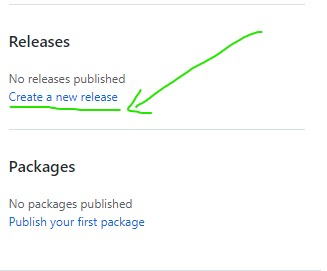
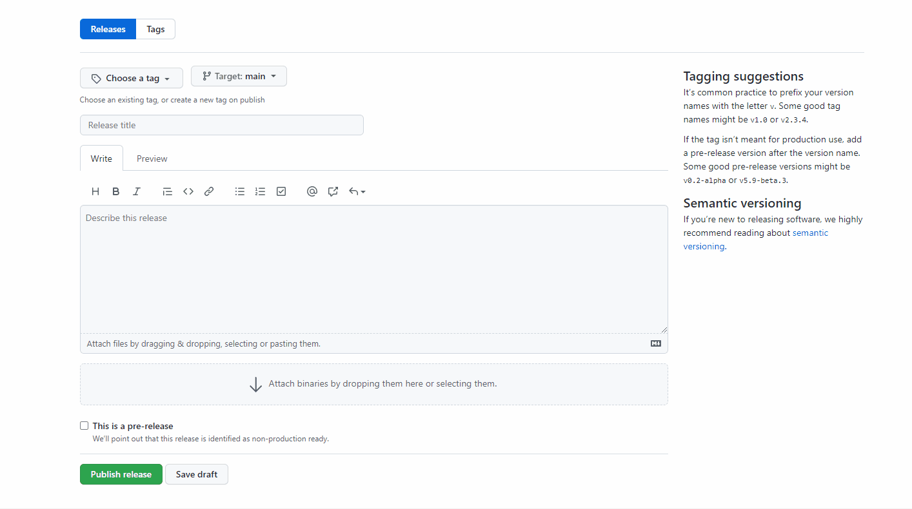

# GitHub如何创建一个新的Releases

1. 打开任意一个仓库，在右侧点击create a new release

   

2. 使用 github 打 tag 的时候失败，错误提示为`We weren’t able to create the release for you. Make sure you have a valid tag.`

   - 解决方法：需要先手动创建，再进行输入，就可以成功打tag

   

   