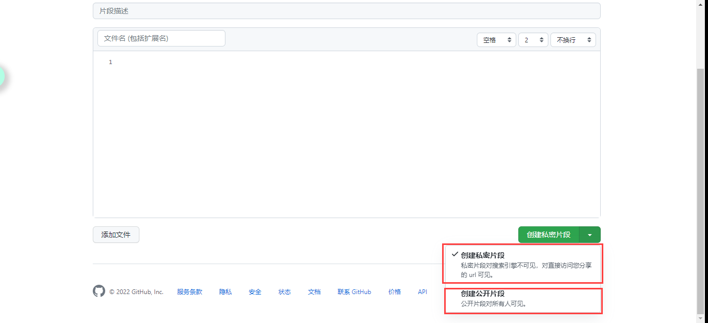
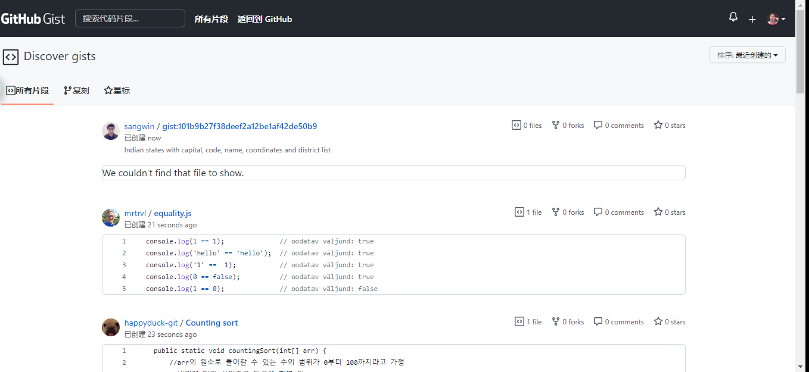
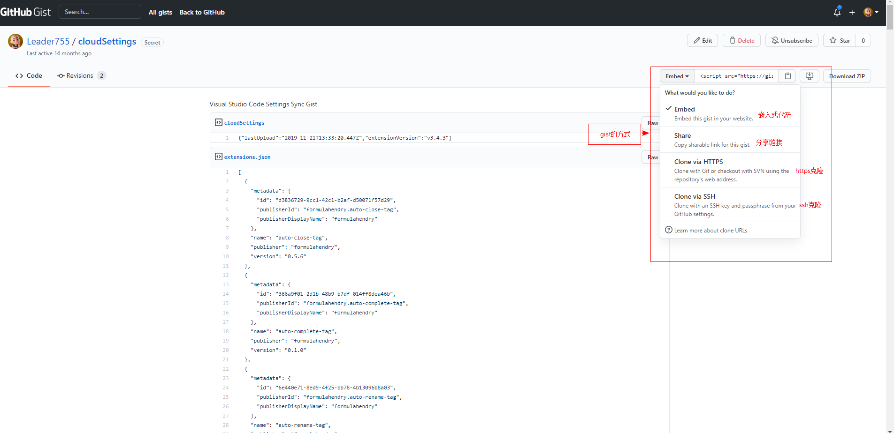
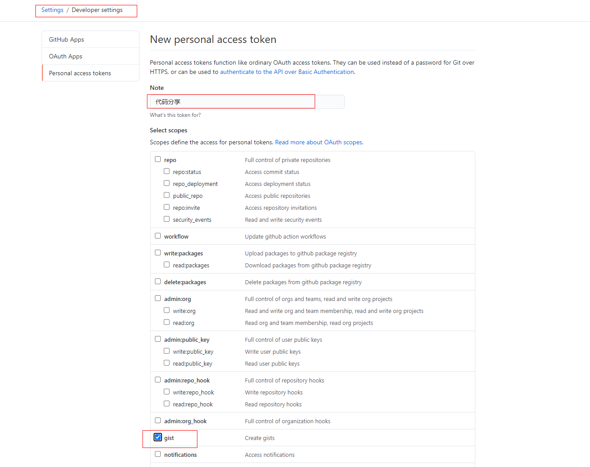
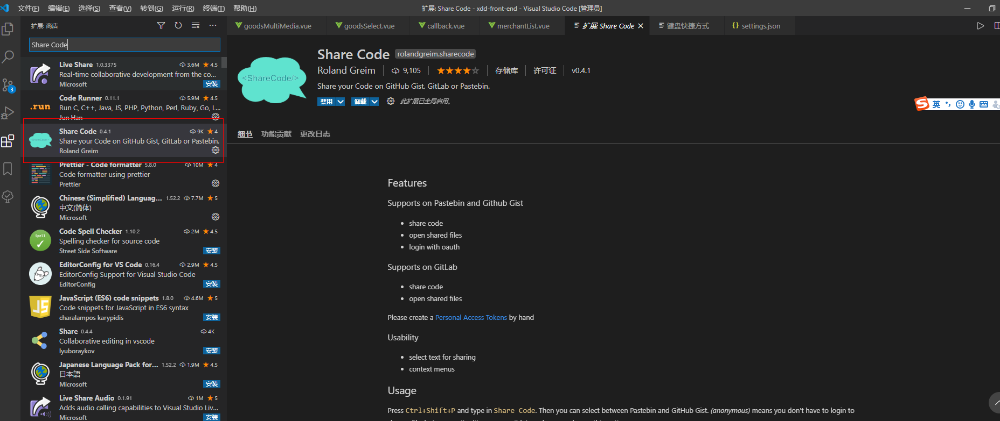
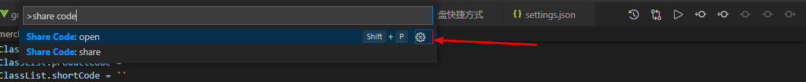
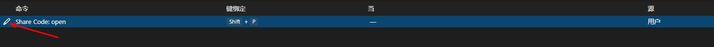
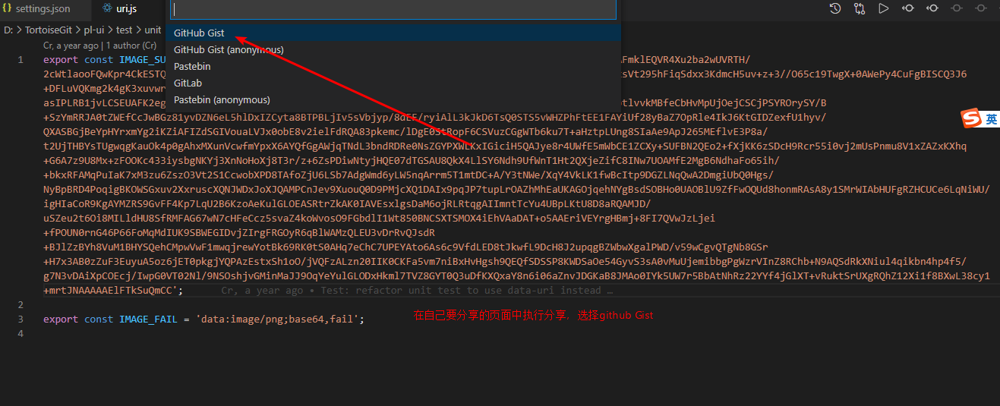

## 谈谈Gist

[TOC]

## 1. Gist是什么

> - Gist是一种与其他人共享代码片段和粘贴的简单方法。 当您需要与同事或朋友共享示例代码或技术时，可以使用它。
> - GitHub提供了一个平台，可以作为团队（私人仓库）或整个世界（公共仓库）的回购共享整个项目。
> - Gist就是小型代码片段的分享. 类似的服务还有如 [Pastebin](http://pastebin.com/) 和 [Pastie](http://pastie.org/), 但明显出生于Github的Gist更有优势了。
> - Gist可以用来写一些东西，然后可以分享，类似笔记软件
> - 每个Gist都是一个Git库，有版本历史，可以被fork或clone
> - Gist有两种：公开的和私有的，私有的不会在你的Gist主页显示，也无法用搜索引擎搜索到，但这个链接是人人都能访问的
> - Gist可以搜索、下载、嵌入到网页
> - 关于Gist的详细介绍，请阅读官方文档[About gists](https://help.github.com/en/articles/about-gists)

## 2. 创建新Gist, 编辑修改Gist

> - https://gist.github.com/ , 直接填写内容或者在自己的Gist 右上角上点击 New gist即可
> - 可以一个Gist多个文件, 使用 Add file 添加即可.
> - 可以设置indent为空格space还是tab, tab长度, 是否行缩进.
> - 点 Create secret gist 创建私有代码, Create public gist 创建开放的gist. 前者可以不被搜索到.
> - 创建Gist后,点选自己的某个Gist, 进去后右上角可进行网上的编辑/修改: Edit, 编辑; Delete, 删除; Star, 标星. 旁边还有举报 . 修改后下方的Update public/secret gist即可保存修改.
> - 编辑时上方的Make Secret可以转为私有库.



## 3. 浏览Gist

> - 左上角可以看到列出自己最近的gist, 右上角See all of your gists可以查看所有自己的Gist.私有gist会显示SECRET标签.
> - 搜索框可以进行代码搜索(开放gist), 可能搜出相关的代码片段
> - 点All Gists可以到Discover gists模式, 查看最近发布或被fork的gists(或者别的排序方式). 参考意义不大.
> - 在浏览Gist时点击右上GithubGist图标或者左上头像选Your Gists即可返回
> - 在浏览Gist文件时, 点Raw可以看文字的纯代码.



## 4. 分享

> 点击一个gist进去, , 在 Edit菜单下方有几个选项：
>
> - 分享 (可选方式框,代码/地址, 复制到黏贴板)，
>   - Embed 是HTML嵌入代码
>   - Share是分享链接
>   - Clone via HTTPS是https克隆
>   - Clone via SSH是ssh克隆
> - 下载下来使用Github Desktop打开管理
> - Download Zip(下载全部内容并打包)



```js
<script src="https://gist.github.com/Leader755/93a14d335e6650edbb7fe17e6aedb51d.js"></script>
```

## 5. 创建VSCode的gist的代码片段分享

1. 首先在github中创建Personal access tokens，创建成功将获取到秘钥保存(只会展示一次)

   

2. vscode中插件中搜索share code并安装

   

3. 设置快捷键并在setting.json中配置github等相关的信息

   - `ctrl+shift+p`打开搜索，输入`share code`，并点击设置配置快捷方式

     

     

   - 在setting.json中配置以下

     ```js
      //vscode的gist的分享
       "shareCode.github.username": "Leader755",
       "shareCode.github.authtoken": "3751ef6lkgds4e0befkhdwe82f1bccf907b3a6038a22",//填写自己的
       "shareCode.pastebin.username": "...",
       "shareCode.pastebin.authtoken": "...",
       "shareCode.gitlab.baseurl": "...",
       "shareCode.gitlab.authtoken": "..."
      //vscode的gist的分享
     ```

4. vscode中分享代码片段到github

   

   