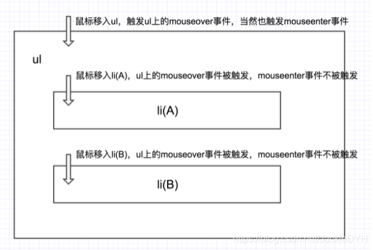
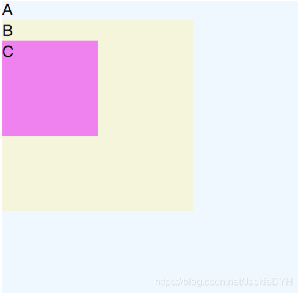
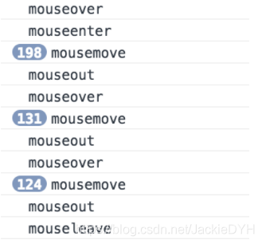

# JavaScript中鼠标事件mouseover、mouseenter和mouseleave、mouseout的区别

> mouseover：当鼠标移入元素或其子元素都会触发事件，所以有一个重复触发，冒泡过程。对应的移除事件是mouseout
>
> mouseenter:当鼠标移除元素本身（不包含元素的子元素）会触发事件，也就是不会冒泡，对应的移除事件是mouseleave

### 解释

- `mouseenter`：当鼠标移入某元素时触发。
- `mouseleave`：当鼠标移出某元素时触发。
- `mouseover`：当鼠标移入某元素时触发，移入和移出其子元素时也会触发。
- `mouseout`：当鼠标移出某元素时触发，移入和移出其子元素时也会触发。
- `mousemove`：鼠标在某元素上移动时触发，即使在其子元素上也会触发。
- `mouseout`、`mouseover`和`mouseleave`、`mouseenter`最大的区别，在于子元素连带触发。

### 异同

1. 是否支持冒泡
2. 事件的触发时机



### mouseenter事件

- 当鼠标从元素的边界之外移入元素的边界之内时，事件被触发。而鼠标本身在元素边界内时，要触发该事件，必须先将鼠标移出元素边界外，再次移入才能触发。也就是说：`mouseover`支持事件冒泡，而`mouseenter`不支持事件冒泡。由于`mouseenter`不支持事件冒泡，导致在一个元素的子元素上进入或离开的时候会触发其`mouseover`和`mouseout`事件，但不会触发`mouseenter`和`mouseleave`事件。

### 模拟mouseenter事件

- 可见`mouseover`事件因其具有冒泡的性质，在子元素内移动的时候，频繁被触发，如果我们不希望如此，可以使用`mouseenter`事件代替之，但是早期只有ie浏览器支持该事件，虽然现在大多数高级浏览器都支持了`mouseenter`事件，但是难免会有些兼容问题，所以如果可以自己手动模拟，那就太好了。

```html
<!DOCTYPE html>
<html>
<head lang="en">
    <meta charset="UTF-8">
    <title></title>
    <style>
    .a{
      width: 500px;
      height: 500px;
      background: aliceblue;
    }
    .b{
      width: 200px;
      height: 200px;
      background: beige;
    }
    .c{
      width: 100px;
      height: 100px;
      background: violet;
    }
    </style>
</head>
<body>
    <div class="a">A
      <div class="b"
        onmouseenter="mouseenter()"
        onmouseleave="mouseleave()"
        onmouseout="mouseout()"
        onmouseover="mouseover()"
        onmousemove="mousemove()">B
        <div class="c">C
        </div>
      </div>
    </div>
    <script>
      function mouseenter(){
        console.log('mouseenter')
      }
      function mouseleave(){
        console.log('mouseleave')
      }
      function mouseout(){
        console.log('mouseout')
      }
      function mouseover(){
        console.log('mouseover')
      }
      function mousemove(){
        console.log('mousemove')
      }
    </script>
</body>
</html>
```



- 从A元素到C元素，再从C回到A，控制台输出如下

