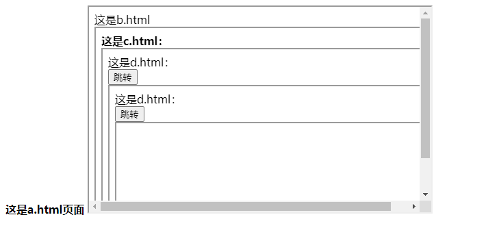
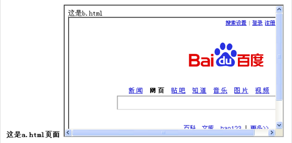

# window.location.href和window.open的几种用法与区别

[TOC]

## 一、location.href常见的几种形式

```js
self.location.href;//当前页面打开URL页面
window.location.href;//当前页面打开URL页面
this.location.href;//当前页面打开URL页面
location.href;// 当前页面打开URL页面
parent.location.href;//在父页面打开新页面
top.location.href;//在顶层页面打开新页面  
```

- ①如果页面中自定义了frame，那么可将parent、self、top换为自定义frame的名称,效果是在frame窗口打开url地址。
- ②此外，`window.location.href=window.location.href;和window.location.Reload();`都是刷新当前页面。区别在于是否有提交数据。当有提交数据时，window.location.Reload()会提示是否提交，`window.location.href=window.location.href;`则是向指定的url提交数据.
- ③用`window.open()`打开新页面 
  但是用`window.location.href＝""` 却是在原窗口打开的. 有时浏览器会一些安全设置`window.open`肯定被屏蔽。例如避免弹出广告窗口。

## 二、location.href不同形式之间的区别

### 2.1 示例

- a.html:

```html
<form id="form1" action="">
<div><strong>这是a.html页面<strong>
<iframe src="b.html" width="500px" height="300px"></iframe> </strong></strong></div>
</form>
```

- b.html

```html
<span>这是b.html</span><span id="span1"></span><br />
<iframe src="c.html" width="500px" height="300px"></iframe>
```

- c.html

```html
<span><strong>这是c.html：<strong></span><span id="span1"></span><br />
<iframe src="d.html" width="500px" height="300px"></iframe>
```

- d.html

```html
<span>这是d.html：</span><span id="span1"></span><br />
<input type='button' onclick='jump();' value='跳转'>
<iframe src="d.html" width="500px" height="300px"></iframe>
```

- a.html里面嵌着b.html；b.html里面嵌着c.html；c.html里面嵌着d.html



### 2.2 测试

- **在d.html里面head部分写js**

```js
<strong>function jump()
{
//经测试：window.location.href与location.href,self.location.href,location.href都是本页面跳转
//作用一样
window.location.href="http://www.baidu.com";
//location.href="http://www.baidu.com";
//self.location.href="http://www.baidu.com";
//this.location.href="http://www.baidu.com";
//location.href="http://www.baidu.com";
} </strong>
```

- **再次运行a.html,点击那个"跳转" 按钮，运行结果如下图二**


- **对比图一和图二的变化，你会发现d.html部分已经跳转到了百度的首页，而其它地方没有发生变化。这也就解释了"本页跳转"是什么意思。好，再来修改d.html里面的js部分**

```js
function jump()
{
parent.location.href='http://www.baidu.com';
}
```

- **运行a.html后，再次点击"跳转" 按钮，运行结果图三如下**



- **对比图一和图三，你会发现a.html中嵌套的c.html部分已经跳转到了百度首页。**
- **分析：我点击的是a.html中嵌套的d.html部分的跳转按钮，结果是a.html中嵌套的c.html部分跳转到了百度首页，这就解释了"parent.location.href是上一层页面跳转"的意思。再次修改d.html里面的js部分**

```js
function jump()
{
top.location.href='http://www.baidu.com';
}
```

- **运行a.html后，再次点击"跳转" 按钮，你会发现，a.html已经跳转到了百度首页。**

-  **分析：我点击的是a.html中嵌套的d.html部分的跳转按钮，结果是a.html中跳转到了百度首页，这就解释了"top.location.href是最外层的页面跳转"的意思。**

## 三、location.href总结

- location是window对象的属性，而所有的网页下的对象都是属于window作用域链中（这是顶级作用域），所以使用时是可以省略window。而top是指向顶级窗口对象，parent是指向父级窗口对象。

1. **"top.location.href"是最外层的页面跳转**
2. **"window.location.href"、"location.href"是本页面跳转**
3. **"parent.location.href"是上一层页面跳转**

## 四、window.location.href和window.open的区别

1. `window.location`是window对象的属性，而`window.open`是window对象的方法 `window.location`是你对当前浏览器窗口的URL地址对象的参考！`window.open`是用来打开一个新窗口的函数！

2. `window.open`不一定是打开一个新窗口！只要有窗口的名称和`window.open`中第二个参数中的一样就会将这个窗口替换，用这个特性的话可以在iframe和frame中来代替`location.href`。 
   如`<iframe name="aa"></iframe>  <input type=button  onclick="window.open('1.htm','aa','')">`和  `<input type=button  
     onclick="self.frames['aa'].location.href='1.htm'">`的效果一样 

3. 在给按钮、表格、单元格、下拉列表和DIV等做链接时一般都要用Javascript来完成，和做普通链接一样，可能我们需要让链接页面在当前窗口打开，也可能需要在新窗口打开，这时我们就可以使用下面两项之一来完成`window.open` 用来打开新窗口，`window.location` 用来替换当前页，也就是重新定位当前页，可以用以下来个实例来测试一下。 

   ```html
   <input type="button" value="新窗口打开" onclick="window.open('http://www.google.com')"> 
   <input type="button" value="当前页打开" onclick="window.location='http://www.google.com/'"> 
   ```

4. `window.location`或`window.open`如何指定target? 这是一个经常遇到的问题，特别是在用frame框架的时候 
   解决办法：`window.location` 改为 `top.location`　即可在顶部链接到指定页 或 `window.open("你的网址","_top");` 

5. `window.open` 用来打开新窗口，`window.location` 用来替换当前页，也就是重新定位当前页，用户不能改变`document.location`(因为这是当前显示文档的位置)。`window.location`本身也是一个对象。但是,可以用`window.location`改变当前文档 (用其它文档取代当前文档),而`document.location`不是对象。服务器重定向后有可能使`document.url`变动,但`window.location.href`指的永远是访问该网页时用的URL。大多数情况下,`document.location`和`location.href`是相同的，但是，当存在服务器重定向时，`document.location`包含的是已经装载的URL，而`location.href`包含的则是原始请求的文档的URL.

6. `window.open()`是可以在一个网站上打开另外的一个网站的地址，而`window.location()`是只能在一个网站中打开本网站的网页。