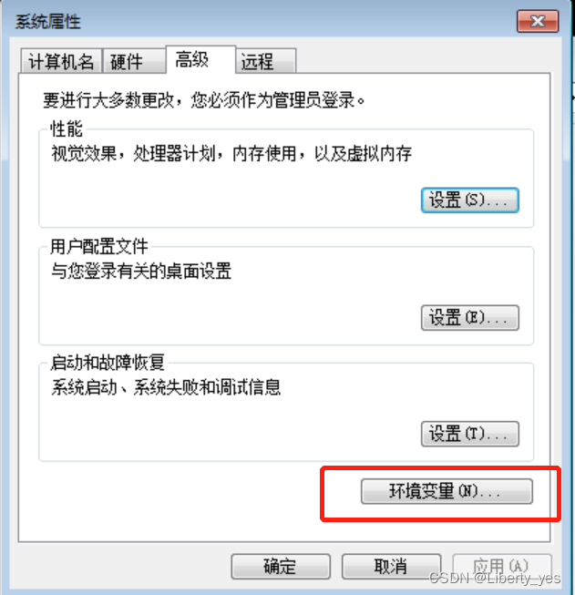

# 离线安装npm包，内网安装@vue/cli

> *因为npm被集成在nodejs中，而安装nodejs只需要把nodejs安装包copy到内网电脑安装就行*

## 方案一

### 1. 复制本地（外网电脑npm-cache缓存目录）

- cmd运行命令 `npm config get cache`查看npm安装包存放目录


### 2. 进入目标目录，找到目录下的文件夹npm-cache，复制一份


### 3. 查看内网电脑全局安装目录

- 命令行运行 `npm root -g` 查看全局安装目录；然后把npm-cache缓存目录复制到内网电脑npm目录里面（如果放到同级会报错，前提内网电脑已经安装了nodejs)


### 4. 在内网电脑上运行安装命令，安装离线包

```shell
npm install --cache ./npm-cache --optional --cache-min 99999999999 --shrinkwrap false yarn
npm install --cache ./npm-cache --optional --cache-min 99999999999 --shrinkwrap false webpack
npm install --cache ./npm-cache --optional --cache-min 99999999999 --shrinkwrap false webpack-cli
npm install --cache ./npm-cache --optional --cache-min 99999999999 --shrinkwrap false @vue/cli
......
```

### 5. 把vue项目复制到内网 包括node_modules文件夹 （注意 mac和windows依赖包不能共用）

### 6. 查看全局命令是否正常 `npm list -global --debth 0`

- 正常


- 异常


- 解决办法
  - `npm root -g`命令找到npm文件夹
  - 删除与npm目录同级的node_modules文件夹
  - 把npm-cache文件夹放到npm目录里面
  - 运行项目 `yarn run serve`

## 方案二

- 如果方案一4、5、6步骤没法安装成功，就在外网电脑上进入你的npm全局目录，步骤同第2步：找到npm和npm-cache两个文件夹，直接打包扔到内网上


- 在内网电脑上，找到npm安装路径，步骤同第3步`npm root -g`,把npm和npm-cache两个文件直接放进去替换掉原来的文件


- 计算机-右键属性-高级系统设置-环境变量-PATH-编辑





- 复制刚刚的npm文件夹路径，把npm路径粘贴进去，**注意如果是win10（不含）以下的系统，粘贴路径之前要先在结尾处加一个英文的分号标点符号，以隔开上一个路径**，点击确定-确定-确定


- 最后一步打开刚刚的npm目录：`E:\KF5188\AppData\npm`，进入node_modules的下一级目录npm，找到文件npmrc用记事本打开，把路径替换成新的npm安装路径，保存关闭


- 此时再运行cmd命令窗口，发现vue环境就成功安装好了


## 方案三

### 1. 通过`npm config get cache`命令复制本地local下的npm-cache文件，至内网环境同目录下

### 2. 通过`-offline`指令使用本地缓存的依赖包进行安装

```shell
npm install -offline
```

### 3. 如果新增了依赖包，则需要把npm cache复制到离线环境，然后需要替换项目的package.json、package-lock.json文件，然后再进行install --offline即可

## Tips


- npm的缓存机制
  - **`npm install`**在执行时，首先构建依赖树，一次安装依赖树中的包
  - 如果缓存中有依赖包，就会向远程仓库确认是否过期（304检查）检查，如果过期，就使用新的返回数据刷新缓存，否则就直接使用缓存中的数据
  - 此外还提供了新的参数，是用户可以指定缓存使用的策略：
    - **`--prefer-offline`**: 将使npm跳过任何条件请求（304检查）直接使用缓存数据，只有在缓存无法匹配到的时候，才去访问网络。这样我们将依赖包添加到项目的过程就会快很多。
    - 例如，**`npm install express --prefer-offline`**将现在缓存中匹配express，只有在本地缓存没有匹配到的情况下，才去联网下载。
    - **`--prefer-online`**: 与它将强制npm重新验证缓存的数据（使用304检查），并使用重新验证的新鲜数据刷新缓存。
    - **`--offline`** 将强制npm使用缓存或退出。如果尝试安装的任何内容尚未在缓存中，则它将出现代码错误。
  - 可以通过**`.npmrc`**或者**`npm config set`**来设置缓存使用的策略。
  - 一个新的**`npm cache verify`**命令，它将对你的缓存进行垃圾回收，减少不需要的东西占据的磁盘使用量，并且会对索引和内容进行全面的完整性验证