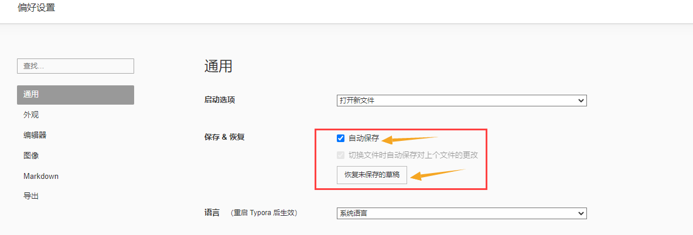
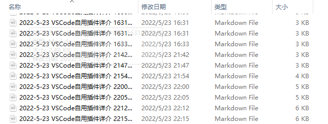

# Typora恢复文件，找回忘记保存的记录

> ​	Typora：老子也有版本管理~

[TOC]

### 1. 打开Typora，点击文件 -> 选择偏好设置打开

- 首先在通用里，找到右侧保存&恢复，点击恢复未保存的文件；
- 此处建议勾选自动保存选项，软件默认的自动保存频率是 5 分钟一次，你也可以打开「高级设置」，修改配置文件 conf.user.json 中的参数来改变这一频率，勾选之后需要重启才能生效

### 2. 点击之后就是你需要恢复的文件，双击打开就行

