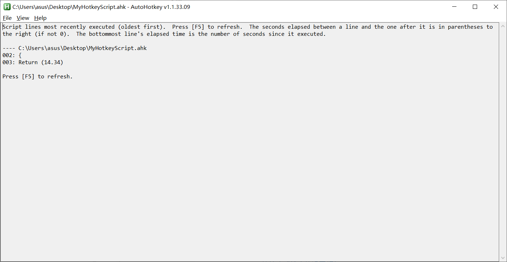
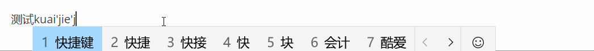
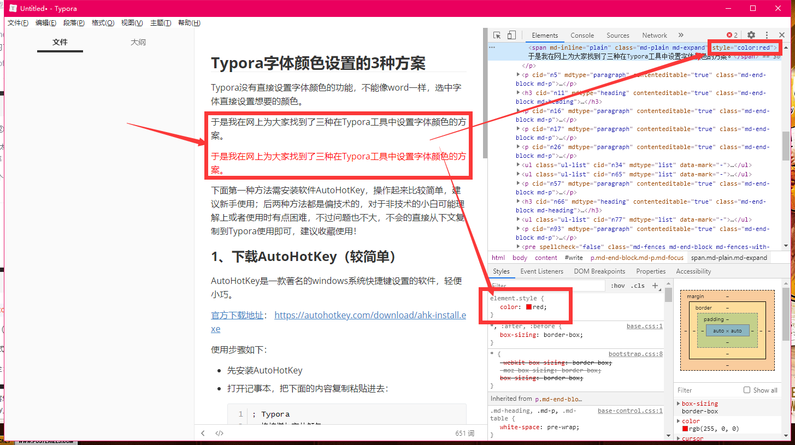
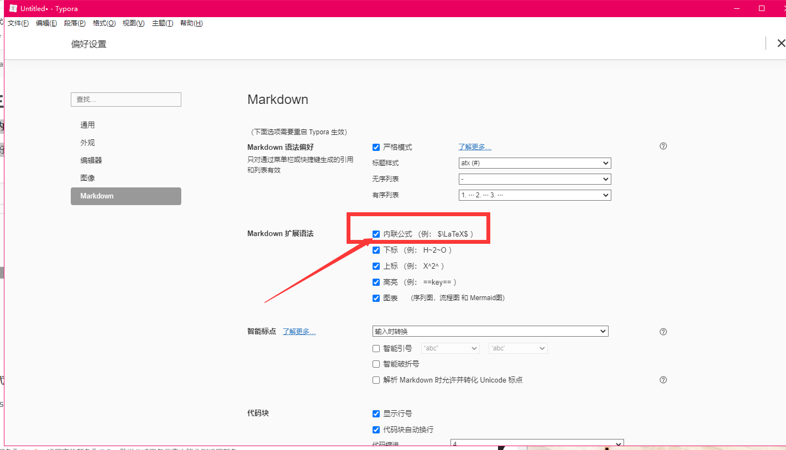

# Typora设置字体颜色方案

> ​	Typora：我的字体漂亮吗？


[TOC]

### 1. 下载AutoHotKey（较简单）

- AutoHotKey是一款著名的windows系统快捷键设置的软件，轻便小巧。

- 官方下载地址： https://autohotkey.com/download/ahk-install.exe


- 使用步骤如下：

  - 先安装AutoHotKey

  - 打开记事本或者其他编辑软件，把下面的内容复制粘贴进去

    ```json
    ; 分号以及分号后的内容代表注释，以下为代码解释
    ; Typora
    ; 快捷增加字体颜色
    ; SendInput {Text} 解决中文输入法问题
     
    #IfWinActive ahk_exe Typora.exe
    {
    	; alt+0 红色
        !0::addFontColor("black")
        ; alt+1 红色
        !1::addFontColor("red")
        ; alt+1 橙色
        !2::addFontColor("orange")
         ; alt+3 黄色
        !3::addFontColor("yellow")
         ; alt+4 绿色
        !4::addFontColor("green")
        ; alt+5 浅蓝色
        !5::addFontColor("cornflowerblue")
         ; alt+6 青色
        !6::addFontColor("cyan") 
       ; alt+7 紫色
        !7::addFontColor("purple")
    }
    
    ; 快捷增加字体颜色
    addFontColor(color){
        clipboard := "" ; 清空剪切板
        Send {ctrl down}c{ctrl up} ; 复制
        ; SendInput {Text} ; 解决中文输入法问题
        SendInput {TEXT}<font color='%color%'>
        SendInput {ctrl down}v{ctrl up} ; 粘贴
        If(clipboard = ""){
            SendInput {TEXT}</font> ; Typora 在这不会自动补充
        }else{
            SendInput {TEXT}</ ; Typora中自动补全标签
        }
    }
    ```

  - 将文件保存为ahk后缀的文件，如AutoHotKey.ahk

  - 双击文件运行【用AutoHotkey运行】，打开AutoHotkey程序看见以下内容

    

  - 重启Typora，在Typora软件里就可以使用快捷键进行想要的修改操作了，测试快捷键是否有效，`Alt + 1234567` 分别是各种颜色

    

  - 想要更多的快捷键设置方式，可以在AutoHotKey.ahk文件中自行添加

    - 如 `Ctrl+Alt+O` 添加橙色， `Ctrl+Alt+R` 红色，按 `Ctrl+\` 取消样式！

  - 也可以右键 AutoHotKey.ahk 脚本文件，点击Compile Script编译脚本成exe程序，就可以不用下载Autohotkey在其他电脑上运行了

### 2. 进入开发者模式改html代码（懂前端技术超简单）

- 右键——>检查元素

- 视图——>开发者工具，打开html代码调试模式

- 按快捷键 `Shift+F12`

  ```css
  <span style="color:文字颜色;background:背景颜色;font-size:文字大小;font-family:字体;">你要改色的文字</span>
  ```

  

- 弊端：当我们用这种方式进行字体修改之后，再将文章用其他工具打开，或者发表到博客上，你就会发现你做的修改都消失了，这是因为Typora支持开发者模式用代码的方式进行元素审查，但是其他工具中并没有这个功能

### 3. 方案三：使用内联公式（既复杂也简单）

- 开启使用内联公式

  文件——>偏好设置（Ctrl+逗号）——>Markdown——>勾选“内联公式”——>重启Typora



- 输入公式代码进行颜色修改

  ```json
  输入$，按Esc键会自动在后面加上一个$，然后在这两个$之间输入公式。
  	     样式如下：
  ——>	     $\textcolor{red}{这里输入你要改变颜色的文字}$
  ```

- **颜色公式代码大全**

  ```json
  $\textcolor{GreenYellow}{GreenYellow} $
  $\textcolor{Yellow}{Yellow}$
  $\textcolor{Goldenrod}{Goldenrod} $
  $\textcolor{Dandelion}{Dandelion}$
  $\textcolor{Apricot}{Apricot} $
  $\textcolor{Peach}{Peach}$
  $\textcolor{Melon}{Melon} $
  $\textcolor{YellowOrange}{YellowOrange}$
  $\textcolor{Orange}{Orange} $
  $\textcolor{BurntOrange}{BurntOrange}$
  $\textcolor{Bittersweet}{Bittersweet}$
  $\textcolor{RedOrange}{RedOrange} $
  $\textcolor{Mahogany}{Mahogany}$
  $\textcolor{Maroon}{Maroon} $
  $\textcolor{BrickRed}{BrickRed}$
  $\textcolor{Red}{Red} $
  $\textcolor{OrangeRed}{OrangeRed}$
  $\textcolor{RubineRed}{RubineRed}$
  $\textcolor{WildStrawberry}{WildStrawberry}$
  $\textcolor{Salmon}{Salmon}$
  $\textcolor{CarnationPink}{CarnationPink}$
  $\textcolor{Magenta}{Magenta} $
  $\textcolor{VioletRed}{VioletRed}$
  $\textcolor{Rhodamine}{Rhodamine} $
  $\textcolor{Mulberry}{Mulberry}$
  $\textcolor{RedViolet}{RedViolet} $
  $\textcolor{Fuchsia}{Fuchsia}$
  $\textcolor{Lavender}{Lavender} $
  $\textcolor{Thistle}{Thistle}$
  $\textcolor{Orchid}{Orchid} $
  $\textcolor{DarkOrchid}{DarkOrchid}$
  $\textcolor{Purple}{Purple} $
  $\textcolor{Plum}{Plum}$
  $\textcolor{Violet}{Violet} $
  $\textcolor{RoyalPurple}{RoyalPurple}$
  $\textcolor{BlueViolet}{BlueViolet}$
  $\textcolor{Periwinkle}{Periwinkle}$
  $\textcolor{CadetBlue}{CadetBlue}$
  $\textcolor{CornflowerBlue}{CornflowerBlue}$
  $\textcolor{MidnightBlue}{MidnightBlue}$
  $\textcolor{NavyBlue}{NavyBlue} $
  $\textcolor{RoyalBlue}{RoyalBlue}$
  $\textcolor{Blue}{Blue} $
  $\textcolor{Cerulean}{Cerulean}$
  $\textcolor{Cyan}{Cyan} $
  $\textcolor{ProcessBlue}{ProcessBlue}$
  $\textcolor{SkyBlue}{SkyBlue} $
  $\textcolor{Turquoise}{Turquoise}$
  $\textcolor{TealBlue}{TealBlue} $
  $\textcolor{Aquamarine}{Aquamarine}$
  $\textcolor{BlueGreen}{BlueGreen} $
  $\textcolor{Emerald}{Emerald}$
  $\textcolor{JungleGreen}{JungleGreen}$
  $\textcolor{SeaGreen}{SeaGreen} $
  $\textcolor{Green}{Green}$
  $\textcolor{ForestGreen}{ForestGreen}$
  $\textcolor{PineGreen}{PineGreen} $
  $\textcolor{LimeGreen}{LimeGreen}$
  $\textcolor{YellowGreen}{YellowGreen}$
  $\textcolor{SpringGreen}{SpringGreen}$
  $\textcolor{OliveGreen}{OliveGreen}$
  $\textcolor{RawSienna}{RawSienna} $
  $\textcolor{Sepia}{Sepia}$
  $\textcolor{Brown}{Brown} $
  $\textcolor{Tan}{Tan}$
  $\textcolor{Gray}{Gray} $
  $\textcolor{Black}{Black}$
  ```