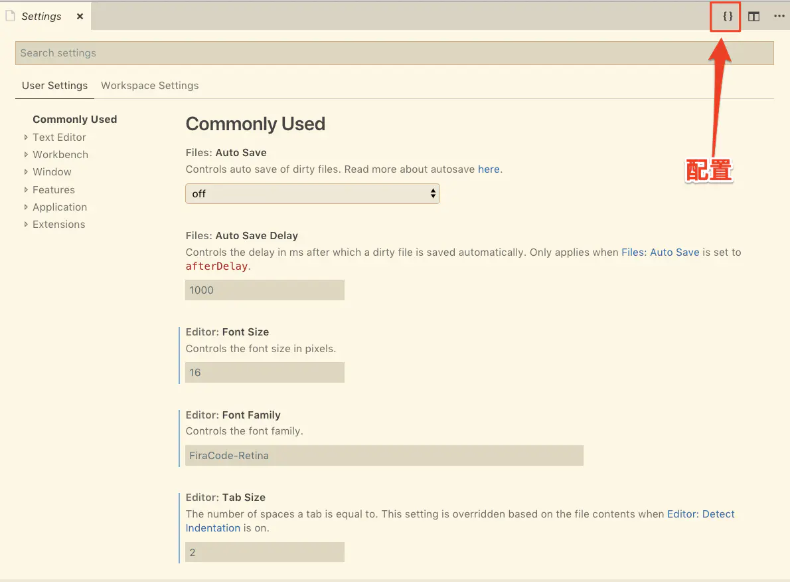
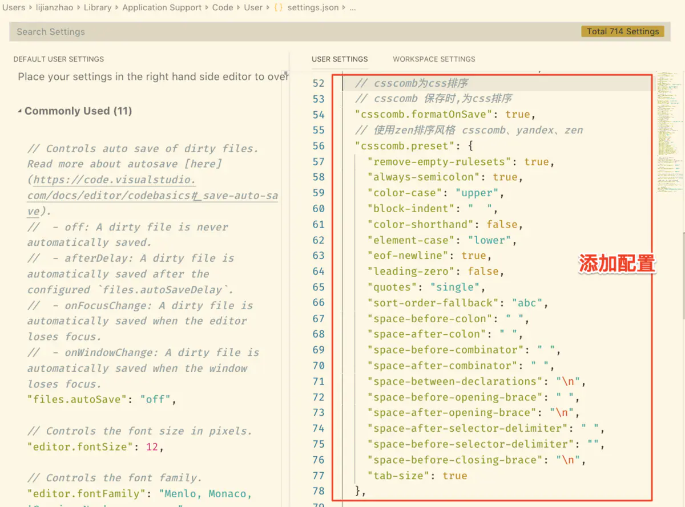
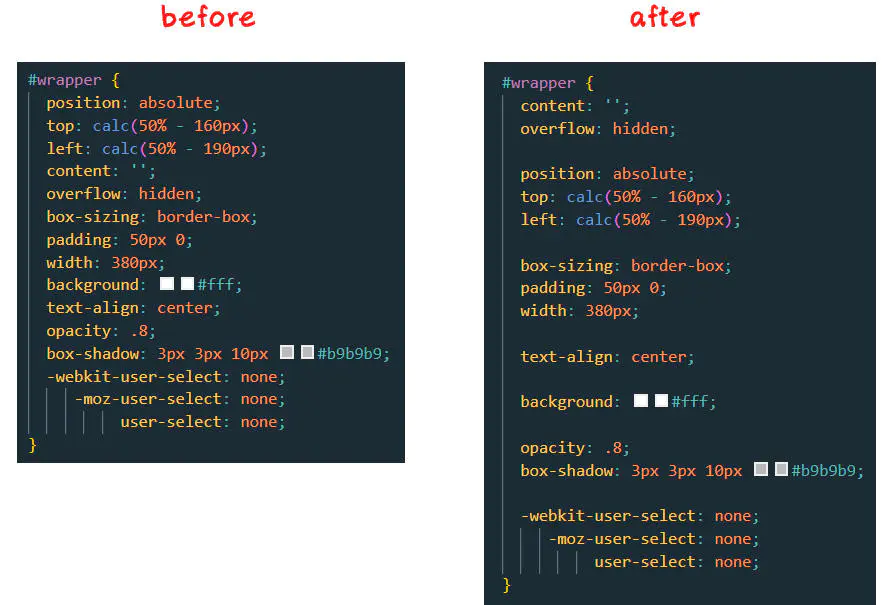
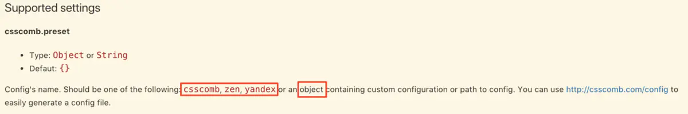

# VSCode为CSS属性自定义排序

> **CSScomb**：正如其名，一把梳理 CSS 属性顺序的 “梳子”。


[TOC]

### 1. 插件介绍

- CSS 属性书写顺序非常重要，一个合格的前端er 一定会有他遵循的 CSS 书写顺序规则。**CSScomb**就是这么一款插件。[CSScomb - Visual Studio Marketplace](https://marketplace.visualstudio.com/items?itemName=mrmlnc.vscode-csscomb)
- GitHub：[csscomb/csscomb.js: CSS coding style formatter (github.com)](https://github.com/csscomb/csscomb.js)

### 2. 使用说明

1. 自定义配置

   - 配置步骤：

     - 安装CSScomb
     - 打开VSCode的settings.json，`Ctrl+，`或者点击`文件-首选项-设置`，搜索settings.json或者直接点击下图位置打开

     

     - 添加配置

     

     - 个人配置

     ```json
     // csscomb 保存时为css排序
         "csscomb.formatOnSave": true,
         // 使用自定义排序风格, 官方推荐的三个: csscomb、yandex、zen
         "csscomb.preset": {
             "remove-empty-rulesets": true, // 删除空规则集
             "always-semicolon": true, // 在每个样式后面加“;”
             "color-case": "upper", // 统一十六进制颜色的大小写
             "block-indent": "    ", // 缩进四个空格
             "color-shorthand": false, // 是扩展十六进制颜色还是使用速记
             "element-case": "lower", // 统一元素选择器的大小写
             "eof-newline": true, // 在 EOF 中添加/删除换行符
             "leading-zero": false, // 在尺寸中添加/删除前导零
             "quotes": "single", // 统一引号样式
             // 设置排序顺序腾讯 AollyTeam 团队的规范
             "sort-order": [
                 [
                     "display",
                     "visibility",
                     "float",
                     "clear",
                     "overflow",
                     "overflow-x",
                     "overflow-y",
                     "clip",
                     "zoom"
                 ],
                 [
                     "table-layout",
                     "empty-cells",
                     "caption-side",
                     "border-spacing",
                     "border-collapse",
                     "list-style",
                     "list-style-position",
                     "list-style-type",
                     "list-style-image"
                 ],
                 [
                     "-webkit-box-orient",
                     "-webkit-box-direction",
                     "-webkit-box-decoration-break",
                     "-webkit-box-pack",
                     "-webkit-box-align",
                     "-webkit-box-flex"
                 ],
                 [
                     "position",
                     "top",
                     "right",
                     "bottom",
                     "left",
                     "z-index"
                 ],
                 [
                     "margin",
                     "margin-top",
                     "margin-right",
                     "margin-bottom",
                     "margin-left",
                     "-webkit-box-sizing",
                     "-moz-box-sizing",
                     "box-sizing",
                     "border",
                     "border-width",
                     "border-style",
                     "border-color",
                     "border-top",
                     "border-top-width",
                     "border-top-style",
                     "border-top-color",
                     "border-right",
                     "border-right-width",
                     "border-right-style",
                     "border-right-color",
                     "border-bottom",
                     "border-bottom-width",
                     "border-bottom-style",
                     "border-bottom-color",
                     "border-left",
                     "border-left-width",
                     "border-left-style",
                     "border-left-color",
                     "-webkit-border-radius",
                     "-moz-border-radius",
                     "border-radius",
                     "-webkit-border-top-left-radius",
                     "-moz-border-radius-topleft",
                     "border-top-left-radius",
                     "-webkit-border-top-right-radius",
                     "-moz-border-radius-topright",
                     "border-top-right-radius",
                     "-webkit-border-bottom-right-radius",
                     "-moz-border-radius-bottomright",
                     "border-bottom-right-radius",
                     "-webkit-border-bottom-left-radius",
                     "-moz-border-radius-bottomleft",
                     "border-bottom-left-radius",
                     "-webkit-border-image",
                     "-moz-border-image",
                     "-o-border-image",
                     "border-image",
                     "-webkit-border-image-source",
                     "-moz-border-image-source",
                     "-o-border-image-source",
                     "border-image-source",
                     "-webkit-border-image-slice",
                     "-moz-border-image-slice",
                     "-o-border-image-slice",
                     "border-image-slice",
                     "-webkit-border-image-width",
                     "-moz-border-image-width",
                     "-o-border-image-width",
                     "border-image-width",
                     "-webkit-border-image-outset",
                     "-moz-border-image-outset",
                     "-o-border-image-outset",
                     "border-image-outset",
                     "-webkit-border-image-repeat",
                     "-moz-border-image-repeat",
                     "-o-border-image-repeat",
                     "border-image-repeat",
                     "padding",
                     "padding-top",
                     "padding-right",
                     "padding-bottom",
                     "padding-left",
                     "width",
                     "min-width",
                     "max-width",
                     "height",
                     "min-height",
                     "max-height"
                 ],
                 [
                     "font",
                     "font-family",
                     "font-size",
                     "font-weight",
                     "font-style",
                     "font-variant",
                     "font-size-adjust",
                     "font-stretch",
                     "font-effect",
                     "font-emphasize",
                     "font-emphasize-position",
                     "font-emphasize-style",
                     "font-smooth",
                     "line-height",
                     "text-align",
                     "-webkit-text-align-last",
                     "-moz-text-align-last",
                     "-ms-text-align-last",
                     "text-align-last",
                     "vertical-align",
                     "white-space",
                     "text-decoration",
                     "text-emphasis",
                     "text-emphasis-color",
                     "text-emphasis-style",
                     "text-emphasis-position",
                     "text-indent",
                     "-ms-text-justify",
                     "text-justify",
                     "letter-spacing",
                     "word-spacing",
                     "-ms-writing-mode",
                     "text-outline",
                     "text-transform",
                     "text-wrap",
                     "-ms-text-overflow",
                     "text-overflow",
                     "text-overflow-ellipsis",
                     "text-overflow-mode",
                     "-ms-word-wrap",
                     "word-wrap",
                     "-ms-word-break",
                     "word-break"
                 ],
                 [
                     "color",
                     "background",
                     "filter:progid:DXImageTransform.Microsoft.AlphaImageLoader",
                     "background-color",
                     "background-image",
                     "background-repeat",
                     "background-attachment",
                     "background-position",
                     "-ms-background-position-x",
                     "background-position-x",
                     "-ms-background-position-y",
                     "background-position-y",
                     "-webkit-background-clip",
                     "-moz-background-clip",
                     "background-clip",
                     "background-origin",
                     "-webkit-background-size",
                     "-moz-background-size",
                     "-o-background-size",
                     "background-size"
                 ],
                 [
                     "outline",
                     "outline-width",
                     "outline-style",
                     "outline-color",
                     "outline-offset",
                     "opacity",
                     "filter:progid:DXImageTransform.Microsoft.Alpha(Opacity",
                     "-ms-filter:\\'progid:DXImageTransform.Microsoft.Alpha",
                     "-ms-interpolation-mode",
                     "-webkit-box-shadow",
                     "-moz-box-shadow",
                     "box-shadow",
                     "filter:progid:DXImageTransform.Microsoft.gradient",
                     "-ms-filter:\\'progid:DXImageTransform.Microsoft.gradient",
                     "text-shadow"
                 ],
                 [
                     "-webkit-transition",
                     "-moz-transition",
                     "-ms-transition",
                     "-o-transition",
                     "transition",
                     "-webkit-transition-delay",
                     "-moz-transition-delay",
                     "-ms-transition-delay",
                     "-o-transition-delay",
                     "transition-delay",
                     "-webkit-transition-timing-function",
                     "-moz-transition-timing-function",
                     "-ms-transition-timing-function",
                     "-o-transition-timing-function",
                     "transition-timing-function",
                     "-webkit-transition-duration",
                     "-moz-transition-duration",
                     "-ms-transition-duration",
                     "-o-transition-duration",
                     "transition-duration",
                     "-webkit-transition-property",
                     "-moz-transition-property",
                     "-ms-transition-property",
                     "-o-transition-property",
                     "transition-property",
                     "-webkit-transform",
                     "-moz-transform",
                     "-ms-transform",
                     "-o-transform",
                     "transform",
                     "-webkit-transform-origin",
                     "-moz-transform-origin",
                     "-ms-transform-origin",
                     "-o-transform-origin",
                     "transform-origin",
                     "-webkit-animation",
                     "-moz-animation",
                     "-ms-animation",
                     "-o-animation",
                     "animation",
                     "-webkit-animation-name",
                     "-moz-animation-name",
                     "-ms-animation-name",
                     "-o-animation-name",
                     "animation-name",
                     "-webkit-animation-duration",
                     "-moz-animation-duration",
                     "-ms-animation-duration",
                     "-o-animation-duration",
                     "animation-duration",
                     "-webkit-animation-play-state",
                     "-moz-animation-play-state",
                     "-ms-animation-play-state",
                     "-o-animation-play-state",
                     "animation-play-state",
                     "-webkit-animation-timing-function",
                     "-moz-animation-timing-function",
                     "-ms-animation-timing-function",
                     "-o-animation-timing-function",
                     "animation-timing-function",
                     "-webkit-animation-delay",
                     "-moz-animation-delay",
                     "-ms-animation-delay",
                     "-o-animation-delay",
                     "animation-delay",
                     "-webkit-animation-iteration-count",
                     "-moz-animation-iteration-count",
                     "-ms-animation-iteration-count",
                     "-o-animation-iteration-count",
                     "animation-iteration-count",
                     "-webkit-animation-direction",
                     "-moz-animation-direction",
                     "-ms-animation-direction",
                     "-o-animation-direction",
                     "animation-direction"
                 ],
                 [
                     "content",
                     "quotes",
                     "counter-reset",
                     "counter-increment",
                     "resize",
                     "cursor",
                     "-webkit-user-select",
                     "-moz-user-select",
                     "-ms-user-select",
                     "user-select",
                     "nav-index",
                     "nav-up",
                     "nav-right",
                     "nav-down",
                     "nav-left",
                     "-moz-tab-size",
                     "-o-tab-size",
                     "tab-size",
                     "-webkit-hyphens",
                     "-moz-hyphens",
                     "hyphens",
                     "pointer-events"
                 ]
             ],
             "sort-order-fallback": "abc", // 按字母顺序对未知选项进行排序
             "space-before-colon": "", // 冒号前空格
             "space-after-colon": " ", // 冒号后空格
             "space-before-combinator": " ", // 在组合器前设置空格
             "space-after-combinator": " ", // 在组合器后设置空格
             "space-between-declarations": "\n", // 每个样式后换行
             "space-before-opening-brace": " ", // 在开始的{前加空格
             "space-after-opening-brace": "\n", // 在开始的{后换行
             "space-after-selector-delimiter": "\n", // 设置选择器分隔符后的空间
             "space-before-selector-delimiter": "", // 设置选择器分隔符前的空间
             "space-before-closing-brace": "\n", // 在结束的}前换行
             "strip-spaces": true, // 是否修剪尾随空格
             "tab-size": 4, // 设置制表符大小  
             "unitless-zero": true, // 是否移除零值尺寸中的单位
             "vendor-prefix-align": true, // 是否对齐属性和值中的前缀
             "lines-between-rulesets": 1, // 规则集或@rules之间的换行符数
             "verbose": true // 是否使用 CLI 中的选项
         },
     ```

   - CSS 属性书写顺序，推荐使用腾讯 AollyTeam 团队的规范：[Code Guide by @AlloyTeam](http://alloyteam.github.io/CodeGuide/#css-declaration-order)

   - CSScomb示例配置文件：[csscomb.js/csscomb.json at master · csscomb/csscomb.js (github.com)](https://github.com/csscomb/csscomb.js/blob/master/config/csscomb.json)

     > 其中的 sort-order 就是 CSS 属性书写顺序，可以按照自己遵循的规范设置，我直接替换成了腾讯的

   - CSScomb配置文件里面各个字段的作用说明：[csscomb.js/options.md at master · csscomb/csscomb.js (github.com)](https://github.com/csscomb/csscomb.js/blob/master/doc/options.md)

   

2. 官方配置

   - 关于属性`csscomb.preset`的配置可以从官方给出的选项任选其一`csscomb`, `zen`, `yandex`
   - GitHub：[csscomb.js/config at master · csscomb/csscomb.js (github.com)](https://github.com/csscomb/csscomb.js/tree/master/config)

   ```json
   "csscomb.preset" : "yandex"
   ```

   

   - 也可以按照自己的习惯,通过`{}`进行配置（上方示例一就是这种方法）


