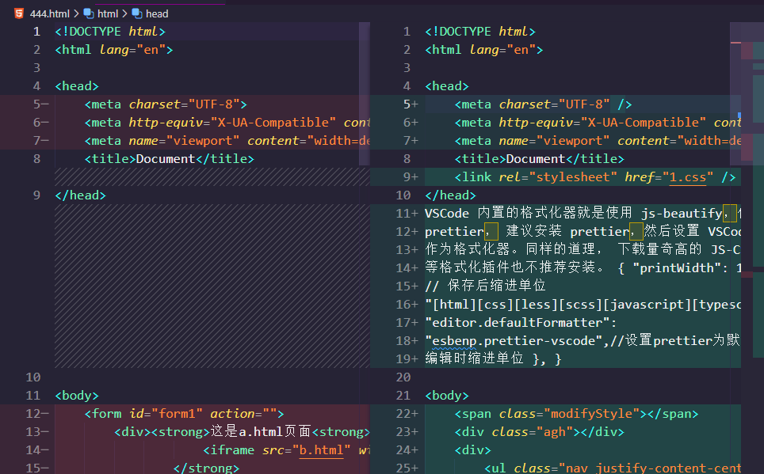

# VSCode代码对比差异功能

[TOC]

## 1. 文件对比 + 同屏滚动

1. 打开项目文件夹，要保证你要对比的两个文件在一个VSCode窗口内（试了一下，两个Window里面的文件不能使用这个功能）

2. 选择第一个文件，右键，点击`Select for Compare`

   

3. 选择第二个文件右键，点击`Compare with Selected`

   

4. 点击之后，就会有一个新的对比文件生成，在这个文件里面，左边的是你第一次Select的文件，右边是第二次Select的文件。规则也很简单，看到行数旁边的符号，‘+’ 是修改后的code，‘-’ 是修改前的code，如果是新写的code行的话，另一个文件里会有网格线提示新写的区域应该在哪里。

   

5. 命令行调用对比功能的方法

   ```shell
   code --diff file1.cs file2.cs
   ```

6. 如果code命令没有添加到path里面

   ```shell
   "%LOCALAPPDATA%\Programs\Microsoft VS Code\code.exe" --diff file1.cs file2.cs
   ```

## 2. 代码对比差异视图窗口切换方法（左右文件位置切换）

### 2.1 问题

- 右键进行对比是按照一定规则来确定两个代码的视图位置的。这个规则就是文件修改时间早的在左，修改时间晚的在右，而与你选择文件的顺序无关。这就给我们带来了很多困扰，为了解决这个问题，有两个解决方案。

### 2.2 方法

#### 2.2.1 命令行启动

1. 在 vscode 内打开内置命令行，输入：

   ```shell
   code -d fileName1.xxx fileName2.xxx
   code -d dev.css prod.css	// 示例
   ```

2. 说明

   - `code` ：启动一个 vscode 进行对比
   - `-d` ：diff 的意思，差异对比
   - `fileName.xxx` ：要对比的文件全名，如果命令行不在该文件目录下的话，需要加上目录
   - 从而第一个指定的 file 一定在左边，第二个就在右边

3. 优点

   - 命令行，启动快速
   - 不需要打开文件

4. 缺点

   - 会重新打开一个 vscode 窗口

#### 2.2.2 命令面板启动

1. 先打开要在对比视窗左边的文件，再按 `Ctrl + Shift + P` 输入 `compare` ，选择 **比较活动文件与** ，之后选择要放在右边视窗的文件即可

   

2. 优点

   - 不需要打开新的 vscode 窗口，比较快速

3. 缺点

   - 需要先打开文件