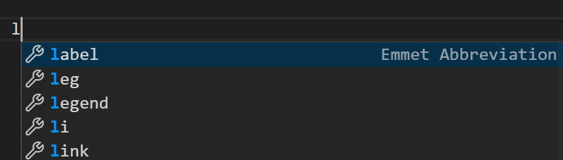
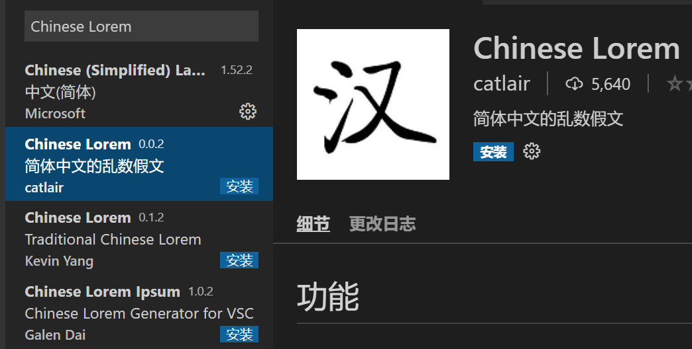
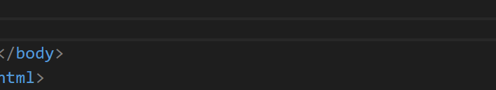
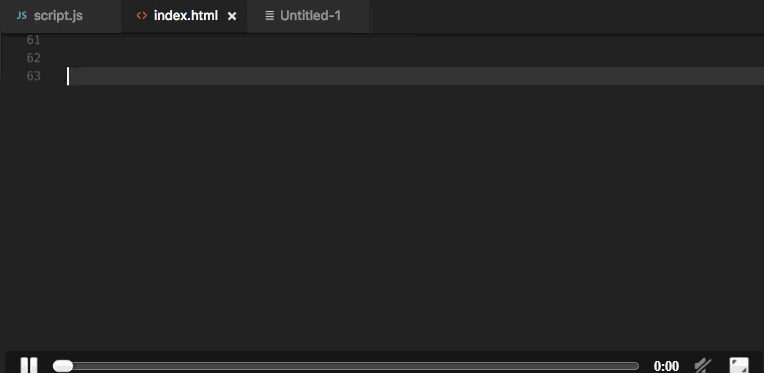
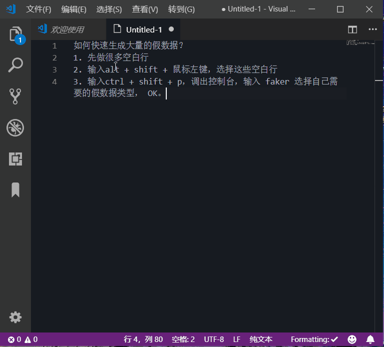

# VSCode假数据生成器插件

> ​		Lorem ipsum，中文又称“乱数假文”， 是指一篇常用于排版设计领域的拉丁文文章 ，主要的目的为测试文章或文字在不同字型、版型下看起来的效果，通常网站还没建设好时会出现这段文字。

[TOC]

### 1. Lorem的使用

- VSCode内置Emmet功能，可以用在html、jsx、css、sass、less等文件上。当Emment捕获到你输入lorem时，自动帮你生成一段英文文本。

- 如：lorem + tab键，默认生成一个30个单词的段落。

  

- 也可指定生成多少单词，如lorem5 + tab键，可以生成5个单词。

  

### 2. Chinese Lorem插件

- 同理，中文也需要一个这样的废话机，VSCode扩展商店搜索 chinese lorem,安装简体版本

  

- 您只需键入jw即可在HTML文件中生成默认的128个简体中文字符。 也可以通过键入jw <字符数>来定义要生成多少个字符。 

- 例如：jw24生成24个字符。 输入触发词汇后按tab或者enter即可产生所需数量的词汇。

  

### 3. Faker插件

- 当然，除了段落文本，还有诸如姓名、地址、图像、电话号码等类型的文本可以通过插件生成。Faker插件完美实现以上需求，效果如下：

  

  

### 4. 快速生成多列假数据

- 通过列编辑+faker可快速大量生成假数据

  