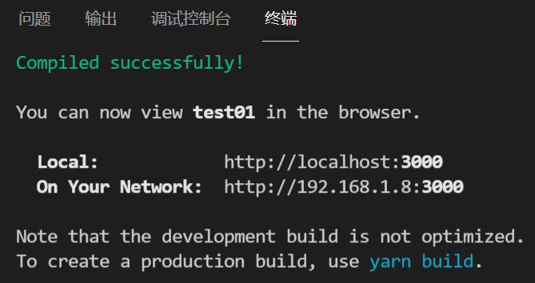
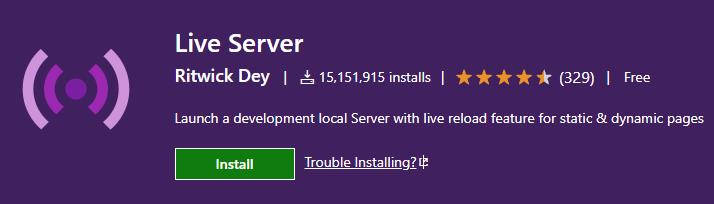
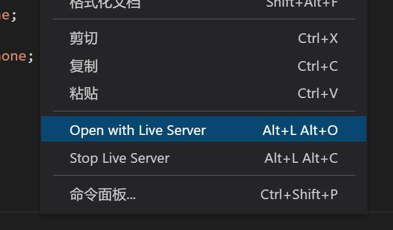
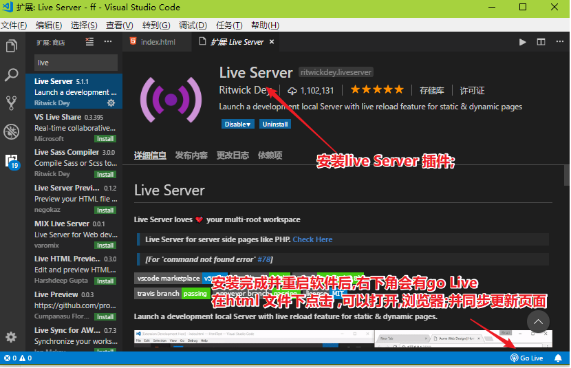
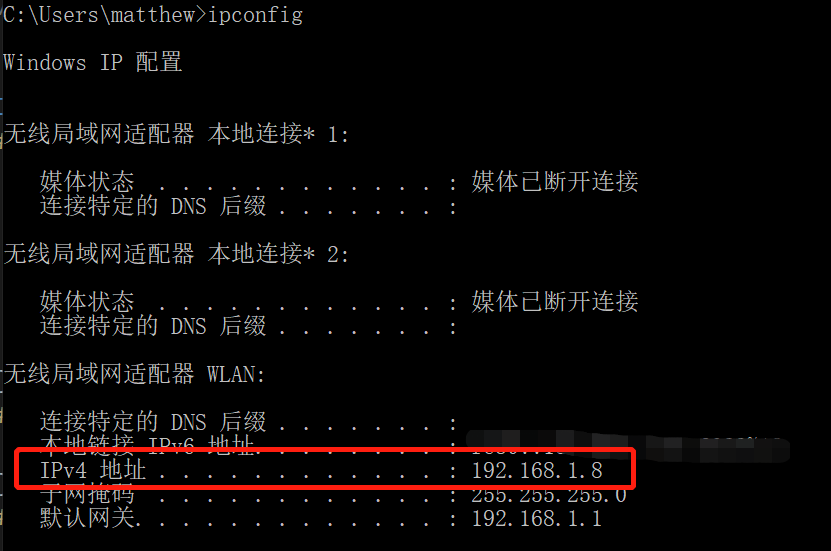
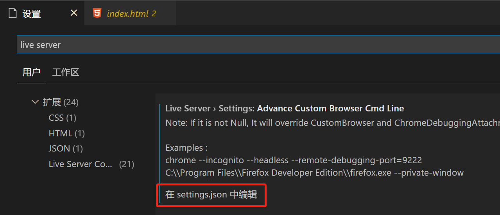
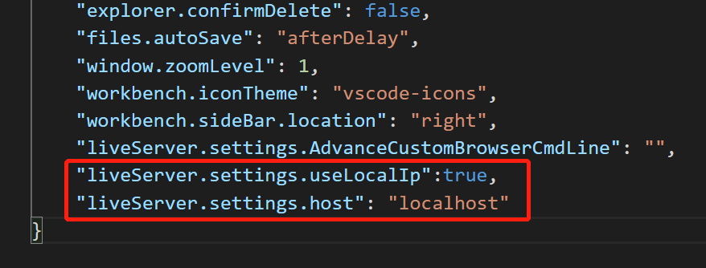

# VSCode如何在手机上访问本地网页

- 现在的框架提供非常好的工具链，周到全面。以react为例子，当你用create-react-app 创建一个react项目，通过yarn start启动后，会有如下提示：

  

- 本机可以通过http://localhost:3000访问，还提示你，局域网内可以通过http://192.168.1.8:3000访问。

- 那如果简单的静态页面如何使用手机查看及调试呢？操作也很简单，可以在vscode上安装一个 live server 的扩展。[Live Server](https://marketplace.visualstudio.com/items?itemName=ritwickdey.LiveServer)

  

- ive Server 可以为静态和动态页面，启动一个本地开发服务器，这个服务还可以实时重载。安装这个扩展之后，用vscode打开静态html项目包。点开项目入口页面如index.html。右键，点击Open with Liver Server，即可启动一个服务，用以访问该网站。

  

  

- 默认的访问地址为：http://127.0.0.1:5500/index.html。此时，手机还无法访问。想要手机能访问，也非常简单，只要把你电脑的在局域网中的地址 `127.0.0.1`替换掉就行。你可以通过 cmd 输入ipconfig /all，查看本机地址。

  

- 当然，直接的方式是让Live Server直接生成以**本机局域网地址**的服务。其步骤为：

  - 打开vscode 首选项–>设置，搜索 Live Server，点击编辑 Live Server 的 setting.json。

    

  - 在setting.json中添加两个配置项：

    ```json
    “liveServer.settings.useLocalIp”:true,
    “liveServer.settings.host”: “localhost”
    ```

    

    

