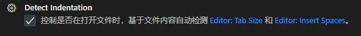
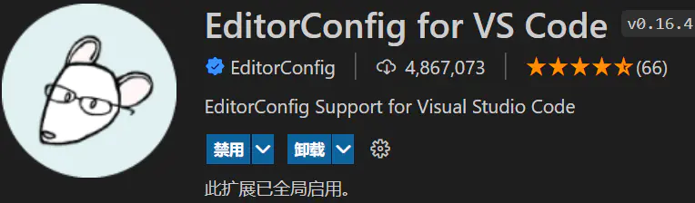
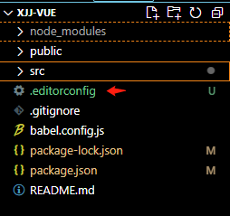
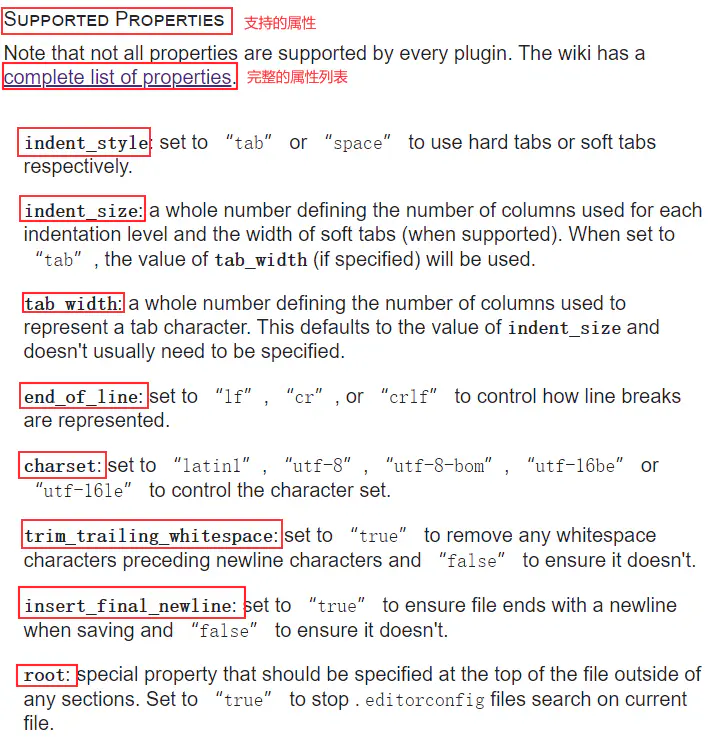
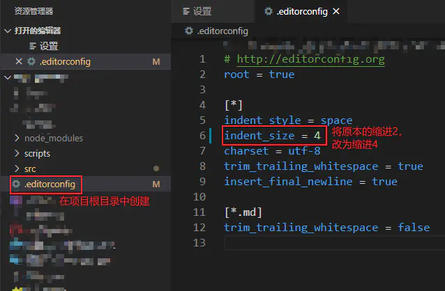

# VSCode插件EditorConfig的配置

[TOC]

## 1. 背景

> ​		当大家在公司工作时，不可能永远是一个人维护一个项目，当多个人参与一个项目，每个人使用的编辑器不一样，代码风格自然也不一样，那么如何让使用不同编辑器的开发者能够轻松惬意的遵守最基本的代码规范呢？我和同事使用的都是 VS Code 编辑器，但同事的缩进是4个空格，而我的编辑器缩进是2个空格。尽管我已经对 VS Code 编辑器进行了如下设置：
>
> 
>
> 
>
> 
>
> ​		虽然我对 VS Code 编辑器进行了如上图一样的设置，依然没有改变两个空格的缩进。这样产生的后果就是每个人修改后的代码在格式上总是不统一的，那么提交到 git 上就会代码风格不一致，变得非常丑陋。而 [EditorConfig](https://links.jianshu.com/go?to=https%3A%2F%2Feditorconfig.org%2F) 正好可以解决这个问题，在这里配置的代码规范规则优先级高于编辑器默认的代码格式化规则。如果没有配置 [editorConfig](https://links.jianshu.com/go?to=https%3A%2F%2Feditorconfig.org%2F)，在格式化时将会执行编辑器默认的代码格式化规则；如果配置了[editorConfig](https://links.jianshu.com/go?to=https%3A%2F%2Feditorconfig.org%2F)，则按照 [editorConfig](https://links.jianshu.com/go?to=https%3A%2F%2Feditorconfig.org%2F) 中的配置来格式化代码，从而忽略编辑器默认的代码格式化规则。

## 2. 简介



> ​		VS Code的一款 插件，实际上真正作用的是 EdiorConfig 这个玩意，它用来取代 各个开发工具或者编辑器 默认的 格式化内容功能 ，简单来说，就是由你自己来决定开发工具或者编辑器在格式化时对于内容的排版，这样的好处是什么呢？当然是 不同的开发工具，相同的项目，内容风格统一！

- EditorConfig和Prettier一样，都是用来配置格式化你的代码的，这个格式化代码，要和你lint配置相符！否则会出现你格式化代码以后，却不能通过你的代码校验工具的检验


- EditorConfig 文件中的设置用于在基本代码库中维持一致的编码风格和设置，例如缩进样式、选项卡宽度、行尾字符以及编码等，而无需考虑使用的编辑器或 IDE
- editorConfig不是什么软件，而是一个名称为.editorconfig的自定义文件。该文件用来定义项目的编码规范，编辑器的行为会与.editorconfig 文件中定义的一致，并且其优先级比编辑器自身的设置要高，这在多人合作开发项目时十分有用而且必要。有些编辑器默认支持editorConfig，如webstorm；而有些编辑器则需要安装editorConfig插件，如ATOM、Sublime、VS Code等。
- 当打开一个文件时，EditorConfig插件会在打开文件的目录和其每一级父目录查找.editorconfig文件，直到有一个配置文件root=true。EditorConfig的配置文件是从上往下读取的并且最近的EditorConfig配置文件会被最先读取. 匹配EditorConfig配置文件中的配置项会按照读取顺序被应用, 所以最近的配置文件中的配置项拥有优先权。如果.editorconfig文件没有进行某些配置，则使用编辑器默认的设置。
- 总结：[EditorConfig](https://links.jianshu.com/go?to=https%3A%2F%2Feditorconfig.org%2F) 包含一个用于定义代码格式的文件和一批编辑器插件，这些插件是让编辑器读取配置文件并以此来格式化代码。

```js
// eclipse 默认的格式化排版
function a(){
  // 两个空格缩进
  alert(a);
}

// VS Code 默认的格式化排版
function a(){
 	// 一个tab缩进
 	alert(a);
}

// 使用 EditorConfig 后，统一tab缩进
function a(){
 	// 一个tab缩进
 	alert(a);
}
```

## 3. 安装

- 直接在插件市场搜索[EditorConfig for vs code](https://marketplace.visualstudio.com/items?itemName=EditorConfig.EditorConfig) 安装就行了，安装完毕记得重启编辑器。
- 全局安装或局部安装
  - editorconfig依赖包(`npm install -g editorconfig | npm install -D editorconfig`)
    安装editorconfig依赖包主要是因为EditorConfig依赖于editorconfig包，不安装的可能会导致EditorConfig无法正常解析我们在第一步定义的editorconfig文件

## 4. 配置

### 4.1 前期准备

- 在当前项目根目录下添加.editorconfig文件

  

- 可以通过资源管理器侧栏的上下文菜单右键选择`Generate .editorconfig`，然后这个目录下面就会创建出一个`.editorconfig文件了`，当然如果团队里有已经配置好的这个文件，直接复制过来就行了。

- 打开需要格式化的文件并手动格式化代码（Mac OS ：shift+option+f Windows ：shift+alt+f）

- 使用建议：配合代码检查工具使用，比如说：ESLint或TSLint，统一代码风格。

### 4,2 配置.editorconfig

- **配置选项参考 [Supported Properties](https://links.jianshu.com/go?to=https%3A%2F%2Feditorconfig.org%2F%23file-format-details) ；或者参考：[complete list of properties](https://links.jianshu.com/go?to=https%3A%2F%2Fgithub.com%2Feditorconfig%2Feditorconfig%2Fwiki%2FEditorConfig-Properties)；配置 .editorconfig 文件时的格式参考文件：[Example file](https://links.jianshu.com/go?to=https%3A%2F%2Feditorconfig.org%2F%23example-file)**

  

- 官网的一个配置

  ```shell
  # EditorConfig is awesome: https://EditorConfig.org
  
  # top-most EditorConfig file 表示是最顶层的配置文件，发现设为true时，才会停止查找.editorconfig文件
  root = true
  
  # Unix-style newlines with a newline ending every file 对于所有的文件  始终在文件末尾插入一个新行
  [*]
  end_of_line = lf
  insert_final_newline = true
  
  # Matches multiple files with brace expansion notation
  # Set default charset  对于所有的js,py文件，设置文件字符集为utf-8
  [*.{js,py}]
  charset = utf-8
  
  # 4 space indentation 控制py文件类型的缩进大小
  [*.py]
  indent_style = space
  indent_size = 4
  
  # Tab indentation (no size specified) 设置某中文件的缩进风格为tab Makefile未指明
  [Makefile]
  indent_style = tab
  
  # Indentation override for all JS under lib directory  设置在lib目录下所有JS的缩进为
  [lib/**.js]
  indent_style = space
  indent_size = 2
  
  # Matches the exact files either package.json or .travis.yml 设置确切文件 package.json/.travis/.yml的缩进类型
  [{package.json,.travis.yml}]
  indent_style = space
  indent_size = 2
  ```

- 示例

  ```shell
  # EditorConfig helps developers define and maintain consistent
  # EditorConfig帮助开发人员定义和维护一致性
  
  # coding styles between different editors and IDEs
  # 不同编辑器和ide之间的编码样式
  
  # 打开需要格式化的文件并手动格式化代码（Mac OS ：shift+option+f  Windows ：shift+alt+f）
  
  # editorconfig.org
  # editorconfig顶级配置文件,停止向上寻找配置文件
  
  root = true
  
  # change these settings to your own preference
  # 将这些设置更改为您自己的首选项
  [*]
  # 缩进样式=空格
  indent_style = space
  # 缩进大小=4
  indent_size = 4
  
  # we recommend you to keep these unchanged
  # 我们建议你保持这些不变
  # 换行符类型 = lf
  end_of_line = lf
  # 字符集=utf-8
  charset = utf-8
  # 删除行尾空格 = 是
  trim_trailing_whitespace = true
  # 插入最后一行=真
  insert_final_newline = true
  
  [*.md]
  # 删除行尾空格 = 否
  trim_trailing_whitespace = false
  
  [package.json]
  # 缩进样式=空格
  indent_style = space
  # 缩进大小=4
  indent_size = 4
  ```



- 重启 VS Code

- 随便打开一个文件，**shift + alt + f** 格式化文件（VS Code格式化按键）

- 网上某个用于vue项目的配置文件，建议配合**ESLint + Prettier**

  ```shell
  #表示是最顶层的配置文件，发现设为true时，才会停止查找.editorconfig文件
  root = true
  
  # Unix-style newlines with a newline ending every file 对于所有的文件  始终在文件末尾插入一个新行
  [*]
  end_of_line = crlf
  insert_final_newline = true
  
  # 对于所有的js文件，设置文件字符集为utf-8
  [*.js]
  charset = utf-8
  
  # 设置所有JS,vue的缩进为
  [*.{js,vue}]
  
  indent_style = tab
  ```

## 5. 配置文件详解

### 5.1 语法

- editorConfig配置文件需要是UTF-8字符集编码的，以回车换行或换行作为一行的分隔符
- 斜线(/)被用作为一个路径分隔符，井号(#)或分号(;)被用作于注释，注释需要与注释符号写在同一行

### 5.2 通配符

```shell
*                匹配除/之外的任意字符串
**               匹配任意字符串
?                匹配任意单个字符
[name]           匹配name中的任意一个单一字符
[!name]          匹配不存在name中的任意一个单一字符
{s1,s2,s3}       匹配给定的字符串中的任意一个(用逗号分隔) 
{num1..num2}   　匹配num1到num2之间的任意一个整数, 这里的num1和num2可以为正整数也可以为负整数
```

### 5.3 属性

- 所有的属性和值都是忽略大小写的，解析时它们都是小写的

```shell
indent_style<"tab" | "space">    设置缩进风格(tab是硬缩进，space为软缩进)
indent_size     用一个整数定义的列数来设置缩进的宽度，如果indent_style为tab，则此属性默认为tab_width
tab_width       用一个整数来设置tab缩进的列数。默认是indent_size
end_of_line<"lf" | "cr" | "crlf">     设置换行符，值为lf、cr和crlf
charset         设置编码，值为latin1、utf-8、utf-8-bom、utf-16be和utf-16le，不建议使用utf-8-bom
trim_trailing_whitespace  设为true表示会去除换行行首的任意空白字符。
insert_final_newline      设为true表示使文件以一个空白行结尾
max_line_length<number>   最大行宽
root        　　　表示是最顶层的配置文件，发现设为true时，才会停止查找.editorconfig文件
```

- 目前VSCode并不是所有属性都支持，所以只需要配置下面几个属性即可：
  - `indent_style`
  - `indent_size`
  - `tab_width`
  - `end_of_line` （保存时）
  - `insert_final_newline` （保存时）
  - `trim_trailing_whitespace` （保存时）

### 5.4 控制指定文件类型的缩进大小

- 对于`.json` `.yml` 文件，使用空格替代tab，并且一个tab会被替换为2个空格。

```shell
[{*.json,*.yml}]
indent_style = space
indent_size = 2
```

### 5.5 文件末尾新行

- 对于所有的文件，每一行的尾部自动调整为 Lf，文件的末尾是一个空行

```shell
[*]
end_of_line = lf
insert_final_newline = true
```

## 6. 建议

1. EditorConfig扩展的作用是读取我们创建的editorconfig文件中定义的规则，并覆盖`user/workspace settings`中的对应配置，从这可以看出vscode本身其实是并不直接支持**editorconfig**的，也就是没有绑定 **EditorConfig** 这个玩意，所以才会需要插件，我们可以去 [EditorConfig官网](https://editorconfig.org/) 查看你的代码工具是否绑定。
2. **注意：如果要在项目根目录中 .editorconfig 文件中的配置生效，一定要在 VS Code 编辑器中安装 [EditorConfig for VS Code](https://links.jianshu.com/go?to=https%3A%2F%2Fmarketplace.visualstudio.com%2Fitems%3FitemName%3DEditorConfig.EditorConfig) 插件，否则 .editorconfig 文件中的配置不生效。**
3. 这时候你或许有些疑惑，因为 [EditorConfig for VS Code](https://links.jianshu.com/go?to=https%3A%2F%2Fmarketplace.visualstudio.com%2Fitems%3FitemName%3DEditorConfig.EditorConfig) 的作用是在团队开发中保持代码规范使得代码风格一致，而 **ESLint** 或 **TSLint** 也是在团队开发中保持代码规范，使得代码风格一致，它们之间在功能上是不是有些重复，在一个项目中同时拥有这些是不是有些冗余。但[EditorConfig for VS Code](https://links.jianshu.com/go?to=https%3A%2F%2Fmarketplace.visualstudio.com%2Fitems%3FitemName%3DEditorConfig.EditorConfig) 这个插件只能简单的配置一些规范，并不能完全满足代码规范的需求，所以还需要其它代码检查工具配合使用，比如说：**ESLint**或**StyleLint**，统一代码风格。

## 7. 参考文档

- 插件：[EditorConfig for VS Code](https://marketplace.visualstudio.com/items?itemName=EditorConfig.EditorConfig)
- EditorConfig官网：[EditorConfig](https://editorconfig.org/)
- 微软说明：[微软](https://docs.microsoft.com/zh-cn/visualstudio/ide/create-portable-custom-editor-options?view=vs-2019)
- GitHub：[editorconfig-vscode github](https://github.com/editorconfig/editorconfig-vscode)


