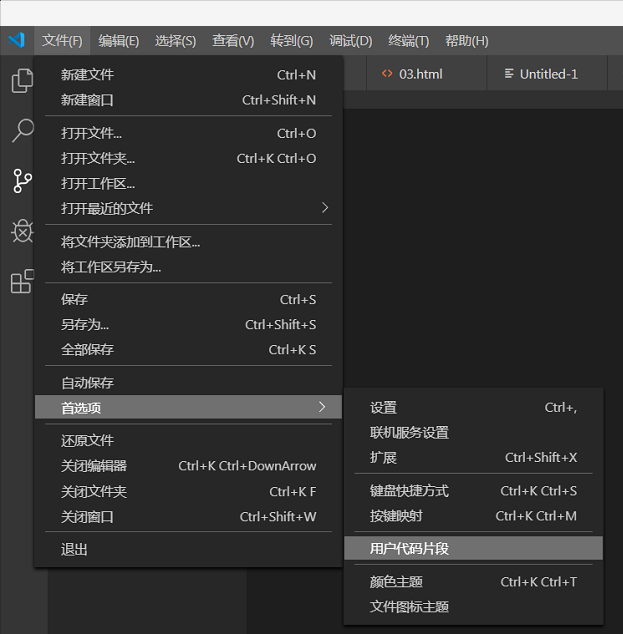
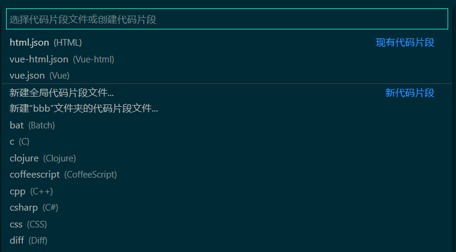
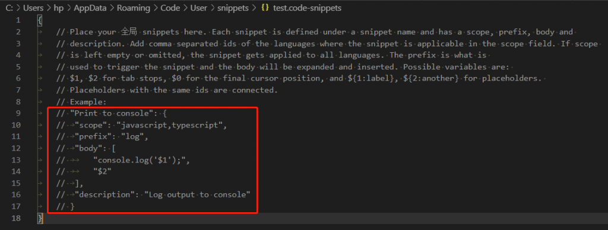
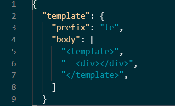
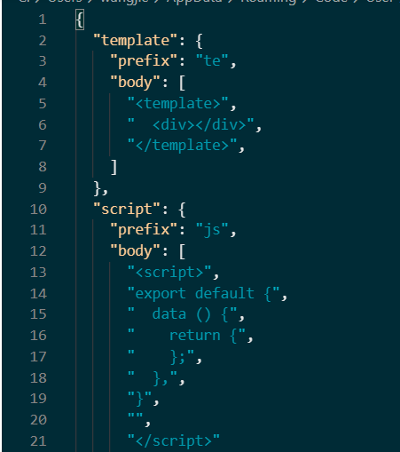

# VSCode添加自定义代码模板

[VS Code 代码片段指南: 从基础到高级技巧 - 简书](https://www.jianshu.com/p/3dc1b7f101bc)

- 首先我们要找到这个模板设置的入口，在文件 - > 首选项 - > 用户代码片段

  

- 选中以后，会出现下面这个输入框，假如你想设置.vue文件的模板，可以输入vue.json或者点击新建全局代码片段，然后回车。

  

- 弹出对话框，输入你想要的代码片段的名称，就来到了编辑界面

  

  

- 其中标红部分是一个完整的示例，取消注释，prefix是你输入的内容，达到输入 log 或者 te 字符，body就是你回车或者Tab键以后出现的内容，注意，body是一个数组，每一行的内容都是数组里的每一项，并且需要用引号引起来。

- 当然如果你觉得这还不够，我们依旧可以在那个json文件里面继续输入，接下来你就可以输入”js”，就能出现下面body里面的代码。

  

- 这里我们建一个vue的html模板代码片段，如下：

  ```json
  {
	// Place your 全局 snippets here. Each snippet is defined under a snippet name and has a scope, prefix, body and 
	// description. Add comma separated ids of the languages where the snippet is applicable in the scope field. If scope 
	// is left empty or omitted, the snippet gets applied to all languages. The prefix is what is 
	// used to trigger the snippet and the body will be expanded and inserted. Possible variables are: 
	// $1, $2 for tab stops, $0 for the final cursor position, and ${1:label}, ${2:another} for placeholders. 
	// Placeholders with the same ids are connected.
	// Example:
	"Print to console": {
		"scope": "html",
		"prefix": "vue",
		"body": [
			"<!DOCTYPE html>",
			"<html lang=\"en\">",
			"",
			"<head>",
    		"	<meta charset=\"UTF-8\">",
    		"	<meta http-equiv=\"X-UA-Compatible\" content=\"IE=edge\">",
    		"	<meta name=\"viewport\" content=\"width=device-width, initial-scale=1.0\">",
    		"	<title></title>",
			"</head>",
			"",
			"<body>",
    		"	<div id=\"app\">",
			"",
    		"	</div>",
    		"	<script src=\"js/vue.js\"></script>",
    		"	<script type=\"text/javascript\">",
        	"		var vm = new Vue({",
            "			el: \"#app\",",
            "			data: {",
			"",
			"			},",
            "			methods: {",
			"",
			"			},",
			"		})",
    		"	</script>",
			"</body>",
			"",
			"</html>",
		],
		"description": "a vue html template"
	}
}
  ```

- 当在vscode中新建一个html后缀文件，在文件中输入vue按tab或者回车，即可实现以下输出：

  ```html
  <!DOCTYPE html>
  <html lang="en">
      <head>
      <meta charset="UTF-8">
      <meta http-equiv="X-UA-Compatible" content="IE=edge">
      <meta name="viewport" content="width=device-width, initial-scale=1.0">
      <title></title>
  </head>
      <body>
          </div>
  <script src="js/vue.js"></script>
  <script type="text/javascript">
      var vm = new Vue({
          el: "#app",
          data: {
  
          },
          methods: {
              
          },
      })
  </script>
      </body>
  
  </html>
