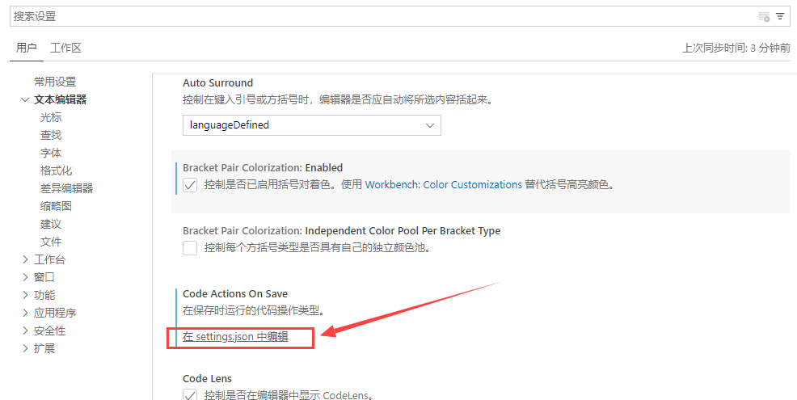
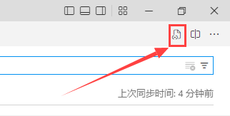
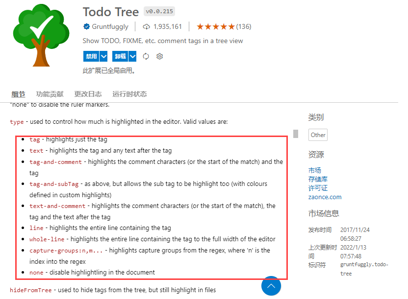

# VSCode Todo Tree插件使用

[TOC]

### 1. VSCode Todo Tree插件安装 


### 2. TODO、FIXME和XXX的注释使用说明

> - TODO: 用来标记待办的地方。常常在有些地方，我们的功能并没有实现，使用ToDo标记我们可以快速定位需要实现的部分。
> - HACK: 用来标记可能需要更改的地方。在写代码的时候，有的地方我们并不确定他是正确的，可能未来有所更改，这时候可以使用HACK标记。
> - NOTE: 添加一些说明文字。
> - INFO: 用来表达一些信息。
> - TAG: 用来创建一些标记。
> - XXX: 用来标记一些草率实现的地方。在写代码的时候，有些地方需要频繁修改，这时候使用XXX标记。
> - BUG: 用来标记BUG
> - FIXME: 用来标记一些需要修复的位置，可以快速定位。

### 3. 在VScode中打造自己专属的图标调试

#### 3.1 打开vscode中的settings.json文件

1. 左下角【管理】图标，点击【设置】，慢慢往下滑动找到settings.json，点击即可

   

2. 左下角【管理】图标，点击【设置】，右上角点击【打开设置[json]】

   

#### 3.2 设置自己的todo tree注释样式

- 在settings.json配置代码

  ```js
  //todo-tree 标签配置  标签兼容大小写字母
  "todo-tree.regex.regex": "((%|#|//|<!--|^\\s*\\*)\\s*($TAGS)|^\\s*- \\[ \\])", // 匹配大小写
      "todo-tree.general.tags": [ 
          "todo",	//添加自定义的标签成员,将在下面实现它们的样式
          "bug",
          "tag",
          "done",
          "mark",
          "test",
          "update",
          "xxx"
      ],
      "todo-tree.regex.regexCaseSensitive": false,       
      "todo-tree.highlights.defaultHighlight": {  //如果相应变量没赋值就会使用这里的默认值
          "foreground": "black",      //字体颜色
          "background": "yellow",     //背景色
          "icon": "check",            //标签样式 check 是一个对号的样式
          "rulerColour": "yellow",    //边框颜色
          "type": "tag",              //填充色类型  可在TODO TREE 细节页面找到允许的值 
          "iconColour": "yellow"      //标签颜色
      },
      //标签样式
      "todo-tree.highlights.customHighlight": {
          //todo	需要做的功能
          "todo": {
              "icon": "alert",        // 图标 
              "background": "#c9c552",  //背景色
              "rulerColour": "#c9c552", //外框颜色
              "iconColour": "#c9c552",  //标签颜色
          },
          //bug	必须要修复的BUG  
          "bug": {
              "background": "#eb5c5c",
              "icon": "bug",
              "rulerColour": "#eb5c5c",
              "iconColour": "#eb5c5c",
          },  
          //tag	标签
          "tag": {
              "background": "#38b2f4",
              "icon": "tag",
              "rulerColour": "#38b2f4",
              "iconColour": "#38b2f4",
              "rulerLane": "full"
          }, 
          //done	已完成
          "done": {
              "background": "#5eec95",
              "icon": "check",
              "rulerColour": "#5eec95",
              "iconColour": "#5eec95",
          },  
          //mark	标记一下
          "mark": {
              "background": "#f90",
              "icon": "note",
              "rulerColour": "#f90",
              "iconColour": "#f90",
          },  
          //test	测试代码
          "test": {
              "background": "#df7be6",
              "icon": "flame",
              "rulerColour": "#df7be6",
              "iconColour": "#df7be6",
          }, 
          //update	优化升级点
          "update": {
              "background": "#d65d8e",
              "icon": "versions",
              "rulerColour": "#d65d8e",
              "iconColour": "#d65d8e",
          },
          //xxx	实现草率的需要修改的地方
          "xxx": {
              "background": "#f90",
              "icon": "note",
              "rulerColour": "#f90",
              "iconColour": "#f90",
          }
      }
  ```

- 配置查询

  > - type：颜色填充高亮的范围，可在TODO TREE 细节页面找到允许的值
  >
  > 
  >
  > - foreground：是指关键字在代码中的前景色
  > - background：是指关键字代码中的背景色
  > - opacity：透明度
  > - icon：图标样式
  > - iconColour：目录树区域的图标颜色
  > - icon网址：https://microsoft.github.io/vscode-codicons/dist/codicon.html
  > - 颜色网址：https://www.5tu.cn/colors/yansezhongwenming.html