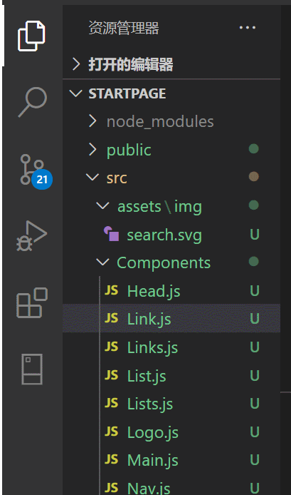
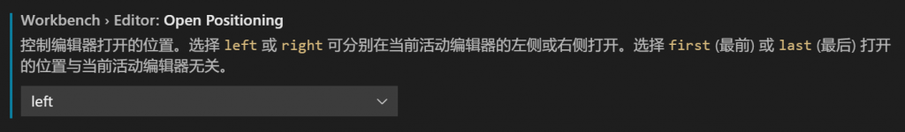
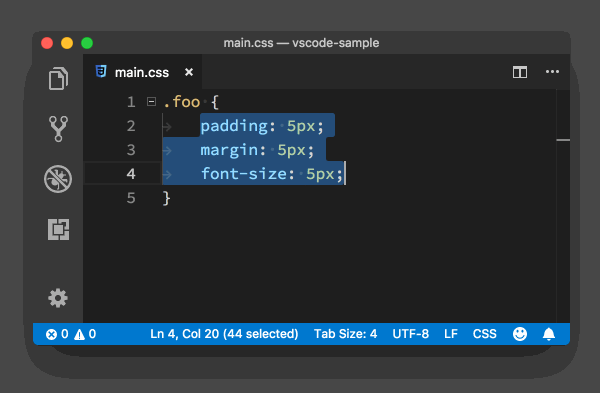

# VSCode的奇技淫巧

[TOC]

### 1. 文件过滤器

- 通过快捷键`ctrl+p`查找文件，也可以直接在文件资源管理器上输入你想要搜索的文件名。如，搜索search.js，你会在右上角看到一个文件过滤器。使用方向键上下移动，可以在搜索的文件和文件夹之间进行跳转。单击X按钮，可以清除过滤器。

  

### 2. Tab（标签页）打开位置

- 与其他主流的编辑器/IDE一样，Visual Studio Code会在编辑器的标题区域显示Tab（标签页）。

- Tab可以帮助开发者快速地在打开的文件之间进行跳转。当然，如果你觉得Tab对你的用处并不大，则可以通过workbench.editor.showTabs配置项把Tab隐藏起来。

  ```js
  "workbench.editor.showTabs":false
  ```

- 默认情况下，新添加的Tab会出现在最右边。可以通过workbench.editor.openPositioning来改变Tab出现的位置。如下所示，可以把新Tab的出现位置设置为左边。

  ```js
  "workbench.editor.openPositioning":"left"
  ```

  

### 3. 行排序

- 将代码行按照字母顺序进行排序，无快捷键，调出命令面板，输入按升序排序或者按降序排序。

  

### 4. 在jsx中使用emmet

- vscode是支持`emmet`语法的，只是默认设置不支持，需要手动设置一下，设置步骤：

  - 点击左下角“设置”

  - 搜emmet

  - 设置如下属性

    ```js
    “emmet.triggerExpansionOnTab”: true
    ```

### 5. 切换标签页

- `ALT + 0/1/2`等数字键可以切换不同的标签页（打开待编辑的文件）。

- 其中`ALT+0`是最后一个标签页，`ALT+1`是第一个标签页，其余类推。
- 因为最大数字是9，建议不要打开太多文件。

### 6. 列编辑

`alt + shift + 鼠标左键`

### 7. 查看各个扩展的在 VSCode 启动时的加载时间

`Ctrl + shift + p`或者 `F1` 打开命令面板调用命令 `Developer: Startup Performance`