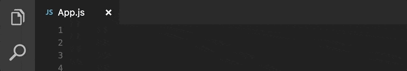
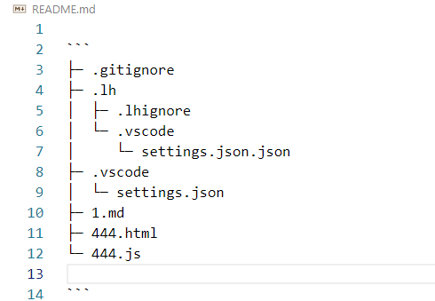
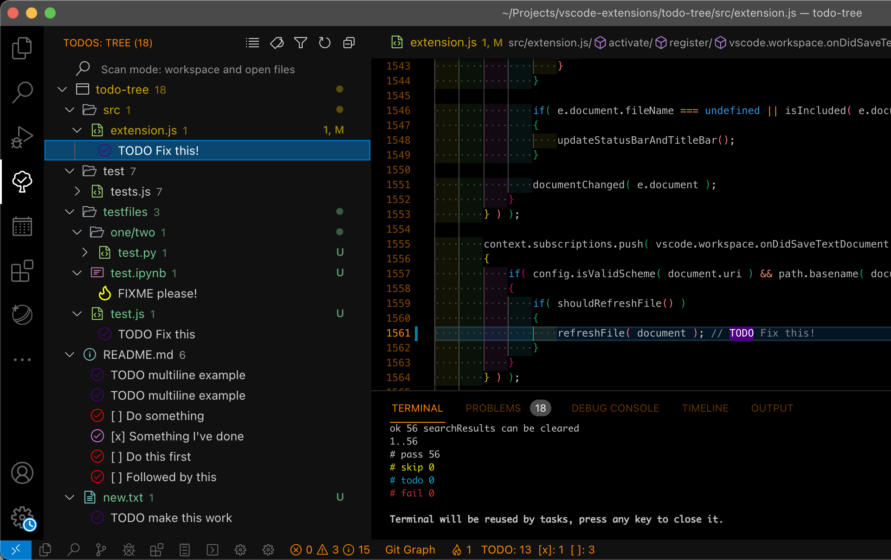

# VSCode自用插件详介

> 工欲善其事必先利其器，VSCode：我变强了，也变臃肿了~

[TOC]

### 1. :emojisense: ✅

- 发布者：Matt
- 简介：将表情符号的建议和自动完成添加到 VS 代码
- 快捷键：`::` 或者 `ctrl + i`
- 网站：[：表情符号： - Visual Studio Marketplace](https://marketplace.visualstudio.com/items?itemName=bierner.emojisense)


### 2. 韭菜盒子 ✅

- 发布者：Nickbing Lao
- 简介：VSCode 里也可以看股票 & 基金 & 期货实时数据，做最好用的投资插件
- 使用说明：[韭菜盒子使用文档](https://github.com/LeekHub/leek-fund/issues/23)
- 网站：[韭菜盒子 - Visual Studio Marketplace](https://marketplace.visualstudio.com/items?itemName=giscafer.leek-fund)


### 3. 驼峰翻译助手 ✅

- 发布者：svenzhao
- 简介：选中输入文案并选择响应的命名格式，一键得到翻译结果（悄悄告诉你 直接选中英文还可以跳过翻译哦 快速改变命名格式），支持谷歌（免费）、腾讯（需要token）、百度（需要token）翻译引擎。
- 快捷键：`Alt+t`
- 网站：[驼峰翻译助手 - Visual Studio Marketplace](https://marketplace.visualstudio.com/items?itemName=svenzhao.var-translation)


### 4. A-super-comprehensive ✅

- 发布者：雪导
- 简介：支持中文的代码补全插件，代码补全合集(vue-webpack-bootstrap-node-mui-html-js-jquery-php-css-react-native)，右击菜单**偷窥葵花宝典**。
- 网站：[A-super-comprehensive - Visual Studio Marketplace](https://marketplace.visualstudio.com/items?itemName=xuedao.super-comprehensive)


### 5. A-super-themes ✅

- 发布者：雪导
- 简介：暗黑+霓虹灯+80 年代幻想主题
- 网站：[A-super-themes - Visual Studio Marketplace](https://marketplace.visualstudio.com/items?itemName=xuedao.super-themes)


### 6. Art Template Helper ✅

- 发布者：ZihanLi
- 简介：VSCode的Art-Template模版支持
- 网站：[Art Template Helper - Visual Studio Marketplace](https://marketplace.visualstudio.com/items?itemName=ZihanLi.at-helper)


### 7. Auto Rename Tag✅

- 发布者：Jun Han
- 简介：重命名一个 HTML/XML 标记时，会同步重命名配对的 HTML/XML 标记
- 网站：[Auto Rename Tag - Visual Studio Marketplace](https://marketplace.visualstudio.com/items?itemName=formulahendry.auto-rename-tag)


### 8. Beautify ✅

- 发布者：HookyQR
- 简介：Beautify是格式化代码的插件，可美化JS、JSON、CSS、Sass、HTML
- 快捷键：`Alt+F`
- 同类插件：[**Prettier - Code formatter**](https://marketplace.visualstudio.com/items?itemName=esbenp.prettier-vscode)
- 网站：[Beautify - Visual Studio Marketplace](https://marketplace.visualstudio.com/items?itemName=HookyQR.beautify)


### 9. Bootstrap 4, Font awesome 4, Font Awesome 5 Free & Pro snippets ✅

- 发布者：Ashok Koyi
- 简介：Bootstrap 4辅助插件
- 网站：[Bootstrap 4, Font awesome 4, Font Awesome 5 Free & Pro snippets - Visual Studio Marketplace](https://marketplace.visualstudio.com/items?itemName=thekalinga.bootstrap4-vscode)


### 10. Chinese (Simplified) (简体中文) ✅

- 发布者：Microsoft
- 简介：适用于 VS Code 的中文（简体）语言包
- 网站：[Chinese (Simplified) (简体中文) Language Pack for Visual Studio Code - Visual Studio Marketplace](https://marketplace.visualstudio.com/items?itemName=MS-CEINTL.vscode-language-pack-zh-hans)


### 11. Code Spell Checker ✅

- 发布者：Street Side Software
- 简介：帮助捕获常见的拼写错误，同时保持较低的误报数，一个基本的拼写检查器，可以很好地与骆驼大小写代码配合使用并且给出修正建议。
- 网站：[Code Spell Checker - Visual Studio Marketplace](https://marketplace.visualstudio.com/items?itemName=streetsidesoftware.code-spell-checker)


### 12. Color Highlight ✅

- 发布者：Sergii N
- 简介：直观显示你定义的颜色
- 网站：[Color Highlight - Visual Studio Marketplace](https://marketplace.visualstudio.com/items?itemName=naumovs.color-highlight)


### 13. Color Info ✅

- 发布者：Matt Bierner
- 简介：将鼠标悬停在 css 颜色上时，提供 css 颜色快速信息
- 网站：[Color Info - Visual Studio Marketplace](https://marketplace.visualstudio.com/items?itemName=bierner.color-info)


### 14. CSS Peek ✅

- 发布者：Pranay Prakash
- 简介：使用此插件，你可以追踪至样式表中 CSS 类和 id 定义的地方。当你在 HTML 文件中右键单击选择器时，选择“ Go to Definition 转到定义 和 Peek definition ”选项，它便会给你发送样式设置的 CSS 代码。
- 快捷键：鼠标悬停或者右键转到定义
- 网站：[CSS Peek - Visual Studio Marketplace](https://marketplace.visualstudio.com/items?itemName=pranaygp.vscode-css-peek)


### 15. CSS Tree ✅

- 发布者：Sachin Bansal
- 简介：从选定的 HTML/JSX 生成 CSS 树
- 快捷键：`Alt+G`
- 网站：[CSS Tree - Visual Studio Marketplace](https://marketplace.visualstudio.com/items?itemName=sachinb94.css-tree)


### 16. css-auto-prefix ✅

- 发布者：sporiley
- 简介：自动键入css属性私有前缀
- 同类插件：[**Autoprefixer**](https://marketplace.visualstudio.com/items?itemName=mrmlnc.vscode-autoprefixer)
- 网站：[css-auto-prefix - Visual Studio Marketplace](https://marketplace.visualstudio.com/items?itemName=sporiley.css-auto-prefix)


### 17. CSScomb ✅

- 发布者：mrmlnc
- 简介：自动为css属性排序
- 配置说明：[Notes/VSCode为CSS属性自定义排序.md at master · Vogadero/Notes (github.com)](https://github.com/Vogadero/Notes/blob/master/VSCode/VSCode为CSS属性自定义排序.md)
- 网站：[CSScomb - Visual Studio Marketplace](https://marketplace.visualstudio.com/items?itemName=mrmlnc.vscode-csscomb)


### 18. Dynamic Theme ✅

- 发布者：guangzan
- 简介：在VS代码上体验动态主题（自动切换主题、自定义浅色或深色主题、自定义深色或浅色主题的开始时间、通过命令设置）
- 网站：[Dynamic Theme - Visual Studio Marketplace](https://marketplace.visualstudio.com/items?itemName=guangzan.dynamic-theme)


### 19. Easy LESS ✅

- 发布者：mrcrowl

- 简介：实现编写less文件后生成css或者wxss文件

- 配置

  ```json
  // Easy LESS配置
      "less.compile": {
          "compress": false, //是否压缩
          "sourceMap": false, //是否生成map文件，有了这个可以在调试台看到less行数
          "out": true, // 是否输出css文件，false为不输出，千万不要是false
          // "outExt": ".wxss", // 输出文件的后缀,小程序可以写'.wxss'
          "outExt": ".css" // 输出文件的后缀,小程序可以写'.wxss'
      }
  ```

- 网站：[Easy LESS - Visual Studio Marketplace](https://marketplace.visualstudio.com/items?itemName=mrcrowl.easy-less)


### 20. Echarts Enhanced Completion ✅

- 发布者：ren-wei
- 简介：用于编辑 `echarts` 的配置项时进行补全提示的 `vscode` 的扩展
- 使用：在你需要用作 `echarts` 配置项的对象的上一行添加一行注释： `/** @type EChartsOption */` (输入 `echartsoption` 可以使用代码片段)，用于定义该对象为配置项对象。现在，在配置项对象中按下 `Enter` 键时，插件会显示你可能需要的配置项的列表，并且提示中有对该配置项的详细说明
- 网站：[Echarts Enhanced Completion - Visual Studio Marketplace](https://marketplace.visualstudio.com/items?itemName=ren-wei.echarts-enhanced-completion)


### 21. ESLint Chinese Rules ✅

- 发布者：maggie
- 简介：ESLint中文规则辅助提示插件，帮助更便捷的查询引用的规则，理解规则。
- 同类插件：[**ESLint**（javascript代码检测工具）](https://marketplace.visualstudio.com/items?itemName=dbaeumer.vscode-eslint)
- 使用说明：鼠标悬停在ESLint诊断错误的地方，打开惊喜小提示，点击蓝色提示，方便的跳转文档地址
- 网站：[ESLint Chinese Rules - Visual Studio Marketplace](https://marketplace.visualstudio.com/items?itemName=maggie.eslint-rules-zh-plugin)

### 22. filesize ✅

- 发布者：Matheus Kautzmann

- 简介：在编辑器的状态栏中显示获得焦点的文件的大小

- 同类插件：[**file-size**（zhcode发布版本）](https://marketplace.visualstudio.com/items?itemName=zh9528.file-size)

- 扩展配置

  > `useDecimal`：设置为“如果您希望根据 [SI 单位制](https://en.wikipedia.org/wiki/International_System_of_Units)显示尺寸数据”，或将其保留为使用 [IEC](https://en.wikipedia.org/wiki/Binary_prefix) 的格式
  >
  > `use24HourFormat`：设置为使用 24 小时制，设置为使用 12 小时制
  >
  > `showGzip`：设置为在详细信息视图中显示计算出的 gzip 大小
  >
  > `showGzipInStatusBar`：设置为在状态栏中显示计算出的 gzip 大小
  >
  > `showBrotli`：设置为在详细信息视图中显示计算出的 brotli 压缩大小
  >
  > `displayInfoOnTheRightSideOfStatusBar`：设置为在右侧显示状态栏信息

- 网站：[filesize - Visual Studio Marketplace](https://marketplace.visualstudio.com/items?itemName=mkxml.vscode-filesize)


### 23. Fluent Icons ✅

- 发布者：Miguel Solorio
- 简介：产品图标主题
- 网站：[Fluent Icons - Visual Studio Marketplace](https://marketplace.visualstudio.com/items?itemName=miguelsolorio.fluent-icons)


### 24. gitignore ✅

- 发布者：CodeZombie
- 简介：使用 https://github.com/github/gitignore 模板快速生成 .gitignore 文件
- 快捷键：使用 `Ctrl+Shift+P` 或 `F1`并键入`Add gitignore`，选择您要使用的模板，然后按回车键，.gitignore 将在项目根目录中生成
- 网站：[gitignore - Visual Studio Marketplace](https://marketplace.visualstudio.com/items?itemName=codezombiech.gitignore)


### 25. gitignore ✅

- 发布者：michelemelluso
- 简介：将文件/文件夹添加到 .gitignore 文件
- 快捷键：右键单击要添加到 .gitignore 中的文件
- 网站：[gitignore - Visual Studio Marketplace](https://marketplace.visualstudio.com/items?itemName=michelemelluso.gitignore)


### 26. HTML CSS Support ✅

- 发布者：ecmel
- 简介：在编写HTML时获得CSS文件中的类名提示
- 网站：[HTML CSS Support - Visual Studio Marketplace](https://marketplace.visualstudio.com/items?itemName=ecmel.vscode-html-css)


### 27. HTMLHint ✅

- 发布者：Mike Kaufman

- 简介：html文件的代码检查工具，对打开的HTML文件运行HTMLHint，并在“问题”面板（**“查看**”>“问题”）中报告状态栏上的错误数以及**详细信息**，HTML 文件中的错误使用波浪线突出显示，您可以将鼠标悬停在波浪线上以查看错误消息。

  > **注意：**HTMLHint只会分析打开的HTML文件，不会在项目文件夹中搜索HTML文件。

- 同类插件：[**HTMLHint**（ctf0发布版本）](https://marketplace.visualstudio.com/items?itemName=ctf0.htmlhint)、[**ESLint**（javascript代码检测工具）](https://marketplace.visualstudio.com/items?itemName=dbaeumer.vscode-eslint)、[**Stylelint**（检验CSS/SASS/LESS代码规范的插件）](https://marketplace.visualstudio.com/items?itemName=stylelint.vscode-stylelint)、[**CSSLint**（CSS 代码静态质量检查）](https://marketplace.visualstudio.com/items?itemName=raymondcamden.CSSLint)、[scss-lint（SCSS代码规范审查工具）](https://marketplace.visualstudio.com/items?itemName=adamwalzer.scss-lint)

- 扩展设置

  > `htmlhint.enable`- 全局或每个工作区禁用 HTMLHint 扩展
  >
  > `htmlhint.documentSelector`- 指定要覆盖的其他语言服务
  >
  > `htmlhint.options`- 提供一个规则集，用于在磁盘或 HTMLHint 默认值上覆盖。`.htmlhintrc`
  >
  > `htmlhint.configFile`- 指定自定义 HTMLHint 配置文件。请指定“ HTMLHint.configfile”或“ HTMLHint.options”，但不要同时指定“ HTMLHint.configfile”或“ HTMLHint.options”

- 规则：HTMLHint 扩展使用 HTMLHint 默认规则，配置项总共有23条，根据项目实际情况可选择配置

  ```json
  // 提供一个规则集，用于在磁盘或 HTMLHint 默认值上覆盖.htmlhintrc
  "htmlhint.options": {
          "tagname-lowercase": true, // 标签名必须小写
          "attr-lowercase": true, // 属性名必须小写
          "attr-value-double-quotes": true, // 属性值必须放在双引号中
          "attr-value-not-empty": false, // 属性值一定不可为空
          "attr-no-duplication": true, // 属性值一定不可重复
          "doctype-first": true, // Doctype必须是 HTML 文档的第一行
          "tag-pair": true, // 标签必须成对
          "tag-self-close": true, // 标签必须自封闭
          "spec-char-escape": true, // 特殊字符必须转义
          "id-unique": true, // ID 属性必须唯一
          "src-not-empty": true, // src 属性一定不可为空
          "title-require": false, // title 属性必须出现在标签中
          "alt-require": true, // img 标签必须包含 alt 属性
          "doctype-html5": true, // Doctype 必须是 HTML5
          "id-class-value": "dash", // ID 和 Class 的命名规则必须统一
          "style-disabled": true, // 不该使用样式标签
          "inline-style-disabled": true, // 不该使用行内样式
          "inline-script-disabled": true, // 不该使用行内脚本
          "space-tab-mixed-disabled": "space4", // 空格和制表符一定不可混合在行前
          "id-class-ad-disabled": true, // ID 和 Class 一定不可使用广告关键词
          "href-abs-or-rel": false, // href 必须是绝对路径或者相对路径
          "attr-unsafe-chars": true, // 属性值一定不可使用不安全字符
          "head-script-disabled": true // script 标签不该使用在头部
      }
  ```

- 网站：[HTMLHint - Visual Studio Marketplace](https://marketplace.visualstudio.com/items?itemName=mkaufman.HTMLHint)


### 28. Image preview ✅

- 发布者：Kiss Tamás
- 简介：鼠标悬停可以预览图片，显示图片的大小和尺寸。不仅仅在`css`中，也可以在`js`、`vue`等文件中预览哦，可以打开对应的文件夹和项目文件为位置
- 网站：[Image preview - Visual Studio Marketplace](https://marketplace.visualstudio.com/items?itemName=kisstkondoros.vscode-gutter-preview)


### 29. Import Cost ✅

- 发布者：Wix
- 简介：以内联方式显示导入包的大小
- 网站：[Import Cost - Visual Studio Marketplace](https://marketplace.visualstudio.com/items?itemName=wix.vscode-import-cost)



### 30. IntelliCode ✅

- 发布者：Microsoft
- 简介：通过在完成列表顶部显示代码上下文的建议完成项来提供 AI 辅助的智能提示
- 网站：[IntelliCode - Visual Studio Marketplace](https://marketplace.visualstudio.com/items?itemName=VisualStudioExptTeam.vscodeintellicode)


### 31. JavaScript (ES6) code snippets ✅

- 发布者：charalampos karypidis
- 简介：ES6 语法中 JavaScript 的代码片段提示
- 网站：[JavaScript (ES6) code snippets - Visual Studio Marketplace](https://marketplace.visualstudio.com/items?itemName=xabikos.JavaScriptSnippets)


### 32. JavaScript Booster ✅

- 发布者：Stephan Burguchev
- 简介：一款了不起的代码重构工具。比如把var转为const或者let，去除多余的else语句，合并声明和初始化，会提示对应的不合理原因和改进方案，帮助你在不合理的地方显示黄色感叹号，单击黄色感叹号后，就会变成更好的代码。
- 网站：[JavaScript Booster - Visual Studio Marketplace](https://marketplace.visualstudio.com/items?itemName=sburg.vscode-javascript-booster)


### 33. JavaScript Snippet Pack ✅

- 发布者：Mahmoud Ali
- 简介：为 JavaScript 和 TypeScript 提供了大量有用的代码片段
- 网站：[JavaScript Snippet Pack - Visual Studio Marketplace](https://marketplace.visualstudio.com/items?itemName=akamud.vscode-javascript-snippet-pack)


### 34. jQuery Code Snippets ✅

- 发布者：Don Jayamanne
- 简介：超过130个用于JavaScript代码的jQuery代码片段，只需键入字母 `jq` 即可获得所有可用jQuery代码片段的列表
- 网站：[jQuery Code Snippets - Visual Studio Marketplace](https://marketplace.visualstudio.com/items?itemName=donjayamanne.jquerysnippets)


### 35. layui-layer-snippets ✅

- 发布者：写代码的猫叔
- 简介：输入`lay`即可看到layui-layer常用代码片段
- 网站：[layui-layer-snippets - Visual Studio Marketplace](https://marketplace.visualstudio.com/items?itemName=maoshu.layui-layer-snippets)


### 36. Live Server ✅

- 发布者：Ritwick Dey
- 简介：启动具有静态和动态页面实时重新加载功能的本地开发服务器
- 网站：[Live Server - Visual Studio Marketplace](https://marketplace.visualstudio.com/items?itemName=ritwickdey.LiveServer)


### 37. Local History ✅

- 发布者：xyz
- 简介：每次修改文件时，旧内容的副本都会保留在本地历史记录中
- 网站：[Local History - Visual Studio Marketplace](https://marketplace.visualstudio.com/items?itemName=xyz.local-history)


### 38. Markdown Emoji ✅

- 发布者：Matt Bierner
- 简介：将表情符号语法支持添加到 VS Code 的内置 Markdown 预览
- 网站：[Markdown Emoji - Visual Studio Marketplace](https://marketplace.visualstudio.com/items?itemName=bierner.markdown-emoji)


### 39. Markdown Preview Enhanced ✅

- 发布者：Yiyi Wang
- 简介：让你拥有飘逸的 Markdown 写作体验
- 网站：[Markdown Preview Enhanced - Visual Studio Marketplace](https://marketplace.visualstudio.com/items?itemName=shd101wyy.markdown-preview-enhanced)


### 40. Path Intellisense ✅

- 发布者：Christian Kohler
- 简介：文件名路径智能感知
- 网站：[Path Intellisense - Visual Studio Marketplace](https://marketplace.visualstudio.com/items?itemName=christian-kohler.path-intellisense)


### 41. Polacode-2020 ✅

- 发布者：Jeff Hykin
- 简介：代码截取屏幕截图
- 快捷键：`Alt + X`
- 网站：[Polacode-2020 - Visual Studio Marketplace](https://marketplace.visualstudio.com/items?itemName=jeff-hykin.polacode-2019)


### 42. project-tree ✅

- 发布者：zhucy

- 简介：在 README.md 中生成项目的树结构

- 快捷键：`Alt + M`

- 扩展设置

  > `ProjectTree.theme`：设置树的展望主题
  >
  > `ProjectTree.withComment`：设置是否可以在行尾添加注释
  >
  > `ProjectTree.commentDistance`：设置评论和最长标题之间的距离，最小值为1
  >
  > `ProjectTree.loadIgnore`：设置是否可以忽略 .gitignore 规则的包含文件

- 网站：[project-tree - Visual Studio Marketplace](https://marketplace.visualstudio.com/items?itemName=zhucy.project-tree)



### 43. px to rem & rpx & vw (cssrem) ✅

- 发布者：cipchk
- 简介：一个 `px` 与 `rem` 单位互转的 VSCode 插件，且支持WXSS微信小程序
- 扩展配置：设置`rootFontSize`的初始值，基准font-size（单位：`px`）
- 网站：[px to rem & rpx & vw (cssrem) - Visual Studio Marketplace](https://marketplace.visualstudio.com/items?itemName=cipchk.cssrem)


### 44. REST Client ✅

- 发布者：Huachao Mao
- 简介：提供了丰富的api配置方式，在vscode中发送/取消/重新运行 **HTTP 请求**，进行接口调试，并在单独的窗格中查看响应，并突出显示语法。
- 使用说明
  - 创建一个 `.http`文件
  - 编写测试接口文件
  - 点击`Send Request`，或者右键选择`Send Request`，即可在右边窗口查看接口返回结果。
- 网站：[REST Client - Visual Studio Marketplace](https://marketplace.visualstudio.com/items?itemName=humao.rest-client)


### 45. Settings Sync ✅

- 发布者：Shan Khan
- 简介：在编辑器中发送/取消/重新运行 **HTTP 请求**，并在单独的窗格中查看响应，并突出显示语法
- 配置说明：[Notes/VSCode设置同步的两种方法.md at master · Vogadero/Notes (github.com)](https://github.com/Vogadero/Notes/blob/master/VSCode/VSCode设置同步的两种方法.md)
- 网站：[Settings Sync - Visual Studio Marketplace](https://marketplace.visualstudio.com/items?itemName=Shan.code-settings-sync)


### 46. SVG ✅

- 发布者：jock
- 简介：SVG编码，缩小，漂亮，预览多合一
- 网站：[SVG - Visual Studio Marketplace](https://marketplace.visualstudio.com/items?itemName=jock.svg)


### 47. Thunder Client ✅

- 发布者：Ranga Vadhineni
- 简介：VSCode的轻量级 Rest API 客户端
- 使用说明：从侧边栏单击雷霆客户端图标到测试 API`New Request`
- 网站：[Thunder Client - Visual Studio Marketplace](https://marketplace.visualstudio.com/items?itemName=rangav.vscode-thunder-client)


### 48. Todo Tree ✅

- 发布者：Gruntfuggly

- 简介：可快速在工作区中搜索注释标记（如 TODO 和 FIXME），并在活动栏的树视图中显示它们

- 个人配置

  ```json
  //todo-tree 设置
      "todo-tree.regex.regex": "((//|#|<!--|;|/\\*|^)\\s*($TAGS):|^\\s*- \\[ \\])",
      "todo-tree.general.tags": [
          "TODO",
          "FIXME",
          "tag",
          "done",
          "bug"
      ],
      "todo-tree.regex.regexCaseSensitive": false,
      "todo-tree.highlights.defaultHighlight": {
          "foreground": "#FFFFFF",
          "background": "#FFA500",
          "icon": "checklist",
          "rulerColour": "#FFA500",
          "type": "text-and-comment",
          "iconColour": "#FFA500"
      },
      "todo-tree.highlights.customHighlight": {
          "FIXME": {
              "background": "#FF0000",
              "icon": "beaker",
              "rulerColour": "#FF0000",
              "iconColour": "#FF0000",
              "opacity": 50,
          },
          "tag": {
              "background": "#FF00FF",
              "icon": "pin",
              "rulerColour": "#FF00FF",
              "iconColour": "#FF00FF",
              "rulerLane": "full",
              "opacity": 50,
          },
          "done": {
              "background": "#00CED1",
              "icon": "verified",
              "rulerColour": "#00CED1",
              "iconColour": "#00CED1",
              "opacity": 50,
          },
          "bug": {
              "background": "#008000",
              "icon": "bug",
              "rulerColour": "#008000",
              "iconColour": "#008000",
              "opacity": 50,
          },
      }
  ```

- 配置说明：[Notes/VSCode Todo Tree插件使用.md at master · Vogadero/Notes (github.com)](https://github.com/Vogadero/Notes/blob/master/VSCode/VSCode Todo Tree插件使用.md)

- 同类插件：[**Better Comments**（通过提醒、信息、TODO 等进行注释来改进您的代码注释）](https://marketplace.visualstudio.com/items?itemName=aaron-bond.better-comments)

- 网站：[Todo Tree - Visual Studio Marketplace](https://marketplace.visualstudio.com/items?itemName=Gruntfuggly.todo-tree)



### 49. view-in-browser ✅

- 发布者：Koppt Ho
- 简介：在浏览器中预览`HTML`文件，支持Chrome，Firefox，Opera，Safari，IE。
- 网站：[view-in-browser - Visual Studio Marketplace](https://marketplace.visualstudio.com/items?itemName=koppt.vscode-view-in-browser)


### 50. vscode-icons ✅

- 发布者：VSCode Icons Team
- 简介：漂亮的目录树文件图标主题
- 网站：[vscode-icons - Visual Studio Marketplace](https://marketplace.visualstudio.com/items?itemName=vscode-icons-team.vscode-icons)


### 51. 翻译(英汉词典) ❌

- 发布者：中文编程

- 简介：本地77万词条英汉词典，不依赖任何在线翻译API，无查询次数限制。可翻译驼峰和下划线命名，及对整个文件中的标识符批量翻译。

- 配置说明

  | 键名称                               | 默认值 | 说明                 |
  | ------------------------------------ | ------ | -------------------- |
  | EnglishChineseDictionary.enableHover | false  | 开启悬停显示翻译结果 |

- 网站：[翻译(英汉词典) - Visual Studio Marketplace](https://marketplace.visualstudio.com/items?itemName=CodeInChinese.EnglishChineseDictionary)


### 52. Angular Language Service ❌

- 发布者：Angular

- 简介：Angular 语言服务让你能在 Angular 模板内获得自动补全、错误检查、查看定义、快速定位、给出提示和内部导航等功能，而不用管这些模板位于外部 HTML 文件中还是内嵌在注解/装饰器的字符串中。 Angular 语言服务会自动检测你要打开的 Angular 文件（从你的 tsconfig.json 中读取），找出应用中所需的所有模板，然后为你打开的这些模板提供语言服务。

- 配置说明

  ```json
  // Angular 语言服务使用与编译应用程序相同的选项集
  "angularCompilerOptions": {
    "strictTemplates": true
  }
  ```

- 网站：[Angular Language Service - Visual Studio Marketplace](https://marketplace.visualstudio.com/items?itemName=Angular.ng-template)


### 53. code settings sync ❌

- 发布者：gitee-code-settings-sync
- 简介：用于同步vscode设置到码云（gitee），功能类似[**Settings Sync - Visual Studio Marketplace**](https://marketplace.visualstudio.com/items?itemName=Shan.code-settings-sync)
- 网站：[code settings sync - Visual Studio Marketplace](https://marketplace.visualstudio.com/items?itemName=Alex-Chen.gitee-code-settings-sync)


### 54. Code Translate ❌

- 发布者：w88975
- 简介：一款纯粹的 vscode 滑词翻译插件
- 网站：[Code Translate - Visual Studio Marketplace](https://marketplace.visualstudio.com/items?itemName=w88975.code-translate)


### 55. Easy Sass ❌

- 发布者：Wojciech Sura

- 简介：保存时自动将 SASS/SCSS 文件编译为 .css 和 .min.css，快速编译项目中的所有 SCSS/SASS 文件

- 扩展设置

  > easysass.compileAfterSave：启用或禁用保存后的自动编译
  > easysass.formats：指定导出文件的扩展名和格式
  > easysass.targetDir：为生成的文件定义目标目录
  > easysass.excludeRegex：使用正则表达式从编译中排除文件

- 同类插件：[**Live Sass Compiler**（实时编译sass/scss到css）](https://marketplace.visualstudio.com/items?itemName=glenn2223.live-sass)

- 网站：[Easy Sass - Visual Studio Marketplace](https://marketplace.visualstudio.com/items?itemName=spook.easysass)


### 56. Google Translate ❌

- 发布者：Hancel.Lin

- 简介：基于 [Google 翻译(cn)](https://translate.google.cn/)，无需科学上网，无需 API Key 的翻译扩展

- 快捷键

  > - 自动语言互译 `Ctrl + Shift + T`
  > - 翻译并复制结果到剪贴板 `Alt + T`
  > - 展开候选词选择 `Shift + Alt + T`
  > - 翻译并替换 `Ctrl + Alt + T`

- 网站：[Google Translate - Visual Studio Marketplace](https://marketplace.visualstudio.com/items?itemName=hancel.google-translate)


### 57. koroFileHeader ❌

- 发布者：OBKoro1
- 简介
  - 自动生成文件头部注释，自动更新最后编辑人、最后编辑时间等。
  - 一键生成函数注释，支持函数参数自动提取并列到注释中。
  - 支持添加佛祖保佑永无bug、神兽护体、甩葱少女等好玩有趣的图像注释。
  - 配置非常灵活方便，各种细节都能配置，可以量身打造适合你的注释。
  - 支持所有主流语言, 配置文档非常详细，齐全。
- 网站：[koroFileHeader - Visual Studio Marketplace](https://marketplace.visualstudio.com/items?itemName=OBKoro1.korofileheader)


### 58. pdcode ❌

- 发布者：hujun2
- 简介：使用本插件可自由编辑和创建 智能提示文档、代码块，同时内置了丰富的javascript、css、node.js及一些常用第三方模块的中文版知识库，也可以自己任意添加其它语言的知识库，云端保存防丢失数据，同时支持中文首拼快捷输入代码。功能类似[**A-super-comprehensive - Visual Studio Marketplace**](https://marketplace.visualstudio.com/items?itemName=xuedao.super-comprehensive)
- 网站：[pdcode - Visual Studio Marketplace](https://marketplace.visualstudio.com/items?itemName=hujun2.pdcode)


### 59. Sass ❌

- 发布者：Syler
- 简介：缩进 Sass 语法突出显示、自动完成和格式化
- 网站：[Sass - Visual Studio Marketplace](https://marketplace.visualstudio.com/items?itemName=Syler.sass-indented)


### 60. SVN ❌

- 发布者：Chris Johnston
- 简介：VSCode 代码的子版本源代码管理
- 网站：[SVN - Visual Studio Marketplace](https://marketplace.visualstudio.com/items?itemName=johnstoncode.svn-scm)


### 61. Tabnine AI Autocomplete for Javascript, Python, Typescript, PHP, Go, Java, Ruby & more ❌

- 发布者：TabNine
- 简介：通过 AI 完成功能加快编码速度
- 网站：[Tabnine AI Autocomplete for Javascript, Python, Typescript, PHP, Go, Java, Ruby & more - Visual Studio Marketplace](https://marketplace.visualstudio.com/items?itemName=TabNine.tabnine-vscode)


### 62. TortoiseSVN Helper ❌

- 发布者：Zlorn

- 简介：这是一个基于 [TortoiseSVN](https://tortoisesvn.net/) 的 VSCode 右键快捷菜单扩展

- 使用说明：在文件内容中右键，或者在资源管理器中右键，都可以看到此快捷菜单。也可以使用命令或者快捷键执行操作

  | 命令                       | 快捷键  |
  | -------------------------- | ------- |
  | SVN Update                 | alt + u |
  | SVN Commit                 | alt + c |
  | Show log                   | alt + l |
  | Diff with previous version | alt + d |
  | Rename                     | -       |
  | Revert                     | -       |
  | Blame                      | alt + b |

- 网站：[TortoiseSVN Helper - Visual Studio Marketplace](https://marketplace.visualstudio.com/items?itemName=Zlorn.svn-helper)


### 63. Vetur ❌

- 发布者：Pine Wu
- 简介：Vue 支持工具
- 网站：[Vetur - Visual Studio Marketplace](https://marketplace.visualstudio.com/items?itemName=octref.vetur)


### 64. Vue 3 Snippets ❌

- 发布者：hollowtree
- 简介：基于最新的 Vue 2 及 Vue 3 的 API 添加了 Code Snippets
- 网站：[Vue 3 Snippets - Visual Studio Marketplace](https://marketplace.visualstudio.com/items?itemName=hollowtree.vue-snippets)


### 65. wpy-beautify ❌

- 发布者：doingweb
- 简介：美化vscode的wpy/vue代码
- 网站：[wpy-beautify - Visual Studio Marketplace](https://marketplace.visualstudio.com/items?itemName=doingweb.wpy-beautify)


