# VSCode设置同步的两种方法

[TOC]

## 方法一：官方账户(推荐)

1. ##### 首先，点击设置

   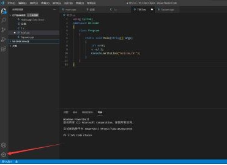

2. ##### 然后，点击设置同步

   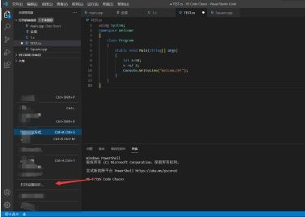

3. ##### 接着，点击箭头所指的地方

   

4. ##### 最后，登录账户(两种登录方式)后，设置成功

   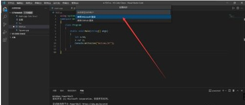

## 方法二：云同步扩展 Settings Sync 

1. ##### 在VSCode中点击扩展，搜索：**Settings Sync** 安装

   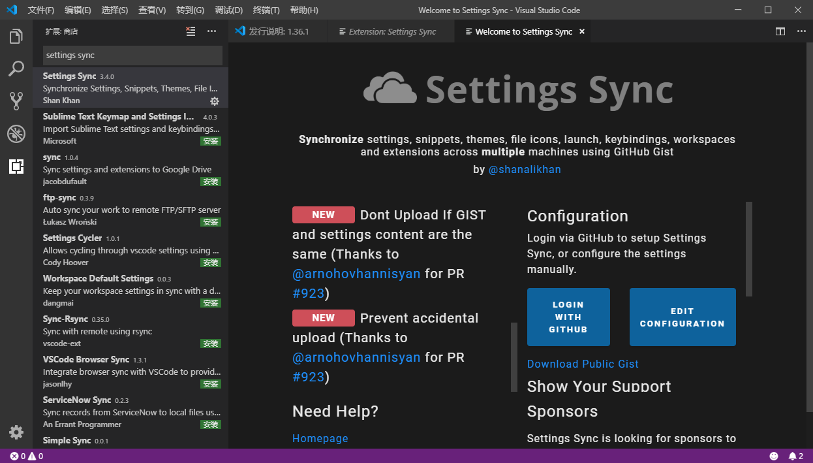

2. ##### 安装好扩展之后我们**登录GitHub开通并创建一个Gist**（代码片段管理服务）来保存你的环境配置

   - 登录你的Github 点击头像 进入**Settings**页面

   - 在Settings页面点击进入 **Developer settings** （开发者设置）再点击进入**Personal access tokens** （个人授权令牌）页面生成一个令牌 点击 **Generate new token**

     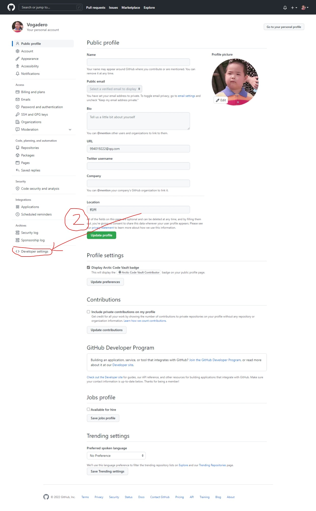

     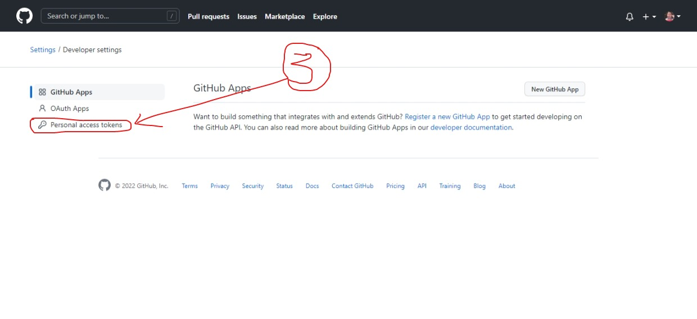

     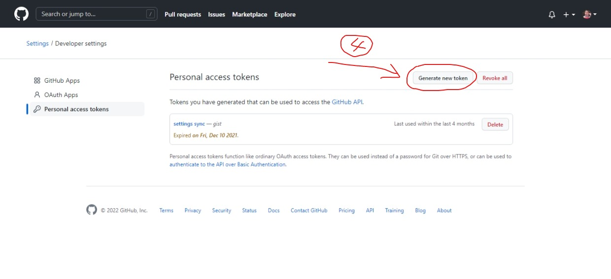

3. ##### 令牌的作用能帮助我们就在VSCode中使用自己的私有令牌访问自己的保存在Gist上的配置.所以我们输入令牌备注，然后选择令牌有效期，勾选Gist，点击生成

   - 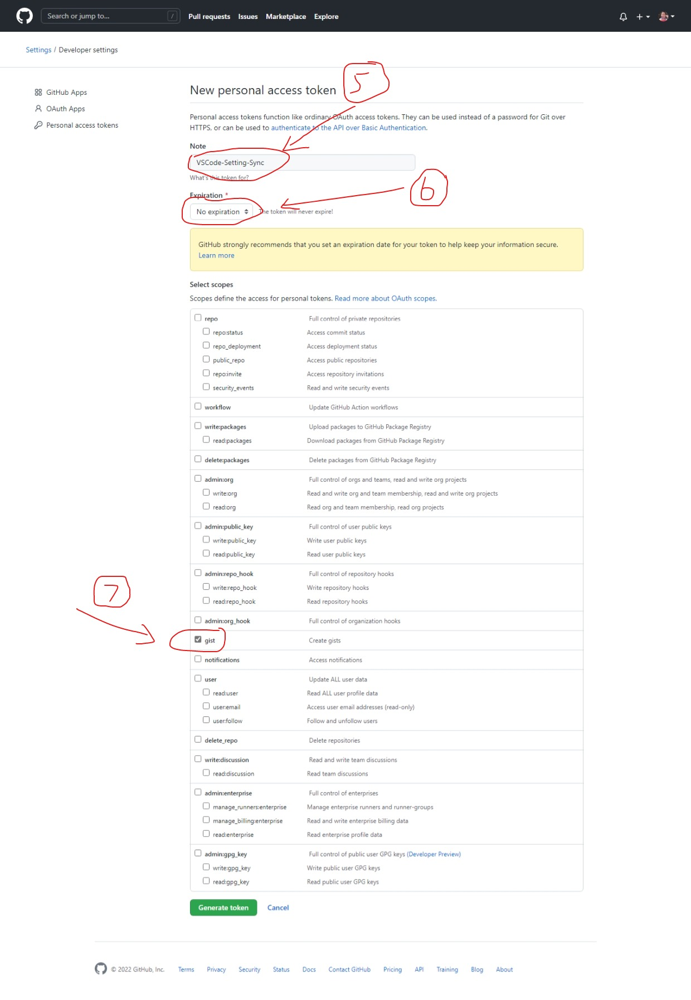

4. ##### 然后你就获得了自己的Gist专属访问令牌，你可以用记事本保存下来，待会并且未来你可能需要在另一台电脑下载你的配置 你同样需要使用到这个令牌。（截图中生成Token演示后删除，请自己生成）

   - 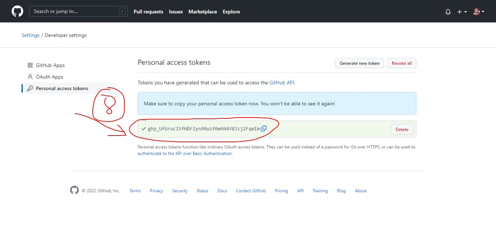

5. ##### 然后再次点击你的头像 点击进入->Gist页面 点击**创建一个新Gist**

   - 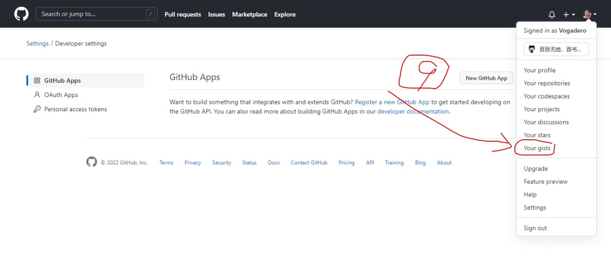
   - 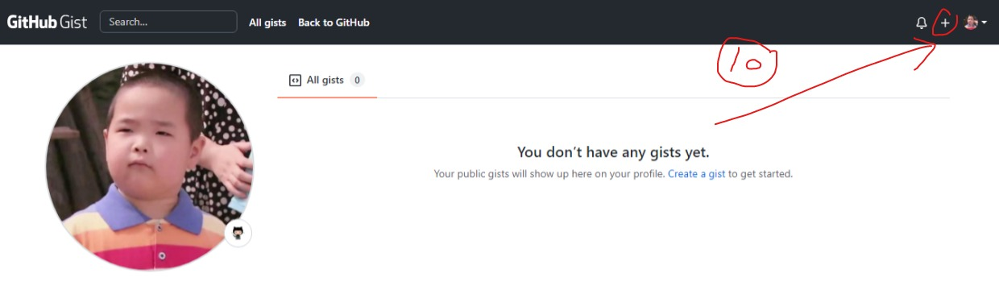

6. ##### 输入创建的Gist描述和片段内容，可以选择是否公开，然后保存即可

   - 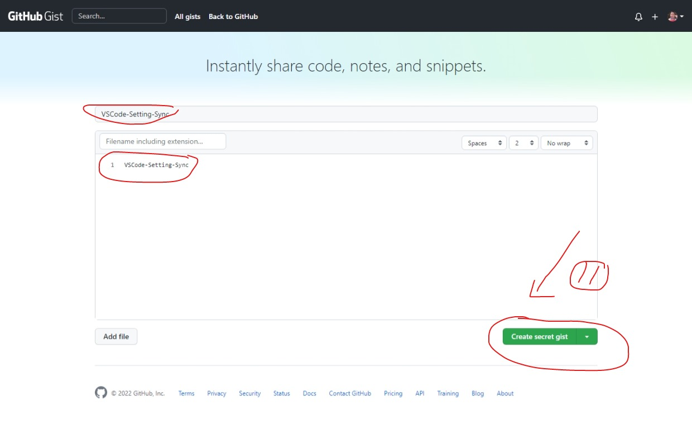

7. ##### 手动复制刚才创建的Gist仓库的ID：它显示在浏览器url最后一串字符串或者截图中第二个框gist冒号后面的字符串（如下图）把它保存在你的记事本中

   - 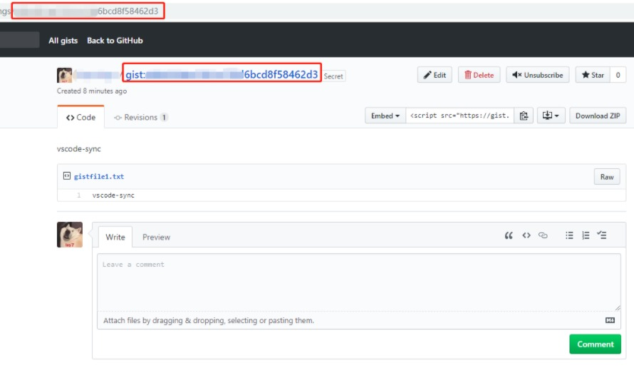

8. ##### 回到VSCode编辑器中 使用快捷键`Ctrl+P` 输入命令 `>sync` 点击 **同步：高级选项**

   - ps：如果有问题，可以点红框下面的 **扩展设置重置** 它不会清除你现有的扩展，只恢复初始sync的配置） 快捷键的用法是 `Ctrl+P` 输入命令：`>Sync: Reset Extension Settings`
   - 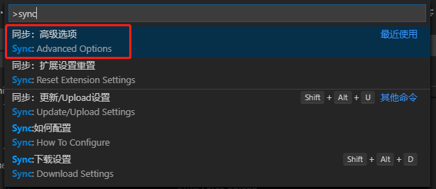

9. ##### 然后选择同步：编辑配置设置。也可以直接打开设置，进入Settings Sync的配置页面，手动填写你在github上创建的gist和token

10. ##### 如果点击编辑配置设置，则输入你在github上创建的token 记得使用`Ctrl+S`保存更改

    - 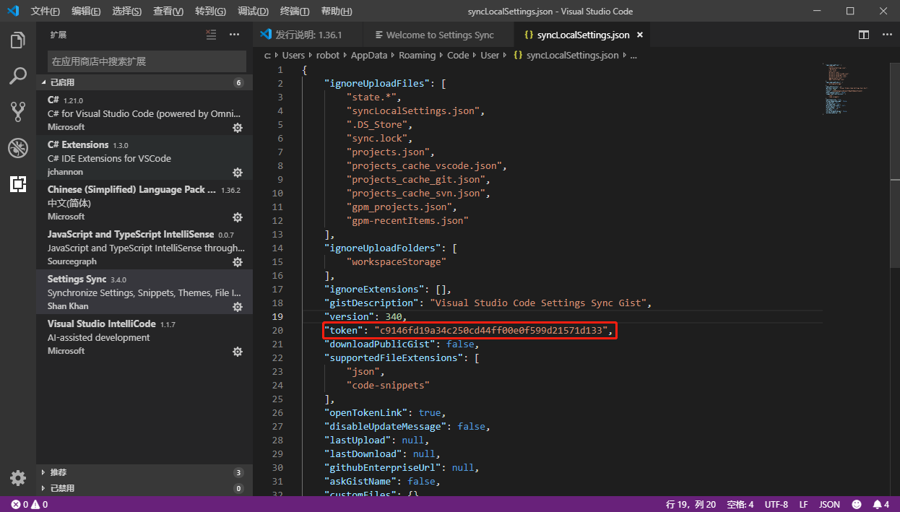

11. ##### 然后如下图进入Settings Sync扩展设置页面设置

    - 

12. ##### 输入创建的Gist仓库ID 输入自动保存设置

    - 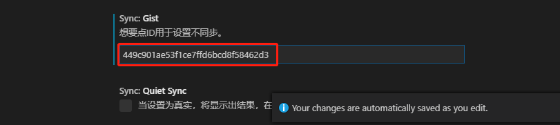

13. ##### 使用Settings Sync我们需要记住两个快捷键：

    - `Shift + Alt + U` 将配置环境 扩展插件信息上传到云端
    - `Shift + Alt + D` 下载云端的配置
    - 所以我们接着上一步 直接在VSCode中使用`Shift + Alt + U`
    - Settings Sync扩展 会在输出区域提示 这里提示没有扩展别移除(因为第一次同步) 然后6个扩展被同步
    - 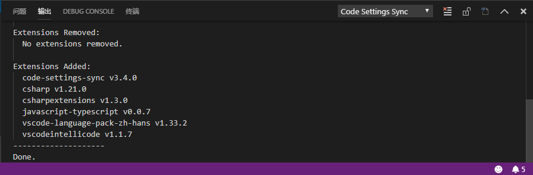

14. ##### 你还可以在你的Gist仓库中查看，看看Settings Sync上传了什么

    - 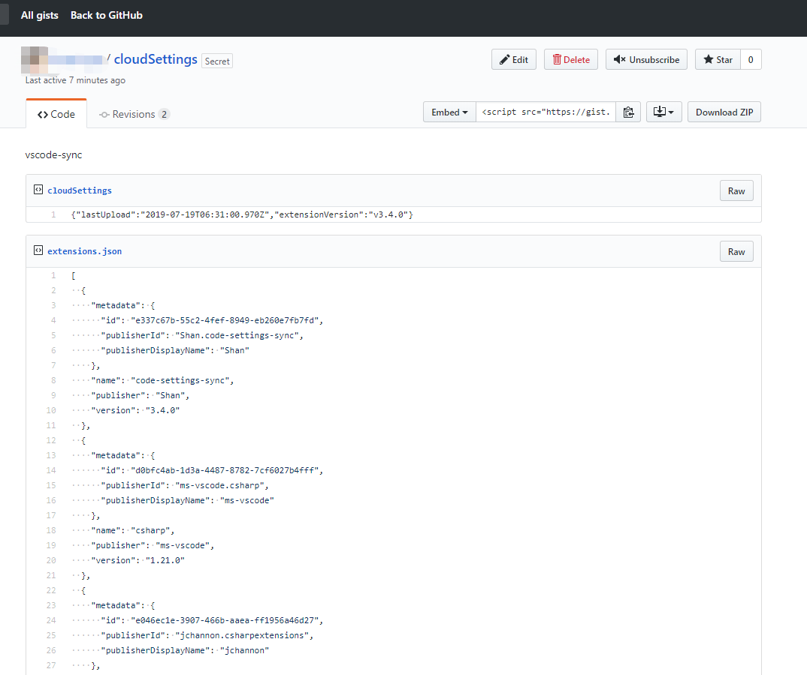

15. ##### 已有配置 直接下载同步远端配置

    - 假设我刚才是在用公司的电脑进行了一次初始化同步设置。现在我想起来我家里的电脑已经设置好了，而且安装的插件更多，有的插件我都忘记了名字。那么我只需要拉取家中Settings Sync配置中对应的Gist ID即可做到 公司和家中用的是同一套VSCode的配置。

    - 查看我们的Gist仓库，获取你想要拉取的Gist ID。截图中，红框中的就是昨晚我在家中最后同步的Gist配置了。点击进入 复制这个**Gist ID**
    - 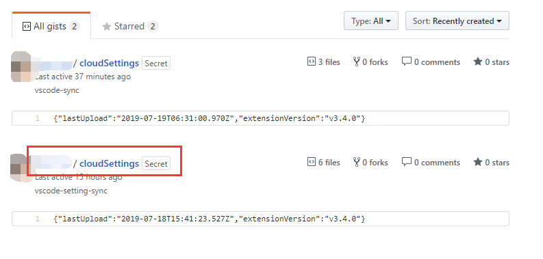

16. ##### 更改Settings Sync中的Gist ID设置

    - 

17. ##### 快捷键Shift+Alt+D 下载配置；同步成功 需要**重启**VSCode

    - **PS：**这里可以思考一下，为什么第一次设置Settings Sync需要创建Token 这里就不需要设置Token了，其实你可以这么理解 Gist ID 它用来标记你的仓库号码，你可能有多个仓库 你的仓库大门用的都是刷脸验证（令牌Token验证），也就是说。Token你只需要创建一个对应Gist的Token即可(多个也可以) 它们都可以打开你的仓库大门，因为在之前我设置好了token，所以这里我只需要设置好Settings Sync 相应的仓库号码。就可以完成同步了
    - 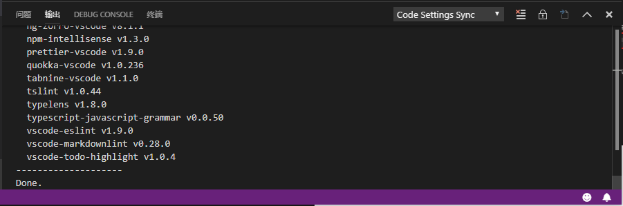

18. ##### 重启后看到同步到了我最常使用的这个Gist配置。一共有31个扩展（虽然很多，但VSCode使用依然顺滑）

    - 

19. ##### 总结：使用Settings Sync 需要明白 Gist ID和Token ID他们的作用。配置好之后使用快捷键 Shift+Alt+U(上传)/D(下载)

20. ##### 对于在使用过程中出现的一些错误，可以简单三部曲：

    - 扩展设置重置：它不会清除你现有的扩展，只恢复初始sync的配置） 快捷键的用法是 Ctrl+P 输入命令：`>Sync: Reset Extension Settings`

    - 更改Settings Sync配置文本：设置Token ID
    - 设置Gist ID：然后同步上传或者下载配置