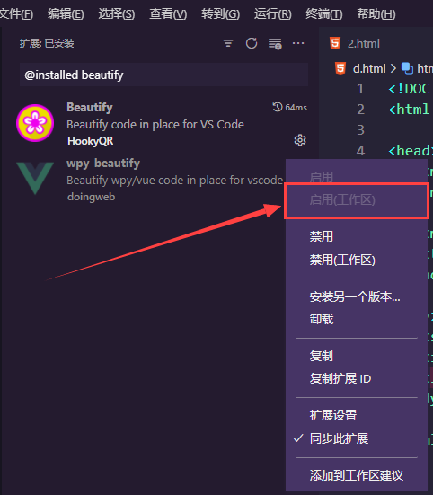

# 提高VSCode性能的 5 个技巧

[TOC]

## 1. 禁用未使用的内置功能

1. `File > Preferences > Settings > Files:Exclude`：添加您不希望 VS Code 在您的项目中使用的任何文件模式。
2. `File > Preferences > Text Editor > Minimap > Enabled`：复选框禁用/启用小地图。
3. `File > Preferences > Text Editor > Suggestions`：在这里，您可以微调与建议相关的任何内容。
4. `File > Preferences > Text Editor > From on save / Format on paste`：例如，您可以在保存时禁用格式并将其推迟到预提交。
5. `File > Preferences > Application > Telemetry`：遥测技术可能会影响性能。
6. `File > Preferences > Text Editor > Code lens`：你可以禁用/启用代码透镜功能。

## 2. 做一个扩展极简主义者

- 有大量的扩展程序可用。然而，这并不意味着你需要它们全部。只添加对你的日常生产生活有直接影响的那些。在添加任何扩展之前，问问自己：
  - 这不是已经内置于VS Code中了吗？
  - 这不仅仅是一件一次性的事情吗？
  - 它真的对你的日常工作有影响吗？
  - 这是适合你使用情况的最佳工具吗？
  - 它有很好的评价吗？

## 3. 将扩展绑定到工作区

- 如果你在许多不同的项目上工作，有不同的代码栈，你可能会发现自己安装了很多扩展。这很容易对性能产生影响。一个技巧是将你的扩展与你的工作空间结合起来。这样，你就知道你只是在加载该工作区所需的插件。您需要做的就是浏览所有可用的插件并禁用特定工作区不需要的插件。

  1. 您可以将所有的插件禁用(默认禁用disable)

     

  2. 然后筛选出您几乎再每个工程目录中都会用到的插件,将他们启用(enable)

  3. 然后打开某一个工程目录,然后再插件右侧点击enable(workspace),这样一来,您再加载特定的工程目录的时候,只会自动加载该项目需要的插件,节约计算机资源,同时提高vscode的响应速度
     `@installed yourExtension`

     

## 4. 监控插件的加载时间

- 通过执行 `cmd + shift + p > Developer: Show Running Extensions` 轻松监控所有插件的启动时间

  

- 你将得到一个所有的活动扩展和它们的激活时间的列表。作为一个一般的经验法则，你可能想仔细检查任何需要超过300毫秒的东西

  

- 如果你想更深入地了解，你可以通过点击记录按钮来分析他们中的任何一个

  

- 如果您想清楚地了解 VS Code 启动时发生的所有事情，您可能需要查看 `cmd + shift + p > Developer Startup Performance`

  

- 你将获得以下信息：

  - 操作系统详情
  - 性能指标
  - 扩展激活详情
  - 缓存位置

  

## 5. 微调你的配置运行时参数

- 在某些情况下，你可能需要进一步配置VS Code的启动。你可以通过在命令行中使用参数来做到这一点。在 `argv.json` 文件中很容易进行配置。运行`CMD + Shift + P > Configure Runtime Arguments`

  

- 然后用你所有的自定义配置编辑 `argv.json` 文件

  