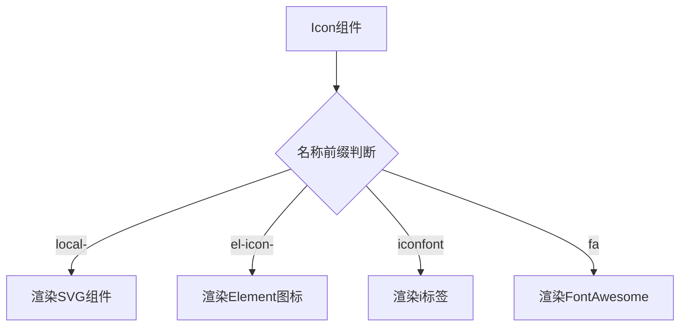

# Vue3 图标集成方案总结

## 1. 本地SVG图标集成
### 核心实现
- **自动加载机制**  
  使用Vite插件自动扫描`/src/assets/icons`目录下的SVG文件，通过`fs`模块递归读取并处理文件
- **SVG处理逻辑**  
  - 清除`width/height`属性
  - 自动添加`viewBox`属性
  - 转换为`<symbol>`元素并注入页面
- **使用方式**  
  ```vue
  <Icon name="local-文件名" size="18px" color="#000" />

### 技术亮点

- 通过`svgBuilder`插件在构建时动态注入SVG集合
- 开发阶段实时监听SVG文件变化
- 自动生成带`local-`前缀的图标名称集合

## 2. Element Plus 图标集成

### 实现方案对比

|   方案   |               链接1方案               |           链接2方案            |
| :------: | :-----------------------------------: | :----------------------------: |
| 安装方式 | `npm install @element-plus/icons-vue` |              相同              |
| 注册方式 |        全局注册 + Icon组件封装        |           仅全局注册           |
| 调用方式 |   `<Icon name="el-icon-Expand" />`    | `<el-icon><expand/></el-icon>` |
| 整合程度 |             统一调用接口              |          原生组件调用          |

### 推荐实现步骤

1. 安装图标库

   ```bash
   npm install @element-plus/icons-vue
   ```

2. 全局注册（示例代码）

   ```ts
   // utils/common.ts
   export function registerIcons(app: App) {
     const icons = elIcons as any;
     for (const i in icons) {
       app.component(`el-icon-${icons[i].name}`, icons[i]);
     }
   }
   ```

3. 在`main.ts`中调用注册方法

## 3. Iconfont 集成方案

### 核心实现

- CSS动态加载通过`loadCss`函数动态注入CDN链接

  ```ts
  loadCss('//at.alicdn.com/t/font_xxxx.css');
  ```

- 使用规范

  ```vue
  <Icon name="iconfont 图标名" />
  ```

### 技术特点

- 自动解析CSS中的图标类名
- 支持多项目图标库切换
- 颜色/尺寸统一控制

## 4. FontAwesome 集成

### 实现方案

- 通过CDN加载官方CSS

  ```ts
  loadCss('//netdna.bootstrapcdn.com/font-awesome/4.7.0/css/font-awesome.min.css');
  ```

- 调用方式

  ```vue
  <Icon name="fa fa-iconname" />
  ```

## 5. 统一 Icon 组件

### 组件逻辑架构



### 核心代码片段

```ts
setup(props) {
  if (props.name.indexOf('el-icon-') === 0) {
    return () => createVNode('el-icon', ...);
  } else if (props.name.indexOf('local-') === 0) {
    return () => createVNode(svg, ...);
  } else {
    return () => createVNode('i', ...);
  }
}
```

## 6. 高级功能扩展

### 图标选择器

- 动态加载各图标库资源
- 自动解析可用图标名称
- 支持搜索/分类/分页功能
- 选择回调事件处理

## 总结对比

|     特性     | 链接1方案  |  链接2方案   |
| :----------: | :--------: | :----------: |
| 支持图标类型 |    4种     |     1种      |
| 统一调用接口 |     ✔️      |      ❌       |
| 动态加载能力 |     ✔️      |      ❌       |
|  构建时优化  |     ✔️      |      ❌       |
|   适合场景   | 企业级项目 | 快速原型开发 |
|   学习成本   |    较高    |     较低     |

> **推荐方案选择**：
>
> - 简单项目建议采用链接2方案
> - 复杂项目推荐链接1的全套整合方案
> - 可渐进式扩展，先实现Element图标再逐步添加其他类型