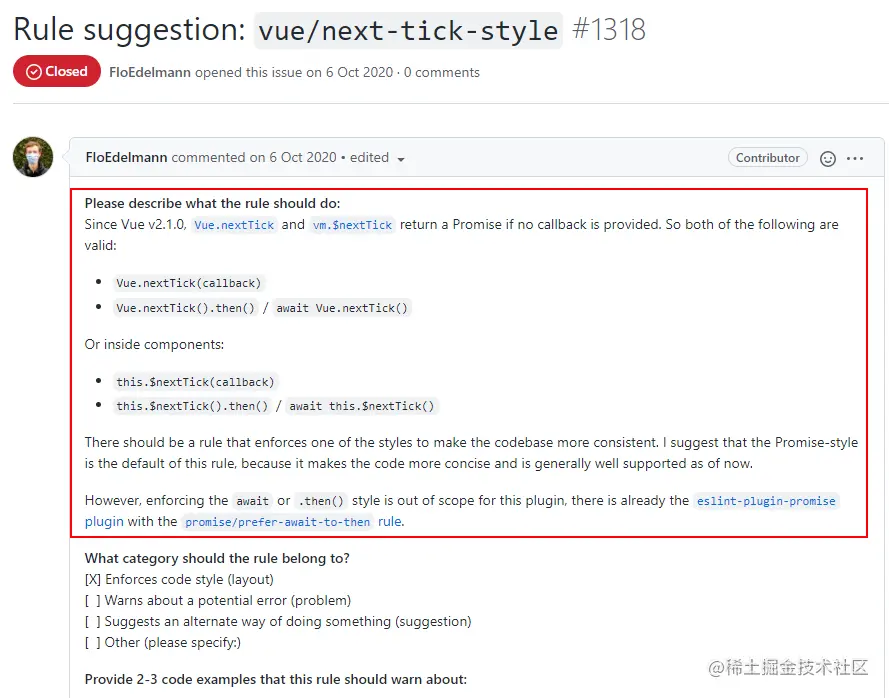

# Vue中nextTick().then()用法和相关约束解析

### 引用

> 1. [vue/next-tick-style官方文档说明](https://eslint.vuejs.org/rules/next-tick-style.html#vue-next-tick-style)
> 2. [vue/next-tick-style提案详情](https://github.com/vuejs/eslint-plugin-vue/issues/1318)

### 背景

- 最近发现有个项目中对`$nextTick`的用法做了约束，统一使用`this.$nextTick().then()`的方式，此约束来自`eslint-plugin-vue`的`vue/next-tick-style`

### 规则详情

- 此规则强制规定`Vue.nextTick`和`this.$nextTick`需要使用`callback`或者`Promise`（Vue2.1.0以下推荐）的风格。

  - **promise**

    ```vue
    <script>
    import { nextTick as nt } from 'vue';
    
    export default {
      async mounted() {
        /* ✓ GOOD */
        nt().then(() => callback());
        await nt(); callback();
        Vue.nextTick().then(() => callback());
        await Vue.nextTick(); callback();
        this.$nextTick().then(() => callback());
        await this.$nextTick(); callback();
    
        /* ✗ BAD */
        nt(() => callback());
        nt(callback);
        Vue.nextTick(() => callback());
        Vue.nextTick(callback);
        this.$nextTick(() => callback());
        this.$nextTick(callback);
      }
    }
    </script>
    ```

    

  - **callback**

    ```vue
    <script>
    import { nextTick as nt } from 'vue';
    
    export default {
      async mounted() {
        /* ✓ GOOD */
        nt(() => callback());
        nt(callback);
        Vue.nextTick(() => callback());
        Vue.nextTick(callback);
        this.$nextTick(() => callback());
        this.$nextTick(callback);
    
        /* ✗ BAD */
        nt().then(() => callback());
        await nt(); callback();
        Vue.nextTick().then(() => callback());
        await Vue.nextTick(); callback();
        this.$nextTick().then(() => callback());
        await this.$nextTick(); callback();
      }
    }
    </script>
    ```

    

### 规则配置

- 默认值为`promise`（`Vue`版本低于`2.1.0`才推荐使用`callback`）

```typescript
{
  "vue/next-tick-style": ["error", "promise" | "callback"]
}
```

### 规则分析

1. 首先是去分析源码

   ```typescript
   // 只贴出部分代码
   export function nextTick (cb?: Function, ctx?: Object) {
     let _resolve
     callbacks.push(() => {
       if (cb) {
         try {
           cb.call(ctx)
         } catch (e) {
           handleError(e, ctx, 'nextTick')
         }
       } else if (_resolve) {
         _resolve(ctx)
       }
     })
     if (!pending) {
       pending = true
       timerFunc()
     }
     // $flow-disable-line
     if (!cb && typeof Promise !== 'undefined') {
       return new Promise(resolve => {
         _resolve = resolve
       })
     }
   }
   ```

   > - 可以看到`promise`的方式其实就是不传`callback`，然后返回了一个`Promise`实例，等到`timeFunc()`生成的异步任务执行`resolve`
   > - 个人观点：其实`timerFunc`本身就按`promise`、`MutationObserver`、`setImmediate`、`setTimeout`的顺序注册了异步任务，然后`promise`的格式执行`then`的时候又是一个异步任务，感觉不是很有必要这样去约束
   > - 分析到这里，还是不太理解，然后继续，就到`eslint-plugin-vue`的`github`上去找相关信息

2. 上github查找

   - 然后在上面找到了`vue/next-tick-style`的提案详情

     

   > - 总的来说就只是为了代码更加简洁和统一，并没有什么深层次的原因
   >
   > - 感觉`callback`的方式反而更加地直观和简洁，`promise`的方式还需要在`then`里面去做回调操作（也可能是用习惯了`callback`的方式）

### 综上

建议是爱用哪个用哪个，统一就好