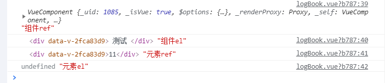

# Vue中ref、$refs和$el的使用

> ```javascript
> $("#id").text('xxx')   // 使用Jquery
> document.getElementById("id")  // 使用原生Dom
> ```

### 1、ref

- **ref: 给元素或者子组件注册引用信息**

#### 1.1 ref加在普通元素上，用this.$ref.xxx（ref值）可以获取到dom元素

```javascript
<div ref="system">测试</div>
// 获取
mounted() {
  console.log(this.$refs.system);
}
```


#### 1.2 ref加在子组件上，用this.$ref.xxx（ref值）可以获取到组件实例，可以使用子组件的所有方法。在使用方法的时候直接this.$refs.（ref值）.方法（） 就可以使用了

```javascript
// this.$ref.xxx.方法名()
// 父组件
<contact-info ref="contactInfo"/>
import ContactInfo from './ContactInfo'
components: { ContactInfo },
mounted() {
   this.$refs.contactInfo.initVal(data) // 调用子组件方法
}
// 子组件
methods: {
  initVal(data){
    Object.keys(this.contactInfo).forEach(val=>{
      this.contactInfo[val] = data[val]
    })
  }
}
```


#### 1.3 利用 v-for 和 ref 获取一组数组或者dom 节点

- 在通过**`v-for`**遍历获取一组ref时记得加冒号，即**`:ref=“xxx”`**，当**`v-for`**用于元素或者组件的时候，引用信息将是包含dom节点或者组件实例的数组。加冒号说明后面是一个变量或者是表达式，不加冒号后面就是字符串常量

#### 1.4 注意事项

1. 获取ref要确保在dom已经渲染完成，**根本原因是因为Vue中DOM更新是异步的**，比如可以在vue生命周期的**`mounted() {}`**钩子函数中调用，或者可以在**`this.$nextTick(() => {})`**中调用。
2. 在页面初始渲染的时候是不能访问ref的，因为此时ref还不存在，**`$ref`**也不是响应式的，不能在模板中做数据绑定。
3. 如果ref 是循环出来的，有多个重名，那么ref的值会是一个数组 ，此时要拿到单个的ref 只需要循环就可以了
4. 在vue中用ref来获取dom的时候，可能会出现this. $refs.xxx为undefined的情况
5. 场景一：在**`created()`**中使用
   - 在这个生命周期中进行数据观测、属性和方法的运算，watch事件回调，但是此时dom还没有渲染完成，是不能通过ref调用dom的。
   - 解决：**mounted中调用或者使用nextTick**。
6. 场景二：父元素或者当前元素使用了**`v-if`**或者**`v-show`**
   - 因为**`$ref`**不是响应式的，只在组件渲染完之后才会生效，在初始渲染的时候是不存在的
   - 因为是非响应式的，所有动态加载的模板更新它都无法相应的变化
   - 解决：通过**`setTimeout(() => {…}, 0)`**来实现

### 2、$el

- **$el: 获取Vue组件实例挂载的DOM元素**

#### 2.1 例一

- 获取自定义组件tabControl，并获取它的OffsetTop。就需要先获取该组件。在组件内设置  属性 **`ref='一个名称(tabControl2)'`**, 然后 **`this.$refs.tabControl2`** 就拿到了该组件 
- 切记：ref属性，而获取组件的时候要用**`$refs`**
- 获取 OffsetTop，组件不是DOM元素，是没有OffsetTop的，无法通过**`.OffsetTop`**来获取的。就需要通过**`$el`**来获取组件中的DOM元素

```vue
<tab-control :titles="[流行'，新款 ，精选'] @tabClick='tabClick' ref='tabContro12'/>
```

```javascript
swiperImageLoad(){
	// 获取tabControl的offsetTop
	// 所有的组件都有一个属性$el:用于获取组件中的元素
	// console.log(this.$refs.tabControl2.$el.offsetTop
	this.taboffsetTop = this.$refs.tabControl2.$el.offsetTop
}
```

#### 2.2 例二

```vue
// 子组件
<template>
  <div>
    测试
  </div>
</template>
<script>
export default {
  name: 'TestComs'
};
</script>
```

```vue
// 父组件
   <test ref="testCom" />
   <div ref="test">11</div>
  mounted() {
    console.log(this.$refs.testCom, '组件ref'); // 获取组件实例
    console.log(this.$refs.testCom.$el, '组件el'); // 获取组件实例的dom元素
    console.log(this.$refs.test, '元素ref'); // 获取dom元素
    console.log(this.$refs.test.$el, '元素el'); // $el用于vue组件，普通dom元素不能用
  },
```



### 3、总结

- **ref** (**给元素或者子组件注册引用信息**) 就像你要给元素设置样式，就需要先给元素设定一个 class 一样，同理，你想获取哪个元素的 DOM，就给这个元素先设定一个 ref，其实这里和 JS 中的 document.各种方法获取 DOM 差不多，不过 ref 是访问 VUE 虚拟出来的DOM，这样可以有效的减少性能消耗

- 简述三者区别：
  - **ref ：是 元素的属性，用于设置在元素上**
  - **$refs ：是 ref 的集合，集合里面包含了当前.vue中的所有 ref，用于获取普通元素中的 DOM 以及子组件中方法/参数的**
  - **$el ：是 用于获取组件内 DOM（包括子组件，当前.vue组件，以及父组件）**