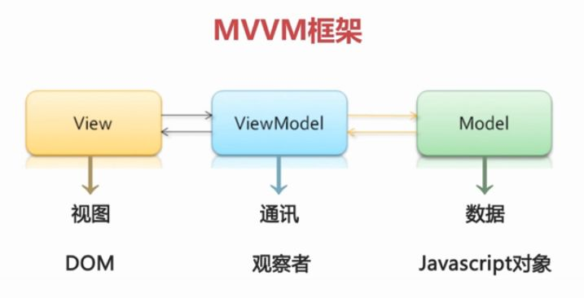

# Vue中vm指的是什么

> 在vue中，vm是ViewModel的缩写，是视图模型的意思，是连接view和model的桥梁；ViewModel能够监听到数据的变化，然后通知到对应的视图做自动更新，实现双向绑定。

- VM实际是ViewModel--视图模型
- MVVM 模型-视图-视图模型
- 【视图】指的是所看到的页面，【模型】指的是后端传递的数据。
- 【视图模型】mvvm模式的核心，它是连接view和model的桥梁；它有两个方向：
  - 将【模型】转化成【视图】，即将后端传递的数据转化成所看到的页面。实现的方式是：数据绑定。
  - 将【视图】转化成【模型】，即将所看到的页面转化成后端的数据。实现的方式是：DOM 事件监听。
  - 这两个方向都实现的，我们称之为数据的【双向绑定】。

- 在 MVVM 的框架下视图和模型是不能直接通信的。它们通过 ViewModel 来通信，ViewModel 通常要实现一个 observer 观察者，当数据发生变化，ViewModel 能够监听到数据的这种变化，然后通知到对应的视图做自动更新。
- 而当用户操作视图，ViewModel 也能监听到视图的变化，然后通知数据做改动，这实际上就实现了数据的双向绑定。并且MVVM中的View 和 ViewModel可以互相通信。