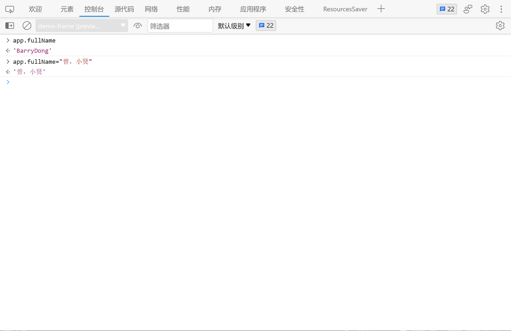
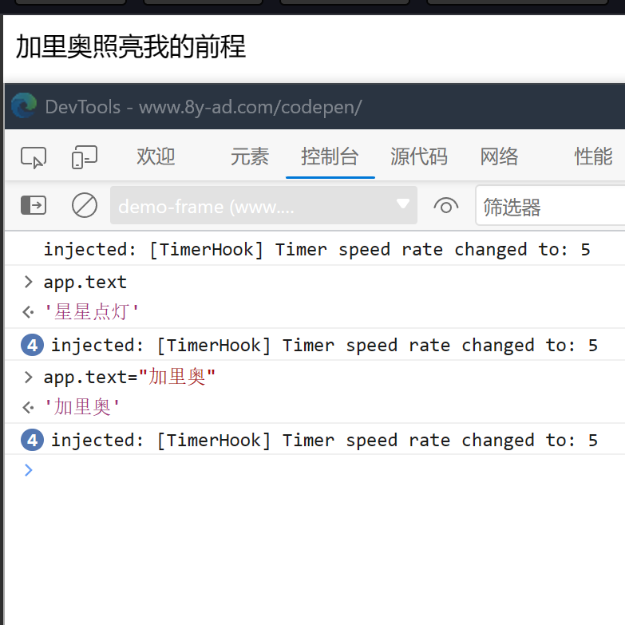
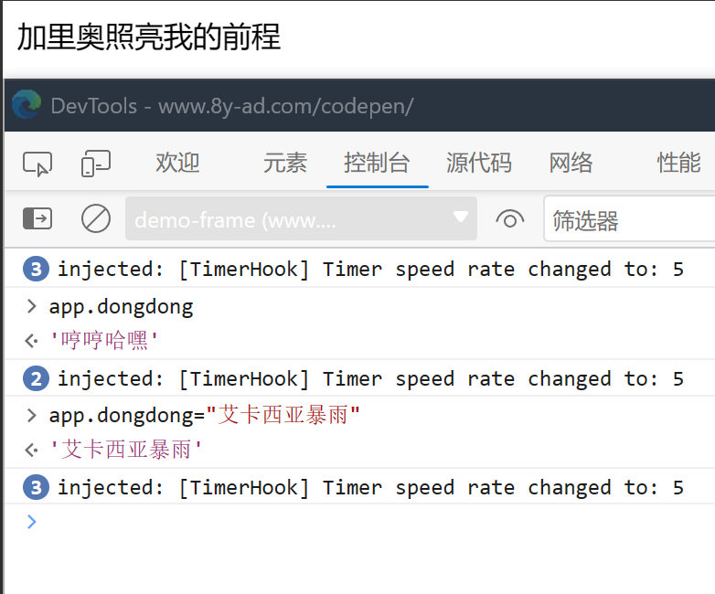

# Vue中计算属性computed的 getter/setter 和缓存

### 熟悉 getter 和 setter

> **每一个计算属性都包含一个 getter 函数和 setter 函数。**

- 举个栗子：来实现一个 "显示姓名" 的 小demo 

```vue
<div id="app">
    {{ fullName }}                      // 3、渲染 fullName
</div>

var app = new Vue({
  el: '#app',
  data: {                               // 1、在data中定义 firstName 和 lastName
    firstName: 'Barry',
    lastName: 'Dong'
  },
  computed: {                          // 2、在计算属性中定义 fullName
    fullName: function () {
      return this.firstName + this.lastName
    }
  }
})
```

现在你可以在页面中看到 "BarryDong" 。等等，`getter` 和 `setter` 呢？你不是说每一个计算属性都包含一个 `getter` 和 `setter` 吗？上面这个 demo 怎么没有呢？这是因为，**计算属性会默认使用 getter 函数**。也就是说，即使你没有明确写出 `getter` 函数，计算属性也会默认使用它。

上面的 demo 中的计算属性，可以改写成这样：

```vue
computed: {
    fullName: {
      get: function () {             // 这里就明确写出了 getter 函数
        return this.firstName + this.lastName
      }
    }
}
```

运行结果与上次结果一致。那么 `setter` 函数呢？`setter` 函数与 `getter` 函数类似，也是写在计算属性中。而不同之处在于，`getter` 函数是默认用法，`setter` 函数不是默认用法。**如果你要使用 setter 函数，那么你必须要手动写出 setter 函数。**

比如，上面的 demo ，需求变了：我要能显示名字的同时，还能改变名字。（这里我们要求，姓与名之间要用中文逗号分隔，不然不好识别哪个是姓，哪个是名）

```vue
<div id="app">
    {{ fullName }} <br>
</div>

var app = new Vue({
  el: '#app',
  data: {
    firstName: 'Barry',
    lastName: 'Dong'
  },
  computed: {
    fullName: {
      get: function () {
        return this.firstName + this.lastName
      },
      set: function (newName) {        // 我们加上了 setter 函数，可以传入新的名字
        var name = newName.split('，')  // 把传入的名字根据逗号，拆分成数组
        this.firstName = name[0]    // 数组的第一个元素为 firstName
        this.lastName = name[1]     // 数组的第二个元素为 lastName
      }
    }
  }
})
```

- 现在我们打开控制台，在控制台中改变名字，那么现在可以看到，页面中渲染出了 "曾小贤" 。



- 总结：
  - **每一个计算属性都包含一个 getter 函数和 setter 函数；**
  - **计算属性会默认使用 getter 函数；**
  - **你也可以提供 setter 函数，当修改计算属性的值时，就会触发 setter 函数，执行一些自定义的操作。**

### methods 与 computed

> **methods 里的方法，与 computed 里的方法，可以起到同样的作用。**

- 举个栗子：做一个 "现在距1970年的时间戳" demo 

```vue
<div id="app">
    方法拿到的时间戳：{{ now() }} <br>
    计算属性拿到的时间戳：{{ thisTime }}
</div>

var app = new Vue({
  el: '#app',
  data: {
    
  },
  methods: {               // 你看下面 computed 中的方法，是不是类似的？
    now: function () {
      return Date.now()
    }
  },
  computed: {
    thisTime: function () {
      return Date.now()
    }
  }
})
```

```vue
<div id="app">
    方法拿到的时间戳：{{ now() }} <br>    // now 后面有括号
    计算属性拿到的时间戳：{{ thisTime }}  // thisTime 后面没有括号
</div>
```

- 因为，`now` 是写在 `methods` 中的，所以要调用。而 `thisTime` 是写在 计算属性 中的，既然是属性，那自然就不用加括号了。

### 计算属性 computed 的缓存

> **methods：只要页面重新渲染，methods 中的方法就会重新执行；不渲染，就不执行。**

```vue
<div id="app">
    {{ text }}
</div>

var app = new Vue({
  el: '#app',
  data: {
    text: '星星点灯',          // text 在页面中渲染
    message: '照亮我的前程'    // message 未在页面中渲染
  },
  computed: {
    ...
  },
  methods: {
    ...
  }
})
```

- 如果通过 `app.text` 改变了 `text` 的值，那么页面就会重新渲染出 `text` 的值，`methods` 中的方法也会重新执行。而如果改变的是 `message` ，因为 `message` 未在页面中渲染，那么页面就不会重新渲染 `message` 的值，`methods` 中的方法不会重新执行。
- **computed：不管页面是否渲染，只要计算属性依赖的数据未发生改变，那么计算属性就不会发生变化，因为计算属性是基于它的缓存的。只有当计算属性依赖的数据发生变化时，计算属性才会重新取值。**

```vue
<div id="app">
    {{ abc }}
</div>

var app = new Vue({
  el: '#app',
  data: {
    text: '星星点灯',
    message: '照亮我的前程',
    dongdong: '哼哼哈嘿'
  },
  computed: {
    abc: function () {
      return this.text + this.message    // 计算属性依赖了 Vue 实例中的 text 和 message
    }
  },
  methods: {
    
  }
})
```

- 如果我将 Vue 实例中的 text 属性更改，那么计算属性就会重新取值，重新渲染：



- 而如果我更改实例中的 `dongdong` 属性，因为计算属性没有依赖它，所以计算属性不会变：



- 那我们要在什么时候使用计算属性呢？那就取决于你是否需要使用缓存了！如果你要遍历一个很大的数组，或者要进行大量的运算，那么你就可以使用计算属性。
- 补充一点：**计算属性不仅可以依赖当前 Vue 实例的数据，还可以依赖其他 Vue 实例的数据。**
- 如果 `app2` 中的 `text` 改变，那么计算属性也会随之改变。

```vue
<div id="app">
    {{ text }} <br>
    {{ reverseText }}
</div>

var app2 = new Vue({
  el: '#app2',
  data: {
    text: '你自己却不知道'
  }
})

var app = new Vue({
  el: '#app',
  data: {
    text: '我想说其实你很好'
  },
  computed: {
    reverseText: function() {
      return this.text.split('').reverse().join('') + ',' + app2.text    // 依赖 app2 中的 text
    }
  }
})
```

