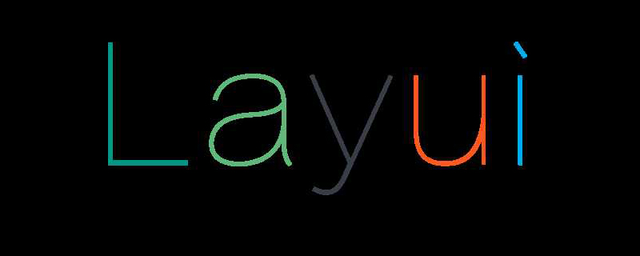

# layUi中使用内部jQuery方法



> ​	由于Layui部分内置模块依赖jQuery，所以很多人引用layui的时候并没有单独再引入jQuery。但是如果在使用$常规写法获取dom元素时，却会提示未定义。这是由于Layui虽然内置了jQuery1.11最稳定的一个版本作为一个内置的DOM模块（唯一的一个第三方模块）。但是只有你所使用的模块有依赖到它，它才会加载，并且如果你的页面已经script引入了jquery，它并不会重复加载。内置的jquery模块去除了全局的$和jQuery，是一个符合layui规范的标准模块。所以，你如果想全局$使用，最好还是单独引入自己的jquery。
>

- 在layui中使用内部jQuery的两种方法：

  1. 通过`layui.use('jquery', function(){var $ =layui.$ ... })`方式使用

     ```js
     //第一种：主动加载jquery模块
     layui.use(['jquery', 'layer'], function(){ 
       var $ = layui.$ //重点处
       ,layer = layui.layer;
       
       //后面就跟你平时使用jQuery一样
       $('body').append('Hello jQuery');
     });
     ```

  2. 通过`layui.use(['form','layer'], function(){var $ =layui.$ ... })`方式使用

     ```js
     //第二种：如果内置的模块本身是依赖jquery，你无需去use jquery，所以上面的写法其实可以是：
     layui.use('layer', function(){ 
       var $ = layui.$ //由于layer弹层依赖jQuery，所以可以直接得到
       ,layer = layui.layer;
      
       //……
     });
     ```

- **注：上面引用使用范围只能是放在layui.use的大括号里才有效**